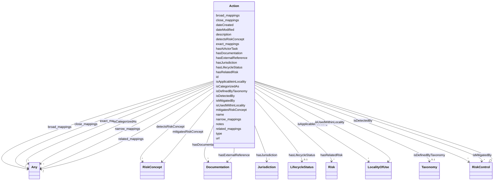

---
search:
  boost: 10.0
---

# Class: Action

_Action to remediate a risk_

<div data-search-exclude markdown="1">

URI: [nexus:Action](https://w3id.org/ai-atlas-nexus/Action)



## Inheritance

- [Entity](Entity.md)
  - [Control](Control.md)
    - [RiskControl](RiskControl.md) [ [RiskConcept](RiskConcept.md)]
      - **Action**

## Slots

| Name                                                | Cardinality and Range                            | Description                                                                      | Inheritance                                  |
| --------------------------------------------------- | ------------------------------------------------ | -------------------------------------------------------------------------------- | -------------------------------------------- |
| [hasRelatedRisk](hasRelatedRisk.md)                 | \* <br/> [Risk](Risk.md)                         | A relationship where an entity relates to a risk                                 | direct                                       |
| [hasDocumentation](hasDocumentation.md)             | \* <br/> [Documentation](Documentation.md)       | Indicates documentation associated with an entity                                | direct                                       |
| [isDefinedByTaxonomy](isDefinedByTaxonomy.md)       | 0..1 <br/> [Taxonomy](Taxonomy.md)               | A relationship where a concept or a concept group is defined by a taxonomy       | direct                                       |
| [hasAiActorTask](hasAiActorTask.md)                 | \* <br/> [String](String.md)                     | Pertinent AI Actor Tasks for each subcategory                                    | direct                                       |
| [detectsRiskConcept](detectsRiskConcept.md)         | \* <br/> [RiskConcept](RiskConcept.md)           | The property airo:detectsRiskConcept indicates the control used for detecting... | [RiskControl](RiskControl.md)                |
| [mitigatesRiskConcept](mitigatesRiskConcept.md)     | \* <br/> [RiskConcept](RiskConcept.md)           | Indicates the control used for mitigating risks, risk sources, consequences, ... | [RiskControl](RiskControl.md)                |
| [isDetectedBy](isDetectedBy.md)                     | \* <br/> [RiskControl](RiskControl.md)           | A relationship where a risk, risk source, consequence, or impact is detected ... | [RiskConcept](RiskConcept.md)                |
| [isMitigatedBy](isMitigatedBy.md)                   | \* <br/> [RiskControl](RiskControl.md)           | A relationship where a risk, risk source, consequence, or impact is mitigated... | [RiskConcept](RiskConcept.md)                |
| [isUsedWithinLocality](isUsedWithinLocality.md)     | \* <br/> [LocalityOfUse](LocalityOfUse.md)       | Specifies the domain an AI system is used within                                 | [RiskConcept](RiskConcept.md)                |
| [isApplicableinLocality](isApplicableinLocality.md) | \* <br/> [LocalityOfUse](LocalityOfUse.md)       | A relationship where an entity has is applicable in these localities             | [Control](Control.md)                        |
| [hasExternalReference](hasExternalReference.md)     | \* <br/> [Documentation](Documentation.md)       | External references / additional resources related to this entity, such as ar... | [Control](Control.md)                        |
| [type](type.md)                                     | 0..1 <br/> [String](String.md)                   | The type or class designation of this entity instance                            | [Concept](Concept.md), [Control](Control.md) |
| [id](id.md)                                         | 1 <br/> [String](String.md)                      | A unique identifier to this instance of the model element                        | [Entity](Entity.md)                          |
| [name](name.md)                                     | 0..1 <br/> [String](String.md)                   | A text name of this instance                                                     | [Entity](Entity.md)                          |
| [description](description.md)                       | 0..1 <br/> [String](String.md)                   | The description of an entity                                                     | [Entity](Entity.md)                          |
| [url](url.md)                                       | 0..1 <br/> [Uri](Uri.md)                         | An optional URL associated with this instance                                    | [Entity](Entity.md)                          |
| [dateCreated](dateCreated.md)                       | 0..1 <br/> [Date](Date.md)                       | The date on which the entity was created                                         | [Entity](Entity.md)                          |
| [dateModified](dateModified.md)                     | 0..1 <br/> [Date](Date.md)                       | The date on which the entity was most recently modified                          | [Entity](Entity.md)                          |
| [exact_mappings](exact_mappings.md)                 | \* <br/> [Any](Any.md)                           | The property is used to link two concepts, indicating a high degree of confid... | [Entity](Entity.md)                          |
| [close_mappings](close_mappings.md)                 | \* <br/> [Any](Any.md)                           | The property is used to link two concepts that are sufficiently similar that ... | [Entity](Entity.md)                          |
| [related_mappings](related_mappings.md)             | \* <br/> [Any](Any.md)                           | The property skos:relatedMatch is used to state an associative mapping link b... | [Entity](Entity.md)                          |
| [narrow_mappings](narrow_mappings.md)               | \* <br/> [Any](Any.md)                           | The property is used to state a hierarchical mapping link between two concept... | [Entity](Entity.md)                          |
| [broad_mappings](broad_mappings.md)                 | \* <br/> [Any](Any.md)                           | The property is used to state a hierarchical mapping link between two concept... | [Entity](Entity.md)                          |
| [isCategorizedAs](isCategorizedAs.md)               | \* <br/> [Any](Any.md)                           | A relationship where an entity has been deemed to be categorized                 | [Entity](Entity.md)                          |
| [hasLifecycleStatus](hasLifecycleStatus.md)         | 0..1 <br/> [LifecycleStatus](LifecycleStatus.md) | The editorial / publication lifecycle state of this entity                       | [Entity](Entity.md)                          |
| [notes](notes.md)                                   | \* <br/> [String](String.md)                     | Free-text editorial notes, source breadcrumbs, or build-time provenance that ... | [Entity](Entity.md)                          |
| [hasJurisdiction](hasJurisdiction.md)               | \* <br/> [Jurisdiction](Jurisdiction.md)         | The legal or political jurisdiction(s) in which this concept applies, express... | [Concept](Concept.md)                        |

## Usages

| used by                   | used in                                 | type   | used                |
| ------------------------- | --------------------------------------- | ------ | ------------------- |
| [Container](Container.md) | [actions](actions.md)                   | range  | [Action](Action.md) |
| [Risk](Risk.md)           | [hasRelatedAction](hasRelatedAction.md) | range  | [Action](Action.md) |
| [Action](Action.md)       | [hasRelatedRisk](hasRelatedRisk.md)     | domain | [Action](Action.md) |

## Identifier and Mapping Information

### Schema Source

- from schema: https://w3id.org/ai-atlas-nexus/ai-risk-ontology

## Mappings

| Mapping Type | Mapped Value |
| ------------ | ------------ |
| self         | nexus:Action |
| native       | nexus:Action |

## LinkML Source

<!-- TODO: investigate https://stackoverflow.com/questions/37606292/how-to-create-tabbed-code-blocks-in-mkdocs-or-sphinx -->

### Direct

<details>
```yaml
name: Action
description: Action to remediate a risk
from_schema: https://w3id.org/ai-atlas-nexus/ai-risk-ontology
is_a: RiskControl
slots:
- hasRelatedRisk
- hasDocumentation
- isDefinedByTaxonomy
- hasAiActorTask
slot_usage:
  hasRelatedRisk:
    name: hasRelatedRisk
    domain: Action
    range: Risk

````
</details>

### Induced

<details>
```yaml
name: Action
description: Action to remediate a risk
from_schema: https://w3id.org/ai-atlas-nexus/ai-risk-ontology
is_a: RiskControl
slot_usage:
  hasRelatedRisk:
    name: hasRelatedRisk
    domain: Action
    range: Risk
attributes:
  hasRelatedRisk:
    name: hasRelatedRisk
    description: A relationship where an entity relates to a risk
    from_schema: https://w3id.org/ai-atlas-nexus/ai-risk-ontology
    rank: 1000
    domain: Action
    owner: Action
    domain_of:
    - Term
    - LLMQuestionPolicy
    - Action
    - AiSystem
    - AiEval
    - EveryEvalAIResult
    - BenchmarkMetadataCard
    - Adapter
    - LLMIntrinsic
    range: Risk
    multivalued: true
    inlined: false
  hasDocumentation:
    name: hasDocumentation
    description: Indicates documentation associated with an entity.
    from_schema: https://w3id.org/ai-atlas-nexus/ai-risk-ontology
    rank: 1000
    slot_uri: airo:hasDocumentation
    owner: Action
    domain_of:
    - Dataset
    - Vocabulary
    - Taxonomy
    - Concept
    - Group
    - Entry
    - Term
    - Principle
    - RiskTaxonomy
    - RiskControlGroupTaxonomy
    - Action
    - BaseAi
    - LargeLanguageModelFamily
    - AiTaskTaxonomy
    - AiEval
    - EveryEvalAIResult
    - BenchmarkMetadataCard
    - Adapter
    - LLMIntrinsic
    range: Documentation
    multivalued: true
    inlined: false
  isDefinedByTaxonomy:
    name: isDefinedByTaxonomy
    description: A relationship where a concept or a concept group is defined by a
      taxonomy
    from_schema: https://w3id.org/ai-atlas-nexus/ai-risk-ontology
    rank: 1000
    slot_uri: schema:isPartOf
    owner: Action
    domain_of:
    - Concept
    - Control
    - Group
    - Entry
    - Policy
    - Rule
    - RiskControlGroup
    - RiskGroup
    - Risk
    - RiskControl
    - Action
    - RiskIncident
    - CapabilityGroup
    - AiTaskDomain
    - AiTaskGroup
    - Stakeholder
    - StakeholderGroup
    - Requirement
    range: Taxonomy
  hasAiActorTask:
    name: hasAiActorTask
    description: Pertinent AI Actor Tasks for each subcategory. Not every AI Actor
      Task listed will apply to every suggested action in the subcategory (i.e., some
      apply to AI development and others apply to AI deployment).
    from_schema: https://w3id.org/ai-atlas-nexus/ai-risk-ontology
    rank: 1000
    owner: Action
    domain_of:
    - Action
    range: string
    multivalued: true
  detectsRiskConcept:
    name: detectsRiskConcept
    description: The property airo:detectsRiskConcept indicates the control used for
      detecting risks, risk sources, consequences, and impacts.
    from_schema: https://w3id.org/ai-atlas-nexus/ai-risk-ontology
    exact_mappings:
    - airo:detectsRiskConcept
    rank: 1000
    domain: RiskControl
    owner: Action
    domain_of:
    - Risk
    - RiskControl
    inverse: isDetectedBy
    range: RiskConcept
    multivalued: true
    inlined: false
  mitigatesRiskConcept:
    name: mitigatesRiskConcept
    description: Indicates the control used for mitigating risks, risk sources, consequences,
      and impacts.
    from_schema: https://w3id.org/ai-atlas-nexus/ai-risk-ontology
    exact_mappings:
    - airo:mitigatesRiskConcept
    rank: 1000
    domain: RiskControl
    owner: Action
    domain_of:
    - RiskControl
    inverse: isMitigatedBy
    range: RiskConcept
    multivalued: true
    inlined: false
  isDetectedBy:
    name: isDetectedBy
    description: A relationship where a risk, risk source, consequence, or impact
      is detected by a risk control.
    from_schema: https://w3id.org/ai-atlas-nexus/ai-risk-ontology
    rank: 1000
    domain: RiskConcept
    owner: Action
    domain_of:
    - RiskConcept
    inverse: detectsRiskConcept
    range: RiskControl
    multivalued: true
    inlined: false
  isMitigatedBy:
    name: isMitigatedBy
    description: A relationship where a risk, risk source, consequence, or impact
      is mitigated by a risk control.
    from_schema: https://w3id.org/ai-atlas-nexus/ai-risk-ontology
    rank: 1000
    domain: RiskConcept
    owner: Action
    domain_of:
    - RiskConcept
    inverse: mitigatesRiskConcept
    range: RiskControl
    multivalued: true
    inlined: false
  isUsedWithinLocality:
    name: isUsedWithinLocality
    description: Specifies the domain an AI system is used within.
    from_schema: https://w3id.org/ai-atlas-nexus/ai-risk-ontology
    rank: 1000
    slot_uri: airo:isUsedWithinLocality
    owner: Action
    domain_of:
    - RiskConcept
    - AiSystem
    range: LocalityOfUse
    multivalued: true
    inlined: false
  isApplicableinLocality:
    name: isApplicableinLocality
    description: A relationship where an entity has is applicable in these localities.
    from_schema: https://w3id.org/ai-atlas-nexus/ai-risk-ontology
    rank: 1000
    slot_uri: nexus:isApplicableinLocality
    owner: Action
    domain_of:
    - Control
    - Policy
    range: LocalityOfUse
    multivalued: true
    inlined: false
  hasExternalReference:
    name: hasExternalReference
    description: External references / additional resources related to this entity,
      such as articles, tools, or datasets. Distinct from hasDocumentation, which
      documents the entity itself. External references are not necessarily curated
      or vetted, and quality will vary.
    from_schema: https://w3id.org/ai-atlas-nexus/ai-risk-ontology
    aliases:
    - additional resources
    - external_links
    close_mappings:
    - rdfs:seeAlso
    rank: 1000
    slot_uri: nexus:hasExternalReference
    owner: Action
    domain_of:
    - Control
    - Entry
    range: Documentation
    multivalued: true
    inlined: false
  type:
    name: type
    description: The type or class designation of this entity instance.
    from_schema: https://w3id.org/ai-atlas-nexus/common
    designates_type: true
    owner: Action
    domain_of:
    - Vocabulary
    - Taxonomy
    - Concept
    - Control
    - Group
    - Entry
    - Policy
    - Rule
    - Permission
    - Prohibition
    - Obligation
    - Recommendation
    - Certification
    - BenchmarkMetadataCard
    - ControlActivity
    - ControlActivityPermission
    - ControlActivityProhibition
    - ControlActivityObligation
    - ControlActivityRecommendation
    - Requirement
    range: string
  id:
    name: id
    description: A unique identifier to this instance of the model element. Example
      identifiers include UUID, URI, URN, etc.
    from_schema: https://w3id.org/ai-atlas-nexus/ai-risk-ontology
    rank: 1000
    slot_uri: schema:identifier
    identifier: true
    owner: Action
    domain_of:
    - Entity
    range: string
    required: true
  name:
    name: name
    description: A text name of this instance.
    from_schema: https://w3id.org/ai-atlas-nexus/ai-risk-ontology
    rank: 1000
    slot_uri: schema:name
    owner: Action
    domain_of:
    - Entity
    - BenchmarkMetadataCard
    range: string
  description:
    name: description
    description: The description of an entity
    from_schema: https://w3id.org/ai-atlas-nexus/ai-risk-ontology
    rank: 1000
    slot_uri: schema:description
    owner: Action
    domain_of:
    - Entity
    range: string
  url:
    name: url
    description: An optional URL associated with this instance.
    from_schema: https://w3id.org/ai-atlas-nexus/ai-risk-ontology
    rank: 1000
    slot_uri: schema:url
    owner: Action
    domain_of:
    - Entity
    range: uri
  dateCreated:
    name: dateCreated
    description: The date on which the entity was created.
    from_schema: https://w3id.org/ai-atlas-nexus/ai-risk-ontology
    rank: 1000
    slot_uri: schema:dateCreated
    owner: Action
    domain_of:
    - Entity
    range: date
    required: false
  dateModified:
    name: dateModified
    description: The date on which the entity was most recently modified.
    from_schema: https://w3id.org/ai-atlas-nexus/ai-risk-ontology
    rank: 1000
    slot_uri: schema:dateModified
    owner: Action
    domain_of:
    - Entity
    range: date
    required: false
  exact_mappings:
    name: exact_mappings
    description: The property is used to link two concepts, indicating a high degree
      of confidence that the concepts can be used interchangeably across a wide range
      of information retrieval applications
    from_schema: https://w3id.org/ai-atlas-nexus/ai-risk-ontology
    rank: 1000
    slot_uri: skos:exactMatch
    owner: Action
    domain_of:
    - Entity
    range: Any
    multivalued: true
    inlined: false
  close_mappings:
    name: close_mappings
    description: The property is used to link two concepts that are sufficiently similar
      that they can be used interchangeably in some information retrieval applications.
    from_schema: https://w3id.org/ai-atlas-nexus/ai-risk-ontology
    rank: 1000
    slot_uri: skos:closeMatch
    owner: Action
    domain_of:
    - Entity
    range: Any
    multivalued: true
    inlined: false
  related_mappings:
    name: related_mappings
    description: The property skos:relatedMatch is used to state an associative mapping
      link between two concepts.
    from_schema: https://w3id.org/ai-atlas-nexus/ai-risk-ontology
    rank: 1000
    slot_uri: skos:relatedMatch
    owner: Action
    domain_of:
    - Entity
    range: Any
    multivalued: true
    inlined: false
  narrow_mappings:
    name: narrow_mappings
    description: The property is used to state a hierarchical mapping link between
      two concepts, indicating that the concept linked to, is a narrower concept than
      the originating concept.
    from_schema: https://w3id.org/ai-atlas-nexus/ai-risk-ontology
    rank: 1000
    slot_uri: skos:narrowMatch
    owner: Action
    domain_of:
    - Entity
    range: Any
    multivalued: true
    inlined: false
  broad_mappings:
    name: broad_mappings
    description: The property is used to state a hierarchical mapping link between
      two concepts, indicating that the concept linked to, is a broader concept than
      the originating concept.
    from_schema: https://w3id.org/ai-atlas-nexus/ai-risk-ontology
    rank: 1000
    slot_uri: skos:broadMatch
    owner: Action
    domain_of:
    - Entity
    range: Any
    multivalued: true
    inlined: false
  isCategorizedAs:
    name: isCategorizedAs
    description: A relationship where an entity has been deemed to be categorized
    from_schema: https://w3id.org/ai-atlas-nexus/ai-risk-ontology
    rank: 1000
    slot_uri: nexus:isCategorizedAs
    owner: Action
    domain_of:
    - Entity
    range: Any
    multivalued: true
    inlined: false
  hasLifecycleStatus:
    name: hasLifecycleStatus
    description: The editorial / publication lifecycle state of this entity. Distinct
      from AiLifecyclePhase, which describes an AI system's runtime evolution rather
      than the editorial workflow of a catalogued entry.
    from_schema: https://w3id.org/ai-atlas-nexus/ai-risk-ontology
    aliases:
    - lifecycle_status
    - doc_status
    rank: 1000
    slot_uri: adms:status
    owner: Action
    domain_of:
    - Entity
    range: LifecycleStatus
  notes:
    name: notes
    description: Free-text editorial notes, source breadcrumbs, or build-time provenance
      that do not belong in the user-facing description. Opaque to consumers.
    from_schema: https://w3id.org/ai-atlas-nexus/ai-risk-ontology
    rank: 1000
    slot_uri: skos:note
    owner: Action
    domain_of:
    - Entity
    range: string
    recommended: false
    multivalued: true
  hasJurisdiction:
    name: hasJurisdiction
    description: The legal or political jurisdiction(s) in which this concept applies,
      expressed as ISO 3166-1 country codes.
    from_schema: https://w3id.org/ai-atlas-nexus/ai-risk-ontology
    rank: 1000
    slot_uri: dpv:hasJurisdiction
    owner: Action
    domain_of:
    - Concept
    range: Jurisdiction
    multivalued: true
    inlined: false

````

</details></div>
