---
search:
  boost: 10.0
---

# Class: Adapter

_Adapter-based methods add extra trainable parameters after the attention and fully-connected layers of a frozen pretrained model to reduce memory-usage and speed up training. The adapters are typically small but demonstrate comparable performance to a fully finetuned model and enable training larger models with fewer resources. (https://huggingface.co/docs/peft/en/conceptual_guides/adapter)_

<div data-search-exclude markdown="1">

URI: [nexus:Adapter](https://w3id.org/ai-atlas-nexus/Adapter)

```mermaid
 classDiagram
    class Adapter
    click Adapter href "../Adapter/"
      LargeLanguageModel <|-- Adapter
        click LargeLanguageModel href "../LargeLanguageModel/"
      Entry <|-- Adapter
        click Entry href "../Entry/"

      Adapter : adaptsModel





        Adapter --> "*" LargeLanguageModel : adaptsModel
        click LargeLanguageModel href "../LargeLanguageModel/"



      Adapter : architecture

      Adapter : broad_mappings





        Adapter --> "*" Any : broad_mappings
        click Any href "../Any/"



      Adapter : carbon_emitted

      Adapter : close_mappings





        Adapter --> "*" Any : close_mappings
        click Any href "../Any/"



      Adapter : contextWindowSize

      Adapter : dateCreated

      Adapter : dateModified

      Adapter : description

      Adapter : exact_mappings





        Adapter --> "*" Any : exact_mappings
        click Any href "../Any/"



      Adapter : fine_tuning

      Adapter : gpu_hours

      Adapter : hasAdapterType





        Adapter --> "*" AdapterType : hasAdapterType
        click AdapterType href "../AdapterType/"



      Adapter : hasCapability





        Adapter --> "*" Capability : hasCapability
        click Capability href "../Capability/"



      Adapter : hasDocumentation





        Adapter --> "*" Documentation : hasDocumentation
        click Documentation href "../Documentation/"



      Adapter : hasEvaluation





        Adapter --> "*" AiEvalResult : hasEvaluation
        click AiEvalResult href "../AiEvalResult/"



      Adapter : hasExternalReference





        Adapter --> "*" Documentation : hasExternalReference
        click Documentation href "../Documentation/"



      Adapter : hasInputModality





        Adapter --> "*" Modality : hasInputModality
        click Modality href "../Modality/"



      Adapter : hasLicense





        Adapter --> "0..1" License : hasLicense
        click License href "../License/"



      Adapter : hasLifecycleStatus





        Adapter --> "0..1" LifecycleStatus : hasLifecycleStatus
        click LifecycleStatus href "../LifecycleStatus/"



      Adapter : hasModelCard

      Adapter : hasOutputModality





        Adapter --> "*" Modality : hasOutputModality
        click Modality href "../Modality/"



      Adapter : hasRelatedRisk





        Adapter --> "*" Risk : hasRelatedRisk
        click Risk href "../Risk/"



      Adapter : hasRiskControl





        Adapter --> "*" RiskControl : hasRiskControl
        click RiskControl href "../RiskControl/"



      Adapter : hasRule





        Adapter --> "*" Rule : hasRule
        click Rule href "../Rule/"



      Adapter : hasTrainingData





        Adapter --> "*" Dataset : hasTrainingData
        click Dataset href "../Dataset/"



      Adapter : id

      Adapter : implementedByAdapter





        Adapter --> "*" Any : implementedByAdapter
        click Any href "../Any/"



      Adapter : implementsCapability





        Adapter --> "*" Capability : implementsCapability
        click Capability href "../Capability/"



      Adapter : isCategorizedAs





        Adapter --> "*" Any : isCategorizedAs
        click Any href "../Any/"



      Adapter : isDefinedByTaxonomy





        Adapter --> "0..1" Taxonomy : isDefinedByTaxonomy
        click Taxonomy href "../Taxonomy/"



      Adapter : isDefinedByVocabulary





        Adapter --> "0..1" Vocabulary : isDefinedByVocabulary
        click Vocabulary href "../Vocabulary/"



      Adapter : isPartOf





        Adapter --> "0..1" LargeLanguageModelFamily : isPartOf
        click LargeLanguageModelFamily href "../LargeLanguageModelFamily/"



      Adapter : isProducedBy





        Adapter --> "0..1" Organization : isProducedBy
        click Organization href "../Organization/"



      Adapter : isProvidedBy





        Adapter --> "0..1" Organization : isProvidedBy
        click Organization href "../Organization/"



      Adapter : name

      Adapter : narrow_mappings





        Adapter --> "*" Any : narrow_mappings
        click Any href "../Any/"



      Adapter : notes

      Adapter : numParameters

      Adapter : numTrainingTokens

      Adapter : performsTask





        Adapter --> "*" AiTask : performsTask
        click AiTask href "../AiTask/"



      Adapter : power_consumption_w

      Adapter : related_mappings





        Adapter --> "*" Any : related_mappings
        click Any href "../Any/"



      Adapter : requiredByTask





        Adapter --> "*" Any : requiredByTask
        click Any href "../Any/"



      Adapter : requiresCapability





        Adapter --> "*" Any : requiresCapability
        click Any href "../Any/"



      Adapter : supported_languages

      Adapter : type

      Adapter : url


```



## Inheritance

- [Entity](Entity.md)
  - [Entry](Entry.md)
    - **Adapter** [ [LargeLanguageModel](LargeLanguageModel.md)]

## Slots

| Name                                              | Cardinality and Range                                              | Description                                                                      | Inheritance                                                    |
| ------------------------------------------------- | ------------------------------------------------------------------ | -------------------------------------------------------------------------------- | -------------------------------------------------------------- |
| [hasAdapterType](hasAdapterType.md)               | \* <br/> [AdapterType](AdapterType.md)                             | The Adapter type, for example: LORA, ALORA, X-LORA                               | direct                                                         |
| [isDefinedByVocabulary](isDefinedByVocabulary.md) | 0..1 <br/> [Vocabulary](Vocabulary.md)                             | A relationship where a term or a term group is defined by a vocabulary           | direct                                                         |
| [hasDocumentation](hasDocumentation.md)           | \* <br/> [Documentation](Documentation.md)                         | Indicates documentation associated with an entity                                | direct                                                         |
| [hasLicense](hasLicense.md)                       | 0..1 <br/> [License](License.md)                                   | Indicates licenses associated with a resource                                    | direct                                                         |
| [hasRelatedRisk](hasRelatedRisk.md)               | \* <br/> [Risk](Risk.md)                                           | A relationship where an entity relates to a risk                                 | direct                                                         |
| [adaptsModel](adaptsModel.md)                     | \* <br/> [LargeLanguageModel](LargeLanguageModel.md)               | The LargeLanguageModel being adapted                                             | direct                                                         |
| [implementsCapability](implementsCapability.md)   | \* <br/> [Capability](Capability.md)                               | Indicates that this adapter implements a specific capability                     | direct                                                         |
| [hasCapability](hasCapability.md)                 | \* <br/> [Capability](Capability.md)                               | Indicates the technical capabilities this entry possesses                        | direct                                                         |
| [requiresCapability](requiresCapability.md)       | \* <br/> [Any](Any.md)                                             | Indicates that this entry requires a specific capability                         | direct                                                         |
| [numParameters](numParameters.md)                 | 0..1 <br/> [Integer](Integer.md)                                   | A property indicating the number of parameters in a LLM                          | [LargeLanguageModel](LargeLanguageModel.md)                    |
| [numTrainingTokens](numTrainingTokens.md)         | 0..1 <br/> [Integer](Integer.md)                                   | The number of tokens a AI model was trained on                                   | [LargeLanguageModel](LargeLanguageModel.md)                    |
| [contextWindowSize](contextWindowSize.md)         | 0..1 <br/> [Integer](Integer.md)                                   | The total length, in bytes, of an AI model's context window                      | [LargeLanguageModel](LargeLanguageModel.md)                    |
| [hasInputModality](hasInputModality.md)           | \* <br/> [Modality](Modality.md)                                   | A relationship indicating the input modalities supported by an AI component      | [LargeLanguageModel](LargeLanguageModel.md)                    |
| [hasOutputModality](hasOutputModality.md)         | \* <br/> [Modality](Modality.md)                                   | A relationship indicating the output modalities supported by an AI component     | [LargeLanguageModel](LargeLanguageModel.md)                    |
| [hasTrainingData](hasTrainingData.md)             | \* <br/> [Dataset](Dataset.md)                                     | A relationship indicating the datasets an AI model was trained on                | [LargeLanguageModel](LargeLanguageModel.md)                    |
| [fine_tuning](fine_tuning.md)                     | 0..1 <br/> [String](String.md)                                     | A description of the fine-tuning mechanism(s) applied to a model                 | [LargeLanguageModel](LargeLanguageModel.md)                    |
| [supported_languages](supported_languages.md)     | \* <br/> [String](String.md)                                       | A list of languages, expressed as ISO two letter codes                           | [LargeLanguageModel](LargeLanguageModel.md)                    |
| [isPartOf](isPartOf.md)                           | 0..1 <br/> [LargeLanguageModelFamily](LargeLanguageModelFamily.md) | Annotation that a Large Language model is part of a family of models             | [Entry](Entry.md), [LargeLanguageModel](LargeLanguageModel.md) |
| [isDefinedByTaxonomy](isDefinedByTaxonomy.md)     | 0..1 <br/> [Taxonomy](Taxonomy.md)                                 | A relationship where a concept or a concept group is defined by a taxonomy       | [Entry](Entry.md)                                              |
| [hasExternalReference](hasExternalReference.md)   | \* <br/> [Documentation](Documentation.md)                         | External references / additional resources related to this entity, such as ar... | [Entry](Entry.md)                                              |
| [requiredByTask](requiredByTask.md)               | \* <br/> [Any](Any.md)                                             | Indicates that this entry is required to perform a specific AI task              | [Entry](Entry.md)                                              |
| [implementedByAdapter](implementedByAdapter.md)   | \* <br/> [Any](Any.md)                                             | Indicates that this capability is implemented by a specific adapter              | [Entry](Entry.md)                                              |
| [hasRule](hasRule.md)                             | \* <br/> [Rule](Rule.md)                                           | Specifying applicability or inclusion of a rule within specified context         | [Entry](Entry.md)                                              |
| [type](type.md)                                   | 0..1 <br/> [String](String.md)                                     | The entry type or class designation specifying what kind of entry this is        | [Entry](Entry.md)                                              |
| [id](id.md)                                       | 1 <br/> [String](String.md)                                        | A unique identifier to this instance of the model element                        | [Entity](Entity.md)                                            |
| [name](name.md)                                   | 0..1 <br/> [String](String.md)                                     | A text name of this instance                                                     | [Entity](Entity.md)                                            |
| [description](description.md)                     | 0..1 <br/> [String](String.md)                                     | The description of an entity                                                     | [Entity](Entity.md)                                            |
| [url](url.md)                                     | 0..1 <br/> [Uri](Uri.md)                                           | An optional URL associated with this instance                                    | [Entity](Entity.md)                                            |
| [dateCreated](dateCreated.md)                     | 0..1 <br/> [Date](Date.md)                                         | The date on which the entity was created                                         | [Entity](Entity.md)                                            |
| [dateModified](dateModified.md)                   | 0..1 <br/> [Date](Date.md)                                         | The date on which the entity was most recently modified                          | [Entity](Entity.md)                                            |
| [exact_mappings](exact_mappings.md)               | \* <br/> [Any](Any.md)                                             | The property is used to link two concepts, indicating a high degree of confid... | [Entity](Entity.md)                                            |
| [close_mappings](close_mappings.md)               | \* <br/> [Any](Any.md)                                             | The property is used to link two concepts that are sufficiently similar that ... | [Entity](Entity.md)                                            |
| [related_mappings](related_mappings.md)           | \* <br/> [Any](Any.md)                                             | The property skos:relatedMatch is used to state an associative mapping link b... | [Entity](Entity.md)                                            |
| [narrow_mappings](narrow_mappings.md)             | \* <br/> [Any](Any.md)                                             | The property is used to state a hierarchical mapping link between two concept... | [Entity](Entity.md)                                            |
| [broad_mappings](broad_mappings.md)               | \* <br/> [Any](Any.md)                                             | The property is used to state a hierarchical mapping link between two concept... | [Entity](Entity.md)                                            |
| [isCategorizedAs](isCategorizedAs.md)             | \* <br/> [Any](Any.md)                                             | A relationship where an entity has been deemed to be categorized                 | [Entity](Entity.md)                                            |
| [hasLifecycleStatus](hasLifecycleStatus.md)       | 0..1 <br/> [LifecycleStatus](LifecycleStatus.md)                   | The editorial / publication lifecycle state of this entity                       | [Entity](Entity.md)                                            |
| [notes](notes.md)                                 | \* <br/> [String](String.md)                                       | Free-text editorial notes, source breadcrumbs, or build-time provenance that ... | [Entity](Entity.md)                                            |
| [hasEvaluation](hasEvaluation.md)                 | \* <br/> [AiEvalResult](AiEvalResult.md)                           | A relationship indicating that an entity has an AI evaluation result             | [AiModel](AiModel.md)                                          |
| [architecture](architecture.md)                   | 0..1 <br/> [String](String.md)                                     | A description of the architecture of an AI such as 'Decoder-only'                | [AiModel](AiModel.md)                                          |
| [gpu_hours](gpu_hours.md)                         | 0..1 <br/> [Integer](Integer.md)                                   | GPU consumption in terms of hours                                                | [AiModel](AiModel.md)                                          |
| [power_consumption_w](power_consumption_w.md)     | 0..1 <br/> [Integer](Integer.md)                                   | power consumption in Watts                                                       | [AiModel](AiModel.md)                                          |
| [carbon_emitted](carbon_emitted.md)               | 0..1 <br/> [Float](Float.md)                                       | The number of tons of carbon dioxide equivalent that are emitted during train... | [AiModel](AiModel.md)                                          |
| [hasRiskControl](hasRiskControl.md)               | \* <br/> [RiskControl](RiskControl.md)                             | Indicates the control measures associated with a system or component to modif... | [AiModel](AiModel.md)                                          |
| [isProducedBy](isProducedBy.md)                   | 0..1 <br/> [Organization](Organization.md)                         | A relationship to the Organization instance which produces this instance         | [BaseAi](BaseAi.md)                                            |
| [hasModelCard](hasModelCard.md)                   | \* <br/> [String](String.md)                                       | A relationship to model card references                                          | [BaseAi](BaseAi.md)                                            |
| [performsTask](performsTask.md)                   | \* <br/> [AiTask](AiTask.md)                                       | relationship indicating the AI tasks an AI model can perform                     | [BaseAi](BaseAi.md)                                            |
| [isProvidedBy](isProvidedBy.md)                   | 0..1 <br/> [Organization](Organization.md)                         | A relationship to the Organization instance that provides this instance          | [BaseAi](BaseAi.md)                                            |

## Usages

| used by                         | used in                                         | type   | used                  |
| ------------------------------- | ----------------------------------------------- | ------ | --------------------- |
| [Container](Container.md)       | [adapters](adapters.md)                         | range  | [Adapter](Adapter.md) |
| [Capability](Capability.md)     | [implementedByAdapter](implementedByAdapter.md) | range  | [Adapter](Adapter.md) |
| [Adapter](Adapter.md)           | [hasRelatedRisk](hasRelatedRisk.md)             | domain | [Adapter](Adapter.md) |
| [Adapter](Adapter.md)           | [implementsCapability](implementsCapability.md) | domain | [Adapter](Adapter.md) |
| [LLMIntrinsic](LLMIntrinsic.md) | [hasAdapter](hasAdapter.md)                     | range  | [Adapter](Adapter.md) |

## Identifier and Mapping Information

### Schema Source

- from schema: https://w3id.org/ai-atlas-nexus/ai-risk-ontology

## Mappings

| Mapping Type | Mapped Value  |
| ------------ | ------------- |
| self         | nexus:Adapter |
| native       | nexus:Adapter |

## LinkML Source

<!-- TODO: investigate https://stackoverflow.com/questions/37606292/how-to-create-tabbed-code-blocks-in-mkdocs-or-sphinx -->

### Direct

<details>
```yaml
name: Adapter
description: Adapter-based methods add extra trainable parameters after the attention
  and fully-connected layers of a frozen pretrained model to reduce memory-usage and
  speed up training. The adapters are typically small but demonstrate comparable performance
  to a fully finetuned model and enable training larger models with fewer resources.
  (https://huggingface.co/docs/peft/en/conceptual_guides/adapter)
from_schema: https://w3id.org/ai-atlas-nexus/ai-risk-ontology
is_a: Entry
mixins:
- LargeLanguageModel
slots:
- hasAdapterType
- isDefinedByVocabulary
- hasDocumentation
- hasLicense
- hasRelatedRisk
- adaptsModel
- implementsCapability
- hasCapability
- requiresCapability
slot_usage:
  implementsCapability:
    name: implementsCapability
    description: Indicates that this adapter implements a specific capability
    domain: Adapter
    inverse: implementedByAdapter
    range: Capability
  hasRelatedRisk:
    name: hasRelatedRisk
    domain: Adapter
    range: Risk

````
</details>

### Induced

<details>
```yaml
name: Adapter
description: Adapter-based methods add extra trainable parameters after the attention
  and fully-connected layers of a frozen pretrained model to reduce memory-usage and
  speed up training. The adapters are typically small but demonstrate comparable performance
  to a fully finetuned model and enable training larger models with fewer resources.
  (https://huggingface.co/docs/peft/en/conceptual_guides/adapter)
from_schema: https://w3id.org/ai-atlas-nexus/ai-risk-ontology
is_a: Entry
mixins:
- LargeLanguageModel
slot_usage:
  implementsCapability:
    name: implementsCapability
    description: Indicates that this adapter implements a specific capability
    domain: Adapter
    inverse: implementedByAdapter
    range: Capability
  hasRelatedRisk:
    name: hasRelatedRisk
    domain: Adapter
    range: Risk
attributes:
  hasAdapterType:
    name: hasAdapterType
    description: 'The Adapter type, for example: LORA, ALORA, X-LORA'
    from_schema: https://w3id.org/ai-atlas-nexus/ai-risk-ontology
    rank: 1000
    owner: Adapter
    domain_of:
    - Adapter
    range: AdapterType
    multivalued: true
  isDefinedByVocabulary:
    name: isDefinedByVocabulary
    description: A relationship where a term or a term group is defined by a vocabulary
    from_schema: https://w3id.org/ai-atlas-nexus/ai-risk-ontology
    rank: 1000
    slot_uri: schema:isPartOf
    owner: Adapter
    domain_of:
    - Entry
    - Term
    - Adapter
    - LLMIntrinsic
    range: Vocabulary
  hasDocumentation:
    name: hasDocumentation
    description: Indicates documentation associated with an entity.
    from_schema: https://w3id.org/ai-atlas-nexus/ai-risk-ontology
    rank: 1000
    slot_uri: airo:hasDocumentation
    owner: Adapter
    domain_of:
    - Dataset
    - Vocabulary
    - Taxonomy
    - Concept
    - Group
    - Entry
    - Term
    - Principle
    - RiskTaxonomy
    - RiskControlGroupTaxonomy
    - Action
    - BaseAi
    - LargeLanguageModelFamily
    - AiTaskTaxonomy
    - AiEval
    - EveryEvalAIResult
    - BenchmarkMetadataCard
    - Adapter
    - LLMIntrinsic
    range: Documentation
    multivalued: true
    inlined: false
  hasLicense:
    name: hasLicense
    description: Indicates licenses associated with a resource
    from_schema: https://w3id.org/ai-atlas-nexus/ai-risk-ontology
    rank: 1000
    slot_uri: airo:hasLicense
    owner: Adapter
    domain_of:
    - Dataset
    - Documentation
    - Vocabulary
    - Taxonomy
    - RiskTaxonomy
    - RiskControlGroupTaxonomy
    - BaseAi
    - AiTaskTaxonomy
    - AiEval
    - BenchmarkMetadataCard
    - Adapter
    range: License
  hasRelatedRisk:
    name: hasRelatedRisk
    description: A relationship where an entity relates to a risk
    from_schema: https://w3id.org/ai-atlas-nexus/ai-risk-ontology
    rank: 1000
    domain: Adapter
    owner: Adapter
    domain_of:
    - Term
    - LLMQuestionPolicy
    - Action
    - AiSystem
    - AiEval
    - EveryEvalAIResult
    - BenchmarkMetadataCard
    - Adapter
    - LLMIntrinsic
    range: Risk
    multivalued: true
    inlined: false
  adaptsModel:
    name: adaptsModel
    description: The LargeLanguageModel being adapted
    from_schema: https://w3id.org/ai-atlas-nexus/ai-risk-ontology
    rank: 1000
    owner: Adapter
    domain_of:
    - Adapter
    range: LargeLanguageModel
    multivalued: true
  implementsCapability:
    name: implementsCapability
    description: Indicates that this adapter implements a specific capability
    from_schema: https://w3id.org/ai-atlas-nexus/ai-risk-ontology
    rank: 1000
    domain: Adapter
    owner: Adapter
    domain_of:
    - Adapter
    - LLMIntrinsic
    inverse: implementedByAdapter
    range: Capability
    multivalued: true
    inlined: false
  hasCapability:
    name: hasCapability
    description: 'Indicates the technical capabilities this entry possesses.

      '
    from_schema: https://w3id.org/ai-atlas-nexus/ai-risk-ontology
    rank: 1000
    slot_uri: tech:hasCapability
    owner: Adapter
    domain_of:
    - AiSystem
    - Adapter
    - LLMIntrinsic
    range: Capability
    multivalued: true
    inlined: false
  requiresCapability:
    name: requiresCapability
    description: Indicates that this entry requires a specific capability
    from_schema: https://w3id.org/ai-atlas-nexus/ai-risk-ontology
    rank: 1000
    domain: Any
    owner: Adapter
    domain_of:
    - Entry
    - LargeLanguageModel
    - AiTask
    - Adapter
    inverse: requiredByTask
    range: Any
    multivalued: true
    inlined: false
  numParameters:
    name: numParameters
    description: A property indicating the number of parameters in a LLM.
    from_schema: https://w3id.org/ai-atlas-nexus/ai-risk-ontology
    rank: 1000
    owner: Adapter
    domain_of:
    - LargeLanguageModel
    range: integer
    minimum_value: 0
  numTrainingTokens:
    name: numTrainingTokens
    description: The number of tokens a AI model was trained on.
    from_schema: https://w3id.org/ai-atlas-nexus/ai-risk-ontology
    rank: 1000
    owner: Adapter
    domain_of:
    - LargeLanguageModel
    range: integer
    minimum_value: 0
  contextWindowSize:
    name: contextWindowSize
    description: The total length, in bytes, of an AI model's context window.
    from_schema: https://w3id.org/ai-atlas-nexus/ai-risk-ontology
    rank: 1000
    owner: Adapter
    domain_of:
    - LargeLanguageModel
    range: integer
    minimum_value: 0
  hasInputModality:
    name: hasInputModality
    description: A relationship indicating the input modalities supported by an AI
      component. Examples include text, image, video.
    from_schema: https://w3id.org/ai-atlas-nexus/ai-risk-ontology
    rank: 1000
    owner: Adapter
    domain_of:
    - LargeLanguageModel
    range: Modality
    multivalued: true
    inlined: false
  hasOutputModality:
    name: hasOutputModality
    description: A relationship indicating the output modalities supported by an AI
      component. Examples include text, image, video.
    from_schema: https://w3id.org/ai-atlas-nexus/ai-risk-ontology
    rank: 1000
    owner: Adapter
    domain_of:
    - LargeLanguageModel
    range: Modality
    multivalued: true
    inlined: false
  hasTrainingData:
    name: hasTrainingData
    description: A relationship indicating the datasets an AI model was trained on.
    from_schema: https://w3id.org/ai-atlas-nexus/ai-risk-ontology
    rank: 1000
    slot_uri: airo:hasTrainingData
    owner: Adapter
    domain_of:
    - LargeLanguageModel
    range: Dataset
    multivalued: true
    inlined: false
  fine_tuning:
    name: fine_tuning
    description: A description of the fine-tuning mechanism(s) applied to a model.
    from_schema: https://w3id.org/ai-atlas-nexus/ai-risk-ontology
    rank: 1000
    owner: Adapter
    domain_of:
    - LargeLanguageModel
    range: string
  supported_languages:
    name: supported_languages
    description: A list of languages, expressed as ISO two letter codes. For example,
      'jp, fr, en, de'
    from_schema: https://w3id.org/ai-atlas-nexus/ai-risk-ontology
    rank: 1000
    owner: Adapter
    domain_of:
    - LargeLanguageModel
    range: string
    multivalued: true
    inlined: true
    inlined_as_list: true
  isPartOf:
    name: isPartOf
    description: Annotation that a Large Language model is part of a family of models
    from_schema: https://w3id.org/ai-atlas-nexus/ai-risk-ontology
    rank: 1000
    slot_uri: schema:isPartOf
    owner: Adapter
    domain_of:
    - Entry
    - Risk
    - CapabilityGroup
    - LargeLanguageModel
    - AiTaskGroup
    - Stakeholder
    range: LargeLanguageModelFamily
  isDefinedByTaxonomy:
    name: isDefinedByTaxonomy
    description: A relationship where a concept or a concept group is defined by a
      taxonomy
    from_schema: https://w3id.org/ai-atlas-nexus/ai-risk-ontology
    rank: 1000
    slot_uri: schema:isPartOf
    owner: Adapter
    domain_of:
    - Concept
    - Control
    - Group
    - Entry
    - Policy
    - Rule
    - RiskControlGroup
    - RiskGroup
    - Risk
    - RiskControl
    - Action
    - RiskIncident
    - CapabilityGroup
    - AiTaskDomain
    - AiTaskGroup
    - Stakeholder
    - StakeholderGroup
    - Requirement
    range: Taxonomy
  hasExternalReference:
    name: hasExternalReference
    description: External references / additional resources related to this entity,
      such as articles, tools, or datasets. Distinct from hasDocumentation, which
      documents the entity itself. External references are not necessarily curated
      or vetted, and quality will vary.
    from_schema: https://w3id.org/ai-atlas-nexus/ai-risk-ontology
    aliases:
    - additional resources
    - external_links
    close_mappings:
    - rdfs:seeAlso
    rank: 1000
    slot_uri: nexus:hasExternalReference
    owner: Adapter
    domain_of:
    - Control
    - Entry
    range: Documentation
    multivalued: true
    inlined: false
  requiredByTask:
    name: requiredByTask
    description: Indicates that this entry is required to perform a specific AI task.
    from_schema: https://w3id.org/ai-atlas-nexus/ai-risk-ontology
    rank: 1000
    domain: Entry
    owner: Adapter
    domain_of:
    - Entry
    - Capability
    inverse: requiresCapability
    range: Any
    multivalued: true
    inlined: false
  implementedByAdapter:
    name: implementedByAdapter
    description: Indicates that this capability is implemented by a specific adapter.
      This relationship distinguishes the abstract capability (what can be done) from
      the technical implementation mechanism (how it is added/extended via adapters).
    from_schema: https://w3id.org/ai-atlas-nexus/ai-risk-ontology
    rank: 1000
    domain: Any
    owner: Adapter
    domain_of:
    - Entry
    - Capability
    inverse: implementsCapability
    range: Any
    multivalued: true
    inlined: false
  hasRule:
    name: hasRule
    description: Specifying applicability or inclusion of a rule within specified
      context.
    from_schema: https://w3id.org/ai-atlas-nexus/ai-risk-ontology
    rank: 1000
    slot_uri: dpv:hasRule
    owner: Adapter
    domain_of:
    - Entry
    - LLMQuestionPolicy
    - Rule
    - Requirement
    range: Rule
    multivalued: true
    inlined: false
  type:
    name: type
    description: The entry type or class designation specifying what kind of entry
      this is.
    from_schema: https://w3id.org/ai-atlas-nexus/common
    designates_type: true
    owner: Adapter
    domain_of:
    - Vocabulary
    - Taxonomy
    - Concept
    - Control
    - Group
    - Entry
    - Policy
    - Rule
    - Permission
    - Prohibition
    - Obligation
    - Recommendation
    - Certification
    - BenchmarkMetadataCard
    - ControlActivity
    - ControlActivityPermission
    - ControlActivityProhibition
    - ControlActivityObligation
    - ControlActivityRecommendation
    - Requirement
    range: string
  id:
    name: id
    description: A unique identifier to this instance of the model element. Example
      identifiers include UUID, URI, URN, etc.
    from_schema: https://w3id.org/ai-atlas-nexus/ai-risk-ontology
    rank: 1000
    slot_uri: schema:identifier
    identifier: true
    owner: Adapter
    domain_of:
    - Entity
    range: string
    required: true
  name:
    name: name
    description: A text name of this instance.
    from_schema: https://w3id.org/ai-atlas-nexus/ai-risk-ontology
    rank: 1000
    slot_uri: schema:name
    owner: Adapter
    domain_of:
    - Entity
    - BenchmarkMetadataCard
    range: string
  description:
    name: description
    description: The description of an entity
    from_schema: https://w3id.org/ai-atlas-nexus/ai-risk-ontology
    rank: 1000
    slot_uri: schema:description
    owner: Adapter
    domain_of:
    - Entity
    range: string
  url:
    name: url
    description: An optional URL associated with this instance.
    from_schema: https://w3id.org/ai-atlas-nexus/ai-risk-ontology
    rank: 1000
    slot_uri: schema:url
    owner: Adapter
    domain_of:
    - Entity
    range: uri
  dateCreated:
    name: dateCreated
    description: The date on which the entity was created.
    from_schema: https://w3id.org/ai-atlas-nexus/ai-risk-ontology
    rank: 1000
    slot_uri: schema:dateCreated
    owner: Adapter
    domain_of:
    - Entity
    range: date
    required: false
  dateModified:
    name: dateModified
    description: The date on which the entity was most recently modified.
    from_schema: https://w3id.org/ai-atlas-nexus/ai-risk-ontology
    rank: 1000
    slot_uri: schema:dateModified
    owner: Adapter
    domain_of:
    - Entity
    range: date
    required: false
  exact_mappings:
    name: exact_mappings
    description: The property is used to link two concepts, indicating a high degree
      of confidence that the concepts can be used interchangeably across a wide range
      of information retrieval applications
    from_schema: https://w3id.org/ai-atlas-nexus/ai-risk-ontology
    rank: 1000
    slot_uri: skos:exactMatch
    owner: Adapter
    domain_of:
    - Entity
    range: Any
    multivalued: true
    inlined: false
  close_mappings:
    name: close_mappings
    description: The property is used to link two concepts that are sufficiently similar
      that they can be used interchangeably in some information retrieval applications.
    from_schema: https://w3id.org/ai-atlas-nexus/ai-risk-ontology
    rank: 1000
    slot_uri: skos:closeMatch
    owner: Adapter
    domain_of:
    - Entity
    range: Any
    multivalued: true
    inlined: false
  related_mappings:
    name: related_mappings
    description: The property skos:relatedMatch is used to state an associative mapping
      link between two concepts.
    from_schema: https://w3id.org/ai-atlas-nexus/ai-risk-ontology
    rank: 1000
    slot_uri: skos:relatedMatch
    owner: Adapter
    domain_of:
    - Entity
    range: Any
    multivalued: true
    inlined: false
  narrow_mappings:
    name: narrow_mappings
    description: The property is used to state a hierarchical mapping link between
      two concepts, indicating that the concept linked to, is a narrower concept than
      the originating concept.
    from_schema: https://w3id.org/ai-atlas-nexus/ai-risk-ontology
    rank: 1000
    slot_uri: skos:narrowMatch
    owner: Adapter
    domain_of:
    - Entity
    range: Any
    multivalued: true
    inlined: false
  broad_mappings:
    name: broad_mappings
    description: The property is used to state a hierarchical mapping link between
      two concepts, indicating that the concept linked to, is a broader concept than
      the originating concept.
    from_schema: https://w3id.org/ai-atlas-nexus/ai-risk-ontology
    rank: 1000
    slot_uri: skos:broadMatch
    owner: Adapter
    domain_of:
    - Entity
    range: Any
    multivalued: true
    inlined: false
  isCategorizedAs:
    name: isCategorizedAs
    description: A relationship where an entity has been deemed to be categorized
    from_schema: https://w3id.org/ai-atlas-nexus/ai-risk-ontology
    rank: 1000
    slot_uri: nexus:isCategorizedAs
    owner: Adapter
    domain_of:
    - Entity
    range: Any
    multivalued: true
    inlined: false
  hasLifecycleStatus:
    name: hasLifecycleStatus
    description: The editorial / publication lifecycle state of this entity. Distinct
      from AiLifecyclePhase, which describes an AI system's runtime evolution rather
      than the editorial workflow of a catalogued entry.
    from_schema: https://w3id.org/ai-atlas-nexus/ai-risk-ontology
    aliases:
    - lifecycle_status
    - doc_status
    rank: 1000
    slot_uri: adms:status
    owner: Adapter
    domain_of:
    - Entity
    range: LifecycleStatus
  notes:
    name: notes
    description: Free-text editorial notes, source breadcrumbs, or build-time provenance
      that do not belong in the user-facing description. Opaque to consumers.
    from_schema: https://w3id.org/ai-atlas-nexus/ai-risk-ontology
    rank: 1000
    slot_uri: skos:note
    owner: Adapter
    domain_of:
    - Entity
    range: string
    recommended: false
    multivalued: true
  hasEvaluation:
    name: hasEvaluation
    description: A relationship indicating that an entity has an AI evaluation result.
    from_schema: https://w3id.org/ai-atlas-nexus/ai-risk-ontology
    rank: 1000
    slot_uri: dqv:hasQualityMeasurement
    owner: Adapter
    domain_of:
    - AiModel
    range: AiEvalResult
    multivalued: true
  architecture:
    name: architecture
    description: A description of the architecture of an AI such as 'Decoder-only'.
    from_schema: https://w3id.org/ai-atlas-nexus/ai-risk-ontology
    rank: 1000
    owner: Adapter
    domain_of:
    - AiModel
    range: string
  gpu_hours:
    name: gpu_hours
    description: GPU consumption in terms of hours
    from_schema: https://w3id.org/ai-atlas-nexus/ai-risk-ontology
    rank: 1000
    owner: Adapter
    domain_of:
    - AiModel
    range: integer
    minimum_value: 0
  power_consumption_w:
    name: power_consumption_w
    description: power consumption in Watts
    from_schema: https://w3id.org/ai-atlas-nexus/ai-risk-ontology
    rank: 1000
    owner: Adapter
    domain_of:
    - AiModel
    range: integer
    minimum_value: 0
  carbon_emitted:
    name: carbon_emitted
    description: The number of tons of carbon dioxide equivalent that are emitted
      during training
    from_schema: https://w3id.org/ai-atlas-nexus/ai-risk-ontology
    rank: 1000
    owner: Adapter
    domain_of:
    - AiModel
    range: float
    minimum_value: 0
    unit:
      symbol: t CO2-eq
      descriptive_name: tons of CO2 equivalent
  hasRiskControl:
    name: hasRiskControl
    description: Indicates the control measures associated with a system or component
      to modify risks.
    from_schema: https://w3id.org/ai-atlas-nexus/ai-risk-ontology
    rank: 1000
    slot_uri: airo:hasRiskControl
    owner: Adapter
    domain_of:
    - AiModel
    range: RiskControl
    multivalued: true
  isProducedBy:
    name: isProducedBy
    description: A relationship to the Organization instance which produces this instance.
    from_schema: https://w3id.org/ai-atlas-nexus/ai-risk-ontology
    rank: 1000
    owner: Adapter
    domain_of:
    - BaseAi
    range: Organization
  hasModelCard:
    name: hasModelCard
    description: A relationship to model card references.
    from_schema: https://w3id.org/ai-atlas-nexus/ai-risk-ontology
    rank: 1000
    owner: Adapter
    domain_of:
    - BaseAi
    range: string
    multivalued: true
    inlined: true
    inlined_as_list: true
  performsTask:
    name: performsTask
    description: relationship indicating the AI tasks an AI model can perform.
    from_schema: https://w3id.org/ai-atlas-nexus/ai-risk-ontology
    rank: 1000
    owner: Adapter
    domain_of:
    - BaseAi
    range: AiTask
    multivalued: true
    inlined: false
  isProvidedBy:
    name: isProvidedBy
    description: A relationship to the Organization instance that provides this instance.
    from_schema: https://w3id.org/ai-atlas-nexus/ai-risk-ontology
    rank: 1000
    slot_uri: schema:provider
    owner: Adapter
    domain_of:
    - Dataset
    - BaseAi
    range: Organization

````

</details></div>
