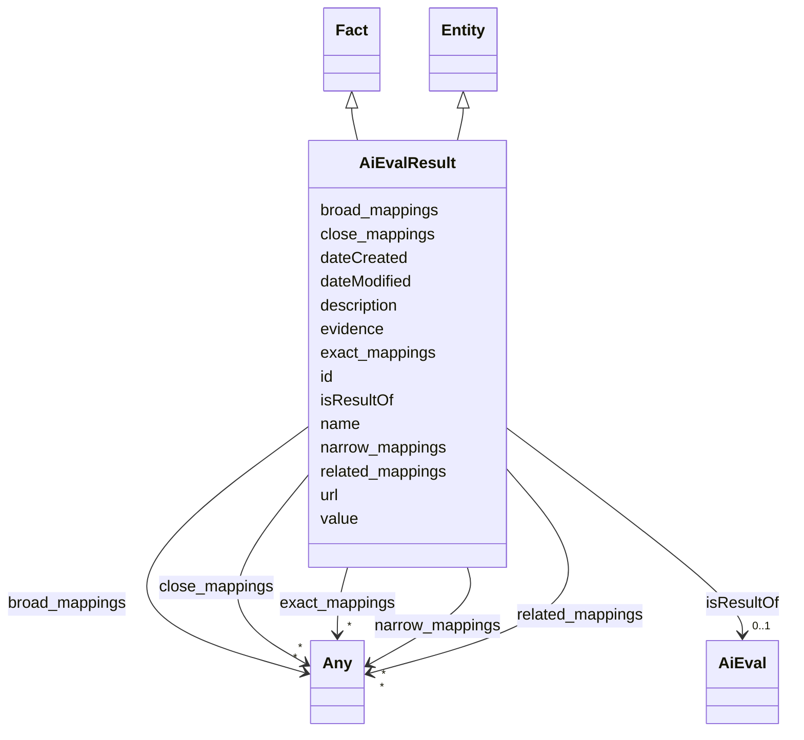

# Class: AiEvalResult


_The result of an evaluation for a specific AI model._


URI: [dqv:QualityMeasurement](https://www.w3.org/TR/vocab-dqv/QualityMeasurement)





## Inheritance
* [Entity](Entity.md)
    * **AiEvalResult** [ [Fact](Fact.md)]


## Slots

| Name | Cardinality and Range | Description | Inheritance |
| ---  | --- | --- | --- |
| [isResultOf](isResultOf.md) | 0..1 <br/> [AiEval](AiEval.md) | A relationship indicating that an entity is the result of an AI evaluation | direct |
| [value](value.md) | 1 <br/> [String](String.md) | Some numeric or string value | [Fact](Fact.md) |
| [evidence](evidence.md) | 0..1 <br/> [String](String.md) | Evidence provides a source (typical a chunk, paragraph or link) describing wh... | [Fact](Fact.md) |
| [id](id.md) | 1 <br/> [String](String.md) | A unique identifier to this instance of the model element | [Entity](Entity.md) |
| [name](name.md) | 0..1 <br/> [String](String.md) | A text name of this instance | [Entity](Entity.md) |
| [description](description.md) | 0..1 <br/> [String](String.md) | The description of an entity | [Entity](Entity.md) |
| [url](url.md) | 0..1 <br/> [Uri](Uri.md) | An optional URL associated with this instance | [Entity](Entity.md) |
| [dateCreated](dateCreated.md) | 0..1 <br/> [Date](Date.md) | The date on which the entity was created | [Entity](Entity.md) |
| [dateModified](dateModified.md) | 0..1 <br/> [Date](Date.md) | The date on which the entity was most recently modified | [Entity](Entity.md) |
| [exact_mappings](exact_mappings.md) | * <br/> [Any](Any.md) | The property is used to link two concepts, indicating a high degree of confid... | [Entity](Entity.md) |
| [close_mappings](close_mappings.md) | * <br/> [Any](Any.md) | The property is used to link two concepts that are sufficiently similar that ... | [Entity](Entity.md) |
| [related_mappings](related_mappings.md) | * <br/> [Any](Any.md) | The property skos:relatedMatch is used to state an associative mapping link b... | [Entity](Entity.md) |
| [narrow_mappings](narrow_mappings.md) | * <br/> [Any](Any.md) | The property is used to state a hierarchical mapping link between two concept... | [Entity](Entity.md) |
| [broad_mappings](broad_mappings.md) | * <br/> [Any](Any.md) | The property is used to state a hierarchical mapping link between two concept... | [Entity](Entity.md) |


## Usages

| used by | used in | type | used |
| ---  | --- | --- | --- |
| [Container](Container.md) | [aievalresults](aievalresults.md) | range | [AiEvalResult](AiEvalResult.md) |
| [AiModel](AiModel.md) | [hasEvaluation](hasEvaluation.md) | range | [AiEvalResult](AiEvalResult.md) |
| [LargeLanguageModel](LargeLanguageModel.md) | [hasEvaluation](hasEvaluation.md) | range | [AiEvalResult](AiEvalResult.md) |
| [Adapter](Adapter.md) | [hasEvaluation](hasEvaluation.md) | range | [AiEvalResult](AiEvalResult.md) |


## Identifier and Mapping Information


### Schema Source


* from schema: https://ibm.github.io/ai-atlas-nexus/ontology/ai-risk-ontology


## Mappings

| Mapping Type | Mapped Value |
| ---  | ---  |
| self | dqv:QualityMeasurement |
| native | nexus:AiEvalResult |


## LinkML Source

<!-- TODO: investigate https://stackoverflow.com/questions/37606292/how-to-create-tabbed-code-blocks-in-mkdocs-or-sphinx -->

### Direct

<details>
```yaml
name: AiEvalResult
description: The result of an evaluation for a specific AI model.
from_schema: https://ibm.github.io/ai-atlas-nexus/ontology/ai-risk-ontology
is_a: Entity
mixins:
- Fact
slots:
- isResultOf
class_uri: dqv:QualityMeasurement

```
</details>

### Induced

<details>
```yaml
name: AiEvalResult
description: The result of an evaluation for a specific AI model.
from_schema: https://ibm.github.io/ai-atlas-nexus/ontology/ai-risk-ontology
is_a: Entity
mixins:
- Fact
attributes:
  isResultOf:
    name: isResultOf
    description: A relationship indicating that an entity is the result of an AI evaluation.
    from_schema: https://ibm.github.io/ai-atlas-nexus/ontology/ai-risk-ontology
    rank: 1000
    slot_uri: dqv:isMeasurementOf
    alias: isResultOf
    owner: AiEvalResult
    domain_of:
    - AiEvalResult
    range: AiEval
    multivalued: false
    inlined: false
  value:
    name: value
    description: Some numeric or string value
    from_schema: https://ibm.github.io/ai-atlas-nexus/ontology/ai-risk-ontology
    rank: 1000
    alias: value
    owner: AiEvalResult
    domain_of:
    - Fact
    range: string
    required: true
  evidence:
    name: evidence
    description: Evidence provides a source (typical a chunk, paragraph or link) describing
      where some value was found or how it was generated.
    from_schema: https://ibm.github.io/ai-atlas-nexus/ontology/ai-risk-ontology
    rank: 1000
    alias: evidence
    owner: AiEvalResult
    domain_of:
    - Fact
    range: string
  id:
    name: id
    description: A unique identifier to this instance of the model element. Example
      identifiers include UUID, URI, URN, etc.
    from_schema: https://ibm.github.io/ai-atlas-nexus/ontology/ai-risk-ontology
    rank: 1000
    slot_uri: schema:identifier
    identifier: true
    alias: id
    owner: AiEvalResult
    domain_of:
    - Entity
    range: string
    required: true
  name:
    name: name
    description: A text name of this instance.
    from_schema: https://ibm.github.io/ai-atlas-nexus/ontology/ai-risk-ontology
    rank: 1000
    slot_uri: schema:name
    alias: name
    owner: AiEvalResult
    domain_of:
    - Entity
    - BenchmarkMetadataCard
    range: string
  description:
    name: description
    description: The description of an entity
    from_schema: https://ibm.github.io/ai-atlas-nexus/ontology/ai-risk-ontology
    rank: 1000
    slot_uri: schema:description
    alias: description
    owner: AiEvalResult
    domain_of:
    - Entity
    range: string
  url:
    name: url
    description: An optional URL associated with this instance.
    from_schema: https://ibm.github.io/ai-atlas-nexus/ontology/ai-risk-ontology
    rank: 1000
    slot_uri: schema:url
    alias: url
    owner: AiEvalResult
    domain_of:
    - Entity
    range: uri
  dateCreated:
    name: dateCreated
    description: The date on which the entity was created.
    from_schema: https://ibm.github.io/ai-atlas-nexus/ontology/ai-risk-ontology
    rank: 1000
    slot_uri: schema:dateCreated
    alias: dateCreated
    owner: AiEvalResult
    domain_of:
    - Entity
    range: date
    required: false
  dateModified:
    name: dateModified
    description: The date on which the entity was most recently modified.
    from_schema: https://ibm.github.io/ai-atlas-nexus/ontology/ai-risk-ontology
    rank: 1000
    slot_uri: schema:dateModified
    alias: dateModified
    owner: AiEvalResult
    domain_of:
    - Entity
    range: date
    required: false
  exact_mappings:
    name: exact_mappings
    description: The property is used to link two concepts, indicating a high degree
      of confidence that the concepts can be used interchangeably across a wide range
      of information retrieval applications
    from_schema: https://ibm.github.io/ai-atlas-nexus/ontology/ai-risk-ontology
    rank: 1000
    slot_uri: skos:exactMatch
    alias: exact_mappings
    owner: AiEvalResult
    domain_of:
    - Entity
    range: Any
    multivalued: true
    inlined: false
  close_mappings:
    name: close_mappings
    description: The property is used to link two concepts that are sufficiently similar
      that they can be used interchangeably in some information retrieval applications.
    from_schema: https://ibm.github.io/ai-atlas-nexus/ontology/ai-risk-ontology
    rank: 1000
    slot_uri: skos:closeMatch
    alias: close_mappings
    owner: AiEvalResult
    domain_of:
    - Entity
    range: Any
    multivalued: true
    inlined: false
  related_mappings:
    name: related_mappings
    description: The property skos:relatedMatch is used to state an associative mapping
      link between two concepts.
    from_schema: https://ibm.github.io/ai-atlas-nexus/ontology/ai-risk-ontology
    rank: 1000
    slot_uri: skos:relatedMatch
    alias: related_mappings
    owner: AiEvalResult
    domain_of:
    - Entity
    range: Any
    multivalued: true
    inlined: false
  narrow_mappings:
    name: narrow_mappings
    description: The property is used to state a hierarchical mapping link between
      two concepts, indicating that the concept linked to, is a narrower concept than
      the originating concept.
    from_schema: https://ibm.github.io/ai-atlas-nexus/ontology/ai-risk-ontology
    rank: 1000
    slot_uri: skos:narrowMatch
    alias: narrow_mappings
    owner: AiEvalResult
    domain_of:
    - Entity
    range: Any
    multivalued: true
    inlined: false
  broad_mappings:
    name: broad_mappings
    description: The property is used to state a hierarchical mapping link between
      two concepts, indicating that the concept linked to, is a broader concept than
      the originating concept.
    from_schema: https://ibm.github.io/ai-atlas-nexus/ontology/ai-risk-ontology
    rank: 1000
    slot_uri: skos:broadMatch
    alias: broad_mappings
    owner: AiEvalResult
    domain_of:
    - Entity
    range: Any
    multivalued: true
    inlined: false
class_uri: dqv:QualityMeasurement

```
</details>
