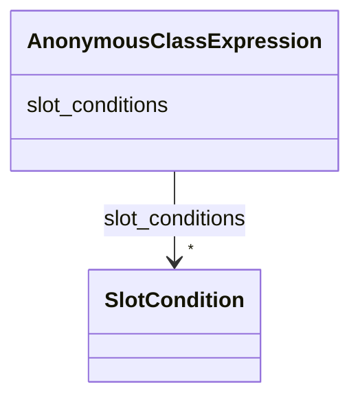

---
search:
  boost: 10.0
---

# Class: AnonymousClassExpression

<div data-search-exclude markdown="1">

URI: [nexus:AnonymousClassExpression](https://w3id.org/ai-atlas-nexus/AnonymousClassExpression)



<!-- no inheritance hierarchy -->

## Slots

| Name                                  | Cardinality and Range                      | Description                                    | Inheritance |
| ------------------------------------- | ------------------------------------------ | ---------------------------------------------- | ----------- |
| [slot_conditions](slot_conditions.md) | \* <br/> [SlotCondition](SlotCondition.md) | List of slot conditions that must be satisfied | direct      |

## Usages

| used by                                             | used in                             | type  | used                                                    |
| --------------------------------------------------- | ----------------------------------- | ----- | ------------------------------------------------------- |
| [AttributeConditionRule](AttributeConditionRule.md) | [preconditions](preconditions.md)   | range | [AnonymousClassExpression](AnonymousClassExpression.md) |
| [AttributeConditionRule](AttributeConditionRule.md) | [postconditions](postconditions.md) | range | [AnonymousClassExpression](AnonymousClassExpression.md) |

## Identifier and Mapping Information

### Schema Source

- from schema: https://w3id.org/ai-atlas-nexus/ai-risk-ontology

## Mappings

| Mapping Type | Mapped Value                   |
| ------------ | ------------------------------ |
| self         | nexus:AnonymousClassExpression |
| native       | nexus:AnonymousClassExpression |

## LinkML Source

<!-- TODO: investigate https://stackoverflow.com/questions/37606292/how-to-create-tabbed-code-blocks-in-mkdocs-or-sphinx -->

### Direct

<details>
```yaml
name: AnonymousClassExpression
from_schema: https://w3id.org/ai-atlas-nexus/ai-risk-ontology
attributes:
  slot_conditions:
    name: slot_conditions
    description: List of slot conditions that must be satisfied.
    from_schema: https://w3id.org/ai-atlas-nexus/common
    rank: 1000
    domain_of:
    - AnonymousClassExpression
    range: SlotCondition
    multivalued: true
    inlined_as_list: true

````
</details>

### Induced

<details>
```yaml
name: AnonymousClassExpression
from_schema: https://w3id.org/ai-atlas-nexus/ai-risk-ontology
attributes:
  slot_conditions:
    name: slot_conditions
    description: List of slot conditions that must be satisfied.
    from_schema: https://w3id.org/ai-atlas-nexus/common
    rank: 1000
    owner: AnonymousClassExpression
    domain_of:
    - AnonymousClassExpression
    range: SlotCondition
    multivalued: true
    inlined: true
    inlined_as_list: true

````

</details></div>
