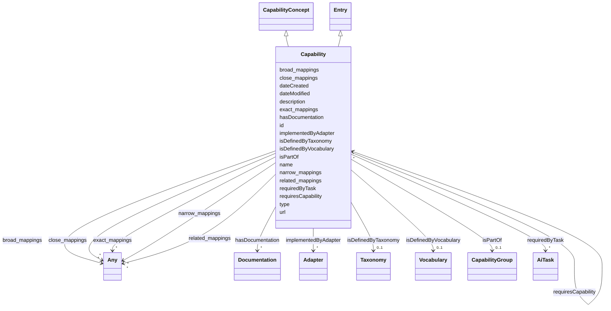

# Class: Capability

_A specific AI capability or ability, such as reading comprehension, logical reasoning, or code generation. Aligned with the W3C DPV AI extension dpv-ai:Capability, representing what an AI technology is capable of achieving or providing._

_Capabilities are distinct from: (1) the intended purpose for which the technology is designed, (2) the actual tasks performed in a specific deployment context, and (3) the technical implementation mechanisms (intrinsics, adapters) that enable the capability._

URI: [ai:Capability](https://w3id.org/dpv/ai#Capability)



## Inheritance

- [Entity](Entity.md)
  - [Entry](Entry.md)
    - **Capability** [ [CapabilityConcept](CapabilityConcept.md)]

## Slots

| Name                                              | Cardinality and Range                            | Description                                                                      | Inheritance                              |
| ------------------------------------------------- | ------------------------------------------------ | -------------------------------------------------------------------------------- | ---------------------------------------- |
| [requiredByTask](requiredByTask.md)               | \* <br/> [AiTask](AiTask.md)                     | Indicates that this capability is required to perform a specific AI task         | direct                                   |
| [implementedByAdapter](implementedByAdapter.md)   | \* <br/> [Adapter](Adapter.md)                   | Indicates that this capability is implemented by a specific adapter              | direct                                   |
| [isDefinedByTaxonomy](isDefinedByTaxonomy.md)     | 0..1 <br/> [Taxonomy](Taxonomy.md)               | A relationship where a concept or a concept group is defined by a taxonomy       | [Concept](Concept.md), [Entry](Entry.md) |
| [isDefinedByVocabulary](isDefinedByVocabulary.md) | 0..1 <br/> [Vocabulary](Vocabulary.md)           | A relationship where a term or a term group is defined by a vocabulary           | [Entry](Entry.md)                        |
| [hasDocumentation](hasDocumentation.md)           | \* <br/> [Documentation](Documentation.md)       | Indicates documentation associated with an entity                                | [Concept](Concept.md), [Entry](Entry.md) |
| [isPartOf](isPartOf.md)                           | 0..1 <br/> [CapabilityGroup](CapabilityGroup.md) | A relationship where a capability is part of a capability group                  | [Entry](Entry.md)                        |
| [requiresCapability](requiresCapability.md)       | \* <br/> [Capability](Capability.md)             | Indicates that this entry requires a specific capability                         | [Entry](Entry.md)                        |
| [type](type.md)                                   | 0..1 <br/> [String](String.md)                   |                                                                                  | [Concept](Concept.md), [Entry](Entry.md) |
| [id](id.md)                                       | 1 <br/> [String](String.md)                      | A unique identifier to this instance of the model element                        | [Entity](Entity.md)                      |
| [name](name.md)                                   | 0..1 <br/> [String](String.md)                   | A text name of this instance                                                     | [Entity](Entity.md)                      |
| [description](description.md)                     | 0..1 <br/> [String](String.md)                   | The description of an entity                                                     | [Entity](Entity.md)                      |
| [url](url.md)                                     | 0..1 <br/> [Uri](Uri.md)                         | An optional URL associated with this instance                                    | [Entity](Entity.md)                      |
| [dateCreated](dateCreated.md)                     | 0..1 <br/> [Date](Date.md)                       | The date on which the entity was created                                         | [Entity](Entity.md)                      |
| [dateModified](dateModified.md)                   | 0..1 <br/> [Date](Date.md)                       | The date on which the entity was most recently modified                          | [Entity](Entity.md)                      |
| [exact_mappings](exact_mappings.md)               | \* <br/> [Any](Any.md)                           | The property is used to link two concepts, indicating a high degree of confid... | [Entity](Entity.md)                      |
| [close_mappings](close_mappings.md)               | \* <br/> [Any](Any.md)                           | The property is used to link two concepts that are sufficiently similar that ... | [Entity](Entity.md)                      |
| [related_mappings](related_mappings.md)           | \* <br/> [Any](Any.md)                           | The property skos:relatedMatch is used to state an associative mapping link b... | [Entity](Entity.md)                      |
| [narrow_mappings](narrow_mappings.md)             | \* <br/> [Any](Any.md)                           | The property is used to state a hierarchical mapping link between two concept... | [Entity](Entity.md)                      |
| [broad_mappings](broad_mappings.md)               | \* <br/> [Any](Any.md)                           | The property is used to state a hierarchical mapping link between two concept... | [Entity](Entity.md)                      |

## Usages

| used by                                     | used in                                         | type   | used                        |
| ------------------------------------------- | ----------------------------------------------- | ------ | --------------------------- |
| [Entry](Entry.md)                           | [requiresCapability](requiresCapability.md)     | range  | [Capability](Capability.md) |
| [Term](Term.md)                             | [requiresCapability](requiresCapability.md)     | range  | [Capability](Capability.md) |
| [Principle](Principle.md)                   | [requiresCapability](requiresCapability.md)     | range  | [Capability](Capability.md) |
| [Risk](Risk.md)                             | [requiresCapability](requiresCapability.md)     | range  | [Capability](Capability.md) |
| [AiSystem](AiSystem.md)                     | [hasCapability](hasCapability.md)               | range  | [Capability](Capability.md) |
| [AiAgent](AiAgent.md)                       | [hasCapability](hasCapability.md)               | range  | [Capability](Capability.md) |
| [LargeLanguageModel](LargeLanguageModel.md) | [requiresCapability](requiresCapability.md)     | range  | [Capability](Capability.md) |
| [AiTask](AiTask.md)                         | [requiresCapability](requiresCapability.md)     | range  | [Capability](Capability.md) |
| [CapabilityGroup](CapabilityGroup.md)       | [hasPart](hasPart.md)                           | range  | [Capability](Capability.md) |
| [Capability](Capability.md)                 | [implementedByAdapter](implementedByAdapter.md) | domain | [Capability](Capability.md) |
| [Capability](Capability.md)                 | [requiresCapability](requiresCapability.md)     | range  | [Capability](Capability.md) |
| [Adapter](Adapter.md)                       | [implementsCapability](implementsCapability.md) | range  | [Capability](Capability.md) |
| [Adapter](Adapter.md)                       | [hasCapability](hasCapability.md)               | range  | [Capability](Capability.md) |
| [Adapter](Adapter.md)                       | [requiresCapability](requiresCapability.md)     | range  | [Capability](Capability.md) |
| [LLMIntrinsic](LLMIntrinsic.md)             | [hasCapability](hasCapability.md)               | range  | [Capability](Capability.md) |
| [LLMIntrinsic](LLMIntrinsic.md)             | [requiresCapability](requiresCapability.md)     | range  | [Capability](Capability.md) |

## Identifier and Mapping Information

### Schema Source

- from schema: https://ibm.github.io/ai-atlas-nexus/ontology/ai-risk-ontology

## Mappings

| Mapping Type | Mapped Value     |
| ------------ | ---------------- |
| self         | ai:Capability    |
| native       | nexus:Capability |
| broad        | tech:Capability  |

## LinkML Source

<!-- TODO: investigate https://stackoverflow.com/questions/37606292/how-to-create-tabbed-code-blocks-in-mkdocs-or-sphinx -->

### Direct

<details>
```yaml
name: Capability
description: 'A specific AI capability or ability, such as reading comprehension,
  logical reasoning, or code generation. Aligned with the W3C DPV AI extension dpv-ai:Capability,
  representing what an AI technology is capable of achieving or providing.

Capabilities are distinct from: (1) the intended purpose for which the technology
is designed, (2) the actual tasks performed in a specific deployment context, and
(3) the technical implementation mechanisms (intrinsics, adapters) that enable the
capability.'
from_schema: https://ibm.github.io/ai-atlas-nexus/ontology/ai-risk-ontology
broad_mappings:

- tech:Capability
  is_a: Entry
  mixins:
- CapabilityConcept
  slots:
- requiredByTask
- implementedByAdapter
  slot_usage:
  isPartOf:
  name: isPartOf
  description: A relationship where a capability is part of a capability group
  range: CapabilityGroup
  requiredByTask:
  name: requiredByTask
  description: Indicates that this capability is required to perform a specific
  AI task. This links abstract capabilities (technical abilities) to concrete
  tasks (application-level operations). An AI system with this capability can
  perform tasks that require it.
  range: AiTask
  implementedByAdapter:
  name: implementedByAdapter
  description: Indicates that this capability is implemented by a specific adapter.
  This relationship distinguishes the abstract capability (what can be done) from
  the technical implementation mechanism (how it is added/extended via adapters).
  domain: Capability
  range: Adapter
  class_uri: ai:Capability

````
</details>

### Induced

<details>
```yaml
name: Capability
description: 'A specific AI capability or ability, such as reading comprehension,
  logical reasoning, or code generation. Aligned with the W3C DPV AI extension dpv-ai:Capability,
  representing what an AI technology is capable of achieving or providing.

  Capabilities are distinct from: (1) the intended purpose for which the technology
  is designed, (2) the actual tasks performed in a specific deployment context, and
  (3) the technical implementation mechanisms (intrinsics, adapters) that enable the
  capability.'
from_schema: https://ibm.github.io/ai-atlas-nexus/ontology/ai-risk-ontology
broad_mappings:
- tech:Capability
is_a: Entry
mixins:
- CapabilityConcept
slot_usage:
  isPartOf:
    name: isPartOf
    description: A relationship where a capability is part of a capability group
    range: CapabilityGroup
  requiredByTask:
    name: requiredByTask
    description: Indicates that this capability is required to perform a specific
      AI task. This links abstract capabilities (technical abilities) to concrete
      tasks (application-level operations). An AI system with this capability can
      perform tasks that require it.
    range: AiTask
  implementedByAdapter:
    name: implementedByAdapter
    description: Indicates that this capability is implemented by a specific adapter.
      This relationship distinguishes the abstract capability (what can be done) from
      the technical implementation mechanism (how it is added/extended via adapters).
    domain: Capability
    range: Adapter
attributes:
  requiredByTask:
    name: requiredByTask
    description: Indicates that this capability is required to perform a specific
      AI task. This links abstract capabilities (technical abilities) to concrete
      tasks (application-level operations). An AI system with this capability can
      perform tasks that require it.
    from_schema: https://ibm.github.io/ai-atlas-nexus/ontology/ai-risk-ontology
    rank: 1000
    alias: requiredByTask
    owner: Capability
    domain_of:
    - Entry
    - Capability
    inverse: requiresCapability
    range: AiTask
    multivalued: true
    inlined: false
  implementedByAdapter:
    name: implementedByAdapter
    description: Indicates that this capability is implemented by a specific adapter.
      This relationship distinguishes the abstract capability (what can be done) from
      the technical implementation mechanism (how it is added/extended via adapters).
    from_schema: https://ibm.github.io/ai-atlas-nexus/ontology/ai-risk-ontology
    rank: 1000
    domain: Capability
    alias: implementedByAdapter
    owner: Capability
    domain_of:
    - Entry
    - Capability
    inverse: implementsCapability
    range: Adapter
    multivalued: true
    inlined: false
  isDefinedByTaxonomy:
    name: isDefinedByTaxonomy
    description: A relationship where a concept or a concept group is defined by a
      taxonomy
    from_schema: https://ibm.github.io/ai-atlas-nexus/ontology/ai-risk-ontology
    rank: 1000
    slot_uri: schema:isPartOf
    alias: isDefinedByTaxonomy
    owner: Capability
    domain_of:
    - Concept
    - Control
    - Group
    - Entry
    - Policy
    - RiskGroup
    - Risk
    - RiskControl
    - Action
    - RiskIncident
    - CapabilityGroup
    - StakeholderGroup
    - Stakeholder
    range: Taxonomy
  isDefinedByVocabulary:
    name: isDefinedByVocabulary
    description: A relationship where a term or a term group is defined by a vocabulary
    from_schema: https://ibm.github.io/ai-atlas-nexus/ontology/ai-risk-ontology
    rank: 1000
    slot_uri: schema:isPartOf
    alias: isDefinedByVocabulary
    owner: Capability
    domain_of:
    - Entry
    - Term
    - Adapter
    - LLMIntrinsic
    range: Vocabulary
  hasDocumentation:
    name: hasDocumentation
    description: Indicates documentation associated with an entity.
    from_schema: https://ibm.github.io/ai-atlas-nexus/ontology/ai-risk-ontology
    rank: 1000
    slot_uri: airo:hasDocumentation
    alias: hasDocumentation
    owner: Capability
    domain_of:
    - Dataset
    - Vocabulary
    - Taxonomy
    - Concept
    - Group
    - Entry
    - Term
    - Principle
    - RiskTaxonomy
    - Action
    - BaseAi
    - LargeLanguageModelFamily
    - AiEval
    - BenchmarkMetadataCard
    - Adapter
    - LLMIntrinsic
    range: Documentation
    multivalued: true
    inlined: false
  isPartOf:
    name: isPartOf
    description: A relationship where a capability is part of a capability group
    from_schema: https://ibm.github.io/ai-atlas-nexus/ontology/ai-risk-ontology
    rank: 1000
    slot_uri: schema:isPartOf
    alias: isPartOf
    owner: Capability
    domain_of:
    - Entry
    - Risk
    - LargeLanguageModel
    - CapabilityGroup
    - Stakeholder
    range: CapabilityGroup
  requiresCapability:
    name: requiresCapability
    description: Indicates that this entry requires a specific capability
    from_schema: https://ibm.github.io/ai-atlas-nexus/ontology/ai-risk-ontology
    rank: 1000
    domain: Any
    alias: requiresCapability
    owner: Capability
    domain_of:
    - Entry
    - LargeLanguageModel
    - AiTask
    - Adapter
    inverse: requiredByTask
    range: Capability
    multivalued: true
    inlined: false
  type:
    name: type
    from_schema: https://ibm.github.io/ai-atlas-nexus/ontology/common
    designates_type: true
    alias: type
    owner: Capability
    domain_of:
    - Vocabulary
    - Taxonomy
    - Concept
    - Control
    - Group
    - Entry
    - Policy
    range: string
  id:
    name: id
    description: A unique identifier to this instance of the model element. Example
      identifiers include UUID, URI, URN, etc.
    from_schema: https://ibm.github.io/ai-atlas-nexus/ontology/ai-risk-ontology
    rank: 1000
    slot_uri: schema:identifier
    identifier: true
    alias: id
    owner: Capability
    domain_of:
    - Entity
    range: string
    required: true
  name:
    name: name
    description: A text name of this instance.
    from_schema: https://ibm.github.io/ai-atlas-nexus/ontology/ai-risk-ontology
    rank: 1000
    slot_uri: schema:name
    alias: name
    owner: Capability
    domain_of:
    - Entity
    - BenchmarkMetadataCard
    range: string
  description:
    name: description
    description: The description of an entity
    from_schema: https://ibm.github.io/ai-atlas-nexus/ontology/ai-risk-ontology
    rank: 1000
    slot_uri: schema:description
    alias: description
    owner: Capability
    domain_of:
    - Entity
    range: string
  url:
    name: url
    description: An optional URL associated with this instance.
    from_schema: https://ibm.github.io/ai-atlas-nexus/ontology/ai-risk-ontology
    rank: 1000
    slot_uri: schema:url
    alias: url
    owner: Capability
    domain_of:
    - Entity
    range: uri
  dateCreated:
    name: dateCreated
    description: The date on which the entity was created.
    from_schema: https://ibm.github.io/ai-atlas-nexus/ontology/ai-risk-ontology
    rank: 1000
    slot_uri: schema:dateCreated
    alias: dateCreated
    owner: Capability
    domain_of:
    - Entity
    range: date
    required: false
  dateModified:
    name: dateModified
    description: The date on which the entity was most recently modified.
    from_schema: https://ibm.github.io/ai-atlas-nexus/ontology/ai-risk-ontology
    rank: 1000
    slot_uri: schema:dateModified
    alias: dateModified
    owner: Capability
    domain_of:
    - Entity
    range: date
    required: false
  exact_mappings:
    name: exact_mappings
    description: The property is used to link two concepts, indicating a high degree
      of confidence that the concepts can be used interchangeably across a wide range
      of information retrieval applications
    from_schema: https://ibm.github.io/ai-atlas-nexus/ontology/ai-risk-ontology
    rank: 1000
    slot_uri: skos:exactMatch
    alias: exact_mappings
    owner: Capability
    domain_of:
    - Entity
    range: Any
    multivalued: true
    inlined: false
  close_mappings:
    name: close_mappings
    description: The property is used to link two concepts that are sufficiently similar
      that they can be used interchangeably in some information retrieval applications.
    from_schema: https://ibm.github.io/ai-atlas-nexus/ontology/ai-risk-ontology
    rank: 1000
    slot_uri: skos:closeMatch
    alias: close_mappings
    owner: Capability
    domain_of:
    - Entity
    range: Any
    multivalued: true
    inlined: false
  related_mappings:
    name: related_mappings
    description: The property skos:relatedMatch is used to state an associative mapping
      link between two concepts.
    from_schema: https://ibm.github.io/ai-atlas-nexus/ontology/ai-risk-ontology
    rank: 1000
    slot_uri: skos:relatedMatch
    alias: related_mappings
    owner: Capability
    domain_of:
    - Entity
    range: Any
    multivalued: true
    inlined: false
  narrow_mappings:
    name: narrow_mappings
    description: The property is used to state a hierarchical mapping link between
      two concepts, indicating that the concept linked to, is a narrower concept than
      the originating concept.
    from_schema: https://ibm.github.io/ai-atlas-nexus/ontology/ai-risk-ontology
    rank: 1000
    slot_uri: skos:narrowMatch
    alias: narrow_mappings
    owner: Capability
    domain_of:
    - Entity
    range: Any
    multivalued: true
    inlined: false
  broad_mappings:
    name: broad_mappings
    description: The property is used to state a hierarchical mapping link between
      two concepts, indicating that the concept linked to, is a broader concept than
      the originating concept.
    from_schema: https://ibm.github.io/ai-atlas-nexus/ontology/ai-risk-ontology
    rank: 1000
    slot_uri: skos:broadMatch
    alias: broad_mappings
    owner: Capability
    domain_of:
    - Entity
    range: Any
    multivalued: true
    inlined: false
class_uri: ai:Capability

````

</details>
