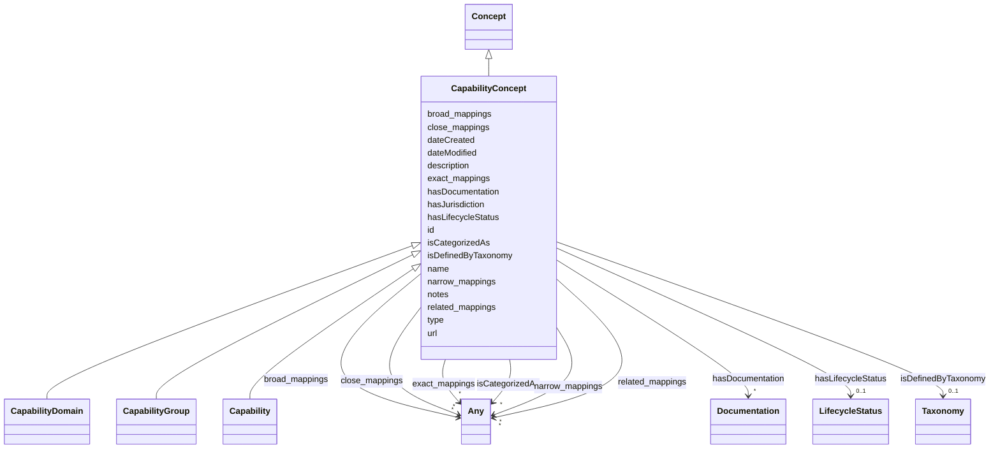

---
search:
  boost: 10.0
---

# Class: CapabilityConcept

_An umbrella term for referring to capability domains, groups, and individual capabilities._

<div data-search-exclude markdown="1">

URI: [nexus:CapabilityConcept](https://w3id.org/ai-atlas-nexus/CapabilityConcept)



## Inheritance

- [Entity](Entity.md)
  - [Concept](Concept.md)
    - **CapabilityConcept**

## Class Properties

| Property  | Value                                                                        |
| --------- | ---------------------------------------------------------------------------- |
| Class URI | [nexus:CapabilityConcept](https://w3id.org/ai-atlas-nexus/CapabilityConcept) |
| Mixin     | Yes                                                                          |

## Slots

| Name                                          | Cardinality and Range                                                                                                                                                                                                                 | Description                                                                      | Inheritance           |
| --------------------------------------------- | ------------------------------------------------------------------------------------------------------------------------------------------------------------------------------------------------------------------------------------- | -------------------------------------------------------------------------------- | --------------------- |
| [isDefinedByTaxonomy](isDefinedByTaxonomy.md) | 0..1 <br/> [Taxonomy](Taxonomy.md)                                                                                                                                                                                                    | A relationship where a concept or a concept group is defined by a taxonomy       | [Concept](Concept.md) |
| [hasDocumentation](hasDocumentation.md)       | \* <br/> [Documentation](Documentation.md)                                                                                                                                                                                            | Indicates documentation associated with an entity                                | [Concept](Concept.md) |
| [hasJurisdiction](hasJurisdiction.md)         | \* <br/> [Jurisdiction](Jurisdiction.md)&nbsp;or&nbsp;<br />[String](String.md)&nbsp;or&nbsp;<br />[SubnationalJurisdiction](SubnationalJurisdiction.md)&nbsp;or&nbsp;<br />[SupraNationalJurisdiction](SupraNationalJurisdiction.md) | The legal or regulatory jurisdiction(s) applicable to an AI system, policy, r... | [Concept](Concept.md) |
| [type](type.md)                               | 0..1 <br/> [String](String.md)                                                                                                                                                                                                        | The type or class designation of this entity instance                            | [Concept](Concept.md) |
| [id](id.md)                                   | 1 <br/> [String](String.md)                                                                                                                                                                                                           | A unique identifier to this instance of the model element                        | [Entity](Entity.md)   |
| [name](name.md)                               | 0..1 <br/> [String](String.md)                                                                                                                                                                                                        | A text name of this instance                                                     | [Entity](Entity.md)   |
| [description](description.md)                 | 0..1 <br/> [String](String.md)                                                                                                                                                                                                        | The description of an entity                                                     | [Entity](Entity.md)   |
| [url](url.md)                                 | 0..1 <br/> [Uri](Uri.md)                                                                                                                                                                                                              | An optional URL associated with this instance                                    | [Entity](Entity.md)   |
| [dateCreated](dateCreated.md)                 | 0..1 <br/> [Date](Date.md)                                                                                                                                                                                                            | The date on which the entity was created                                         | [Entity](Entity.md)   |
| [dateModified](dateModified.md)               | 0..1 <br/> [Date](Date.md)                                                                                                                                                                                                            | The date on which the entity was most recently modified                          | [Entity](Entity.md)   |
| [exact_mappings](exact_mappings.md)           | \* <br/> [Any](Any.md)                                                                                                                                                                                                                | The property is used to link two concepts, indicating a high degree of confid... | [Entity](Entity.md)   |
| [close_mappings](close_mappings.md)           | \* <br/> [Any](Any.md)                                                                                                                                                                                                                | The property is used to link two concepts that are sufficiently similar that ... | [Entity](Entity.md)   |
| [related_mappings](related_mappings.md)       | \* <br/> [Any](Any.md)                                                                                                                                                                                                                | The property skos:relatedMatch is used to state an associative mapping link b... | [Entity](Entity.md)   |
| [narrow_mappings](narrow_mappings.md)         | \* <br/> [Any](Any.md)                                                                                                                                                                                                                | The property is used to state a hierarchical mapping link between two concept... | [Entity](Entity.md)   |
| [broad_mappings](broad_mappings.md)           | \* <br/> [Any](Any.md)                                                                                                                                                                                                                | The property is used to state a hierarchical mapping link between two concept... | [Entity](Entity.md)   |
| [isCategorizedAs](isCategorizedAs.md)         | \* <br/> [Any](Any.md)                                                                                                                                                                                                                | A relationship where an entity has been deemed to be categorized                 | [Entity](Entity.md)   |
| [hasLifecycleStatus](hasLifecycleStatus.md)   | 0..1 <br/> [LifecycleStatus](LifecycleStatus.md)                                                                                                                                                                                      | The editorial / publication lifecycle state of this entity                       | [Entity](Entity.md)   |
| [notes](notes.md)                             | \* <br/> [String](String.md)                                                                                                                                                                                                          | Free-text editorial notes, source breadcrumbs, or build-time provenance that ... | [Entity](Entity.md)   |

## Mixin Usage

| mixed into                              | description                                                                      |
| --------------------------------------- | -------------------------------------------------------------------------------- |
| [CapabilityDomain](CapabilityDomain.md) | A high-level domain of AI capabilities (e                                        |
| [CapabilityGroup](CapabilityGroup.md)   | A group of AI capabilities that are part of a capability taxonomy, organized ... |
| [Capability](Capability.md)             | A specific AI capability or ability, such as reading comprehension, logical r... |

## Identifier and Mapping Information

### Schema Source

- from schema: https://w3id.org/ai-atlas-nexus/ai-risk-ontology

## Mappings

| Mapping Type | Mapped Value            |
| ------------ | ----------------------- |
| self         | nexus:CapabilityConcept |
| native       | nexus:CapabilityConcept |

## LinkML Source

<!-- TODO: investigate https://stackoverflow.com/questions/37606292/how-to-create-tabbed-code-blocks-in-mkdocs-or-sphinx -->

### Direct

<details>
```yaml
name: CapabilityConcept
description: An umbrella term for referring to capability domains, groups, and individual
  capabilities.
from_schema: https://w3id.org/ai-atlas-nexus/ai-risk-ontology
is_a: Concept
mixin: true
class_uri: nexus:CapabilityConcept

````
</details>

### Induced

<details>
```yaml
name: CapabilityConcept
description: An umbrella term for referring to capability domains, groups, and individual
  capabilities.
from_schema: https://w3id.org/ai-atlas-nexus/ai-risk-ontology
is_a: Concept
mixin: true
attributes:
  isDefinedByTaxonomy:
    name: isDefinedByTaxonomy
    description: A relationship where a concept or a concept group is defined by a
      taxonomy
    from_schema: https://w3id.org/ai-atlas-nexus/ai-risk-ontology
    rank: 1000
    slot_uri: schema:isPartOf
    alias: isDefinedByTaxonomy
    owner: CapabilityConcept
    domain_of:
    - Concept
    - Control
    - Group
    - Entry
    - Policy
    - Rule
    - RiskControlGroup
    - RiskGroup
    - Risk
    - RiskControl
    - Action
    - RiskIncident
    - CapabilityGroup
    - AiTaskDomain
    - AiTaskGroup
    - Stakeholder
    - StakeholderGroup
    - Requirement
    range: Taxonomy
  hasDocumentation:
    name: hasDocumentation
    description: Indicates documentation associated with an entity.
    from_schema: https://w3id.org/ai-atlas-nexus/ai-risk-ontology
    rank: 1000
    slot_uri: airo:hasDocumentation
    alias: hasDocumentation
    owner: CapabilityConcept
    domain_of:
    - Dataset
    - Vocabulary
    - Taxonomy
    - Concept
    - Group
    - Entry
    - Term
    - Principle
    - RiskTaxonomy
    - RiskControlGroupTaxonomy
    - Action
    - BaseAi
    - LargeLanguageModelFamily
    - AiTaskTaxonomy
    - AiEval
    - EveryEvalAIResult
    - BenchmarkMetadataCard
    - Adapter
    - LLMIntrinsic
    range: Documentation
    multivalued: true
    inlined: false
  hasJurisdiction:
    name: hasJurisdiction
    description: The legal or regulatory jurisdiction(s) applicable to an AI system,
      policy, risk, or obligation. Accepts ISO 3166-1 country codes, supra-national
      bodies, or subnational jurisdictions with distinct regulatory significance.
      Aligns with dpv:hasJurisdiction.
    from_schema: https://w3id.org/ai-atlas-nexus/ai-risk-ontology
    see_also:
    - https://w3id.org/dpv#hasJurisdiction
    rank: 1000
    slot_uri: dpv:hasJurisdiction
    alias: hasJurisdiction
    owner: CapabilityConcept
    domain_of:
    - Concept
    range: string
    multivalued: true
    inlined: false
    any_of:
    - range: Jurisdiction
    - range: SupraNationalJurisdiction
    - range: SubnationalJurisdiction
  type:
    name: type
    description: The type or class designation of this entity instance.
    from_schema: https://w3id.org/ai-atlas-nexus/common
    designates_type: true
    alias: type
    owner: CapabilityConcept
    domain_of:
    - Vocabulary
    - Taxonomy
    - Concept
    - Control
    - Group
    - Entry
    - Policy
    - Rule
    - Permission
    - Prohibition
    - Obligation
    - Recommendation
    - Certification
    - BenchmarkMetadataCard
    - ControlActivity
    - ControlActivityPermission
    - ControlActivityProhibition
    - ControlActivityObligation
    - ControlActivityRecommendation
    - Requirement
    range: string
  id:
    name: id
    description: A unique identifier to this instance of the model element. Example
      identifiers include UUID, URI, URN, etc.
    from_schema: https://w3id.org/ai-atlas-nexus/ai-risk-ontology
    rank: 1000
    slot_uri: schema:identifier
    identifier: true
    alias: id
    owner: CapabilityConcept
    domain_of:
    - Entity
    range: string
    required: true
  name:
    name: name
    description: A text name of this instance.
    from_schema: https://w3id.org/ai-atlas-nexus/ai-risk-ontology
    rank: 1000
    slot_uri: schema:name
    alias: name
    owner: CapabilityConcept
    domain_of:
    - Entity
    - BenchmarkMetadataCard
    range: string
  description:
    name: description
    description: The description of an entity
    from_schema: https://w3id.org/ai-atlas-nexus/ai-risk-ontology
    rank: 1000
    slot_uri: schema:description
    alias: description
    owner: CapabilityConcept
    domain_of:
    - Entity
    range: string
  url:
    name: url
    description: An optional URL associated with this instance.
    from_schema: https://w3id.org/ai-atlas-nexus/ai-risk-ontology
    rank: 1000
    slot_uri: schema:url
    alias: url
    owner: CapabilityConcept
    domain_of:
    - Entity
    range: uri
  dateCreated:
    name: dateCreated
    description: The date on which the entity was created.
    from_schema: https://w3id.org/ai-atlas-nexus/ai-risk-ontology
    rank: 1000
    slot_uri: schema:dateCreated
    alias: dateCreated
    owner: CapabilityConcept
    domain_of:
    - Entity
    range: date
    required: false
  dateModified:
    name: dateModified
    description: The date on which the entity was most recently modified.
    from_schema: https://w3id.org/ai-atlas-nexus/ai-risk-ontology
    rank: 1000
    slot_uri: schema:dateModified
    alias: dateModified
    owner: CapabilityConcept
    domain_of:
    - Entity
    range: date
    required: false
  exact_mappings:
    name: exact_mappings
    description: The property is used to link two concepts, indicating a high degree
      of confidence that the concepts can be used interchangeably across a wide range
      of information retrieval applications
    from_schema: https://w3id.org/ai-atlas-nexus/ai-risk-ontology
    rank: 1000
    slot_uri: skos:exactMatch
    alias: exact_mappings
    owner: CapabilityConcept
    domain_of:
    - Entity
    range: Any
    multivalued: true
    inlined: false
  close_mappings:
    name: close_mappings
    description: The property is used to link two concepts that are sufficiently similar
      that they can be used interchangeably in some information retrieval applications.
    from_schema: https://w3id.org/ai-atlas-nexus/ai-risk-ontology
    rank: 1000
    slot_uri: skos:closeMatch
    alias: close_mappings
    owner: CapabilityConcept
    domain_of:
    - Entity
    range: Any
    multivalued: true
    inlined: false
  related_mappings:
    name: related_mappings
    description: The property skos:relatedMatch is used to state an associative mapping
      link between two concepts.
    from_schema: https://w3id.org/ai-atlas-nexus/ai-risk-ontology
    rank: 1000
    slot_uri: skos:relatedMatch
    alias: related_mappings
    owner: CapabilityConcept
    domain_of:
    - Entity
    range: Any
    multivalued: true
    inlined: false
  narrow_mappings:
    name: narrow_mappings
    description: The property is used to state a hierarchical mapping link between
      two concepts, indicating that the concept linked to, is a narrower concept than
      the originating concept.
    from_schema: https://w3id.org/ai-atlas-nexus/ai-risk-ontology
    rank: 1000
    slot_uri: skos:narrowMatch
    alias: narrow_mappings
    owner: CapabilityConcept
    domain_of:
    - Entity
    range: Any
    multivalued: true
    inlined: false
  broad_mappings:
    name: broad_mappings
    description: The property is used to state a hierarchical mapping link between
      two concepts, indicating that the concept linked to, is a broader concept than
      the originating concept.
    from_schema: https://w3id.org/ai-atlas-nexus/ai-risk-ontology
    rank: 1000
    slot_uri: skos:broadMatch
    alias: broad_mappings
    owner: CapabilityConcept
    domain_of:
    - Entity
    range: Any
    multivalued: true
    inlined: false
  isCategorizedAs:
    name: isCategorizedAs
    description: A relationship where an entity has been deemed to be categorized
    from_schema: https://w3id.org/ai-atlas-nexus/ai-risk-ontology
    rank: 1000
    slot_uri: nexus:isCategorizedAs
    alias: isCategorizedAs
    owner: CapabilityConcept
    domain_of:
    - Entity
    range: Any
    multivalued: true
    inlined: false
  hasLifecycleStatus:
    name: hasLifecycleStatus
    description: The editorial / publication lifecycle state of this entity. Distinct
      from AiLifecyclePhase, which describes an AI system's runtime evolution rather
      than the editorial workflow of a catalogued entry.
    from_schema: https://w3id.org/ai-atlas-nexus/ai-risk-ontology
    aliases:
    - lifecycle_status
    - doc_status
    rank: 1000
    slot_uri: adms:status
    alias: hasLifecycleStatus
    owner: CapabilityConcept
    domain_of:
    - Entity
    range: LifecycleStatus
  notes:
    name: notes
    description: Free-text editorial notes, source breadcrumbs, or build-time provenance
      that do not belong in the user-facing description. Opaque to consumers.
    from_schema: https://w3id.org/ai-atlas-nexus/ai-risk-ontology
    rank: 1000
    slot_uri: skos:note
    alias: notes
    owner: CapabilityConcept
    domain_of:
    - Entity
    range: string
    recommended: false
    multivalued: true
class_uri: nexus:CapabilityConcept

````

</details></div>
