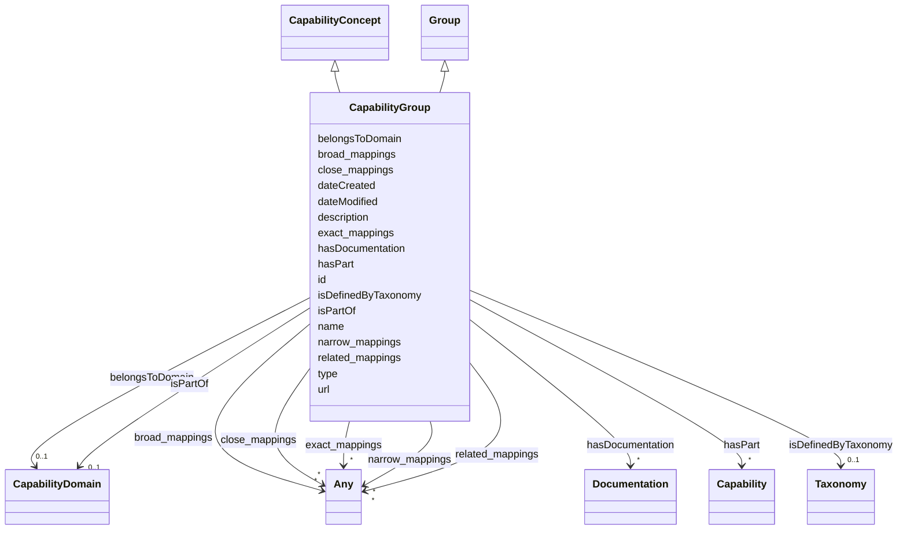

# Class: CapabilityGroup

_A group of AI capabilities that are part of a capability taxonomy, organized under a domain_

URI: [nexus:CapabilityGroup](https://ibm.github.io/ai-atlas-nexus/ontology/CapabilityGroup)



## Inheritance

- [Entity](Entity.md)
  - [Group](Group.md)
    - **CapabilityGroup** [ [CapabilityConcept](CapabilityConcept.md)]

## Slots

| Name                                          | Cardinality and Range                              | Description                                                                      | Inheritance                              |
| --------------------------------------------- | -------------------------------------------------- | -------------------------------------------------------------------------------- | ---------------------------------------- |
| [isDefinedByTaxonomy](isDefinedByTaxonomy.md) | 0..1 <br/> [Taxonomy](Taxonomy.md)                 | A relationship where a concept or a concept group is defined by a taxonomy       | direct                                   |
| [isPartOf](isPartOf.md)                       | 0..1 <br/> [CapabilityDomain](CapabilityDomain.md) | A relationship where a capability group belongs to a capability domain           | direct                                   |
| [hasPart](hasPart.md)                         | \* <br/> [Capability](Capability.md)               | A relationship where a capability group has capabilities                         | direct                                   |
| [belongsToDomain](belongsToDomain.md)         | 0..1 <br/> [CapabilityDomain](CapabilityDomain.md) | A relationship where a capability group belongs to a capability domain           | direct                                   |
| [hasDocumentation](hasDocumentation.md)       | \* <br/> [Documentation](Documentation.md)         | Indicates documentation associated with an entity                                | [Group](Group.md), [Concept](Concept.md) |
| [type](type.md)                               | 0..1 <br/> [String](String.md)                     |                                                                                  | [Group](Group.md), [Concept](Concept.md) |
| [id](id.md)                                   | 1 <br/> [String](String.md)                        | A unique identifier to this instance of the model element                        | [Entity](Entity.md)                      |
| [name](name.md)                               | 0..1 <br/> [String](String.md)                     | A text name of this instance                                                     | [Entity](Entity.md)                      |
| [description](description.md)                 | 0..1 <br/> [String](String.md)                     | The description of an entity                                                     | [Entity](Entity.md)                      |
| [url](url.md)                                 | 0..1 <br/> [Uri](Uri.md)                           | An optional URL associated with this instance                                    | [Entity](Entity.md)                      |
| [dateCreated](dateCreated.md)                 | 0..1 <br/> [Date](Date.md)                         | The date on which the entity was created                                         | [Entity](Entity.md)                      |
| [dateModified](dateModified.md)               | 0..1 <br/> [Date](Date.md)                         | The date on which the entity was most recently modified                          | [Entity](Entity.md)                      |
| [exact_mappings](exact_mappings.md)           | \* <br/> [Any](Any.md)                             | The property is used to link two concepts, indicating a high degree of confid... | [Entity](Entity.md)                      |
| [close_mappings](close_mappings.md)           | \* <br/> [Any](Any.md)                             | The property is used to link two concepts that are sufficiently similar that ... | [Entity](Entity.md)                      |
| [related_mappings](related_mappings.md)       | \* <br/> [Any](Any.md)                             | The property skos:relatedMatch is used to state an associative mapping link b... | [Entity](Entity.md)                      |
| [narrow_mappings](narrow_mappings.md)         | \* <br/> [Any](Any.md)                             | The property is used to state a hierarchical mapping link between two concept... | [Entity](Entity.md)                      |
| [broad_mappings](broad_mappings.md)           | \* <br/> [Any](Any.md)                             | The property is used to state a hierarchical mapping link between two concept... | [Entity](Entity.md)                      |

## Usages

| used by                                 | used in                 | type  | used                                  |
| --------------------------------------- | ----------------------- | ----- | ------------------------------------- |
| [CapabilityDomain](CapabilityDomain.md) | [hasPart](hasPart.md)   | range | [CapabilityGroup](CapabilityGroup.md) |
| [Capability](Capability.md)             | [isPartOf](isPartOf.md) | range | [CapabilityGroup](CapabilityGroup.md) |

## Identifier and Mapping Information

### Schema Source

- from schema: https://ibm.github.io/ai-atlas-nexus/ontology/ai-risk-ontology

## Mappings

| Mapping Type | Mapped Value          |
| ------------ | --------------------- |
| self         | nexus:CapabilityGroup |
| native       | nexus:CapabilityGroup |

## LinkML Source

<!-- TODO: investigate https://stackoverflow.com/questions/37606292/how-to-create-tabbed-code-blocks-in-mkdocs-or-sphinx -->

### Direct

<details>
```yaml
name: CapabilityGroup
description: A group of AI capabilities that are part of a capability taxonomy, organized
  under a domain
from_schema: https://ibm.github.io/ai-atlas-nexus/ontology/ai-risk-ontology
is_a: Group
mixins:
- CapabilityConcept
slots:
- isDefinedByTaxonomy
- isPartOf
- hasPart
- belongsToDomain
slot_usage:
  hasPart:
    name: hasPart
    description: A relationship where a capability group has capabilities
    range: Capability
  isPartOf:
    name: isPartOf
    description: A relationship where a capability group belongs to a capability domain
    range: CapabilityDomain
  belongsToDomain:
    name: belongsToDomain
    description: A relationship where a capability group belongs to a capability domain
    range: CapabilityDomain

````
</details>

### Induced

<details>
```yaml
name: CapabilityGroup
description: A group of AI capabilities that are part of a capability taxonomy, organized
  under a domain
from_schema: https://ibm.github.io/ai-atlas-nexus/ontology/ai-risk-ontology
is_a: Group
mixins:
- CapabilityConcept
slot_usage:
  hasPart:
    name: hasPart
    description: A relationship where a capability group has capabilities
    range: Capability
  isPartOf:
    name: isPartOf
    description: A relationship where a capability group belongs to a capability domain
    range: CapabilityDomain
  belongsToDomain:
    name: belongsToDomain
    description: A relationship where a capability group belongs to a capability domain
    range: CapabilityDomain
attributes:
  isDefinedByTaxonomy:
    name: isDefinedByTaxonomy
    description: A relationship where a concept or a concept group is defined by a
      taxonomy
    from_schema: https://ibm.github.io/ai-atlas-nexus/ontology/ai-risk-ontology
    rank: 1000
    slot_uri: schema:isPartOf
    alias: isDefinedByTaxonomy
    owner: CapabilityGroup
    domain_of:
    - Concept
    - Control
    - Group
    - Entry
    - Policy
    - Rule
    - RiskGroup
    - Risk
    - RiskControl
    - Action
    - RiskIncident
    - CapabilityGroup
    - StakeholderGroup
    - Stakeholder
    - Requirement
    range: Taxonomy
  isPartOf:
    name: isPartOf
    description: A relationship where a capability group belongs to a capability domain
    from_schema: https://ibm.github.io/ai-atlas-nexus/ontology/ai-risk-ontology
    rank: 1000
    slot_uri: schema:isPartOf
    alias: isPartOf
    owner: CapabilityGroup
    domain_of:
    - Entry
    - Risk
    - LargeLanguageModel
    - CapabilityGroup
    - Stakeholder
    range: CapabilityDomain
  hasPart:
    name: hasPart
    description: A relationship where a capability group has capabilities
    from_schema: https://ibm.github.io/ai-atlas-nexus/ontology/ai-risk-ontology
    rank: 1000
    slot_uri: skos:member
    alias: hasPart
    owner: CapabilityGroup
    domain_of:
    - Group
    - RiskGroup
    - CapabilityGroup
    range: Capability
    multivalued: true
  belongsToDomain:
    name: belongsToDomain
    description: A relationship where a capability group belongs to a capability domain
    from_schema: https://ibm.github.io/ai-atlas-nexus/ontology/ai-risk-ontology
    rank: 1000
    slot_uri: schema:isPartOf
    alias: belongsToDomain
    owner: CapabilityGroup
    domain_of:
    - Group
    - CapabilityGroup
    range: CapabilityDomain
    multivalued: false
    inlined: false
  hasDocumentation:
    name: hasDocumentation
    description: Indicates documentation associated with an entity.
    from_schema: https://ibm.github.io/ai-atlas-nexus/ontology/ai-risk-ontology
    rank: 1000
    slot_uri: airo:hasDocumentation
    alias: hasDocumentation
    owner: CapabilityGroup
    domain_of:
    - Dataset
    - Vocabulary
    - Taxonomy
    - Concept
    - Group
    - Entry
    - Term
    - Principle
    - RiskTaxonomy
    - Action
    - BaseAi
    - LargeLanguageModelFamily
    - AiEval
    - BenchmarkMetadataCard
    - Adapter
    - LLMIntrinsic
    range: Documentation
    multivalued: true
    inlined: false
  type:
    name: type
    from_schema: https://ibm.github.io/ai-atlas-nexus/ontology/common
    ifabsent: string(Group)
    designates_type: true
    alias: type
    owner: CapabilityGroup
    domain_of:
    - Vocabulary
    - Taxonomy
    - Concept
    - Control
    - Group
    - Entry
    - Policy
    - Rule
    - Permission
    - Prohibition
    - Obligation
    - Recommendation
    - Certification
    - ControlActivity
    - ControlActivityPermission
    - ControlActivityProhibition
    - ControlActivityObligation
    - ControlActivityRecommendation
    - Requirement
    range: string
  id:
    name: id
    description: A unique identifier to this instance of the model element. Example
      identifiers include UUID, URI, URN, etc.
    from_schema: https://ibm.github.io/ai-atlas-nexus/ontology/ai-risk-ontology
    rank: 1000
    slot_uri: schema:identifier
    identifier: true
    alias: id
    owner: CapabilityGroup
    domain_of:
    - Entity
    range: string
    required: true
  name:
    name: name
    description: A text name of this instance.
    from_schema: https://ibm.github.io/ai-atlas-nexus/ontology/ai-risk-ontology
    rank: 1000
    slot_uri: schema:name
    alias: name
    owner: CapabilityGroup
    domain_of:
    - Entity
    - BenchmarkMetadataCard
    range: string
  description:
    name: description
    description: The description of an entity
    from_schema: https://ibm.github.io/ai-atlas-nexus/ontology/ai-risk-ontology
    rank: 1000
    slot_uri: schema:description
    alias: description
    owner: CapabilityGroup
    domain_of:
    - Entity
    range: string
  url:
    name: url
    description: An optional URL associated with this instance.
    from_schema: https://ibm.github.io/ai-atlas-nexus/ontology/ai-risk-ontology
    rank: 1000
    slot_uri: schema:url
    alias: url
    owner: CapabilityGroup
    domain_of:
    - Entity
    range: uri
  dateCreated:
    name: dateCreated
    description: The date on which the entity was created.
    from_schema: https://ibm.github.io/ai-atlas-nexus/ontology/ai-risk-ontology
    rank: 1000
    slot_uri: schema:dateCreated
    alias: dateCreated
    owner: CapabilityGroup
    domain_of:
    - Entity
    range: date
    required: false
  dateModified:
    name: dateModified
    description: The date on which the entity was most recently modified.
    from_schema: https://ibm.github.io/ai-atlas-nexus/ontology/ai-risk-ontology
    rank: 1000
    slot_uri: schema:dateModified
    alias: dateModified
    owner: CapabilityGroup
    domain_of:
    - Entity
    range: date
    required: false
  exact_mappings:
    name: exact_mappings
    description: The property is used to link two concepts, indicating a high degree
      of confidence that the concepts can be used interchangeably across a wide range
      of information retrieval applications
    from_schema: https://ibm.github.io/ai-atlas-nexus/ontology/ai-risk-ontology
    rank: 1000
    slot_uri: skos:exactMatch
    alias: exact_mappings
    owner: CapabilityGroup
    domain_of:
    - Entity
    range: Any
    multivalued: true
    inlined: false
  close_mappings:
    name: close_mappings
    description: The property is used to link two concepts that are sufficiently similar
      that they can be used interchangeably in some information retrieval applications.
    from_schema: https://ibm.github.io/ai-atlas-nexus/ontology/ai-risk-ontology
    rank: 1000
    slot_uri: skos:closeMatch
    alias: close_mappings
    owner: CapabilityGroup
    domain_of:
    - Entity
    range: Any
    multivalued: true
    inlined: false
  related_mappings:
    name: related_mappings
    description: The property skos:relatedMatch is used to state an associative mapping
      link between two concepts.
    from_schema: https://ibm.github.io/ai-atlas-nexus/ontology/ai-risk-ontology
    rank: 1000
    slot_uri: skos:relatedMatch
    alias: related_mappings
    owner: CapabilityGroup
    domain_of:
    - Entity
    range: Any
    multivalued: true
    inlined: false
  narrow_mappings:
    name: narrow_mappings
    description: The property is used to state a hierarchical mapping link between
      two concepts, indicating that the concept linked to, is a narrower concept than
      the originating concept.
    from_schema: https://ibm.github.io/ai-atlas-nexus/ontology/ai-risk-ontology
    rank: 1000
    slot_uri: skos:narrowMatch
    alias: narrow_mappings
    owner: CapabilityGroup
    domain_of:
    - Entity
    range: Any
    multivalued: true
    inlined: false
  broad_mappings:
    name: broad_mappings
    description: The property is used to state a hierarchical mapping link between
      two concepts, indicating that the concept linked to, is a broader concept than
      the originating concept.
    from_schema: https://ibm.github.io/ai-atlas-nexus/ontology/ai-risk-ontology
    rank: 1000
    slot_uri: skos:broadMatch
    alias: broad_mappings
    owner: CapabilityGroup
    domain_of:
    - Entity
    range: Any
    multivalued: true
    inlined: false

````

</details>
