# Class: ControlActivity

_An obligation, permission, or prohibition for AI system assurance._

URI: [nexus:ControlActivity](https://ibm.github.io/ai-atlas-nexus/ontology/ControlActivity)

```mermaid
 classDiagram
    class ControlActivity
    click ControlActivity href "../ControlActivity/"
      Rule <|-- ControlActivity
        click Rule href "../Rule/"


      ControlActivity <|-- ControlActivityPermission
        click ControlActivityPermission href "../ControlActivityPermission/"
      ControlActivity <|-- ControlActivityProhibition
        click ControlActivityProhibition href "../ControlActivityProhibition/"
      ControlActivity <|-- ControlActivityObligation
        click ControlActivityObligation href "../ControlActivityObligation/"
      ControlActivity <|-- ControlActivityRecommendation
        click ControlActivityRecommendation href "../ControlActivityRecommendation/"


      ControlActivity : appliesToCapability





        ControlActivity --> "*" AiTask : appliesToCapability
        click AiTask href "../AiTask/"



      ControlActivity : broad_mappings





        ControlActivity --> "*" Any : broad_mappings
        click Any href "../Any/"



      ControlActivity : close_mappings





        ControlActivity --> "*" Any : close_mappings
        click Any href "../Any/"



      ControlActivity : dateCreated

      ControlActivity : dateModified

      ControlActivity : description

      ControlActivity : exact_mappings





        ControlActivity --> "*" Any : exact_mappings
        click Any href "../Any/"



      ControlActivity : hasControlApplication





        ControlActivity --> "0..1" AIUC1ControlApplicationCategory : hasControlApplication
        click AIUC1ControlApplicationCategory href "../AIUC1ControlApplicationCategory/"



      ControlActivity : hasEvidenceCategory





        ControlActivity --> "*" AIUC1EvidenceCategory : hasEvidenceCategory
        click AIUC1EvidenceCategory href "../AIUC1EvidenceCategory/"



      ControlActivity : hasRequirement





        ControlActivity --> "0..1" Requirement : hasRequirement
        click Requirement href "../Requirement/"



      ControlActivity : hasRequirementType





        ControlActivity --> "0..1" AIUC1RequirementType : hasRequirementType
        click AIUC1RequirementType href "../AIUC1RequirementType/"



      ControlActivity : hasRule





        ControlActivity --> "*" Rule : hasRule
        click Rule href "../Rule/"



      ControlActivity : hasTypicalEvidence

      ControlActivity : hasTypicalLocation

      ControlActivity : id

      ControlActivity : isDefinedByTaxonomy





        ControlActivity --> "0..1" Taxonomy : isDefinedByTaxonomy
        click Taxonomy href "../Taxonomy/"



      ControlActivity : name

      ControlActivity : narrow_mappings





        ControlActivity --> "*" Any : narrow_mappings
        click Any href "../Any/"



      ControlActivity : related_mappings





        ControlActivity --> "*" Any : related_mappings
        click Any href "../Any/"



      ControlActivity : type

      ControlActivity : url


```



## Inheritance

- [Entity](Entity.md)
  - [Rule](Rule.md)
    - **ControlActivity**

## Slots

| Name                                              | Cardinality and Range                                                            | Description                                                                      | Inheritance         |
| ------------------------------------------------- | -------------------------------------------------------------------------------- | -------------------------------------------------------------------------------- | ------------------- |
| [hasControlApplication](hasControlApplication.md) | 0..1 <br/> [AIUC1ControlApplicationCategory](AIUC1ControlApplicationCategory.md) | Which of the AIUC-1 ControlApplicationCategory this control activity (rule) b... | direct              |
| [hasEvidenceCategory](hasEvidenceCategory.md)     | \* <br/> [AIUC1EvidenceCategory](AIUC1EvidenceCategory.md)                       | The evidence category, ie Technical Implementation, Operational Practices, et... | direct              |
| [hasTypicalLocation](hasTypicalLocation.md)       | \* <br/> [String](String.md)                                                     | The evidence is usually found here                                               | direct              |
| [appliesToCapability](appliesToCapability.md)     | \* <br/> [AiTask](AiTask.md)                                                     | This evidence only applies to AI systems with this capability                    | direct              |
| [hasRequirement](hasRequirement.md)               | 0..1 <br/> [Requirement](Requirement.md)                                         | This requirement this rule belongs to                                            | direct              |
| [hasRequirementType](hasRequirementType.md)       | 0..1 <br/> [AIUC1RequirementType](AIUC1RequirementType.md)                       | The requirement type of whether this is preventive, detective, etc               | direct              |
| [hasTypicalEvidence](hasTypicalEvidence.md)       | 0..1 <br/> [String](String.md)                                                   | The evidence is usually found here                                               | direct              |
| [type](type.md)                                   | 0..1 <br/> [String](String.md)                                                   |                                                                                  | direct              |
| [isDefinedByTaxonomy](isDefinedByTaxonomy.md)     | 0..1 <br/> [Taxonomy](Taxonomy.md)                                               | A relationship where a concept or a concept group is defined by a taxonomy       | [Rule](Rule.md)     |
| [hasRule](hasRule.md)                             | \* <br/> [Rule](Rule.md)                                                         | Specifying applicability or inclusion of a rule within specified context         | [Rule](Rule.md)     |
| [id](id.md)                                       | 1 <br/> [String](String.md)                                                      | A unique identifier to this instance of the model element                        | [Entity](Entity.md) |
| [name](name.md)                                   | 0..1 <br/> [String](String.md)                                                   | A text name of this instance                                                     | [Entity](Entity.md) |
| [description](description.md)                     | 0..1 <br/> [String](String.md)                                                   | The description of an entity                                                     | [Entity](Entity.md) |
| [url](url.md)                                     | 0..1 <br/> [Uri](Uri.md)                                                         | An optional URL associated with this instance                                    | [Entity](Entity.md) |
| [dateCreated](dateCreated.md)                     | 0..1 <br/> [Date](Date.md)                                                       | The date on which the entity was created                                         | [Entity](Entity.md) |
| [dateModified](dateModified.md)                   | 0..1 <br/> [Date](Date.md)                                                       | The date on which the entity was most recently modified                          | [Entity](Entity.md) |
| [exact_mappings](exact_mappings.md)               | \* <br/> [Any](Any.md)                                                           | The property is used to link two concepts, indicating a high degree of confid... | [Entity](Entity.md) |
| [close_mappings](close_mappings.md)               | \* <br/> [Any](Any.md)                                                           | The property is used to link two concepts that are sufficiently similar that ... | [Entity](Entity.md) |
| [related_mappings](related_mappings.md)           | \* <br/> [Any](Any.md)                                                           | The property skos:relatedMatch is used to state an associative mapping link b... | [Entity](Entity.md) |
| [narrow_mappings](narrow_mappings.md)             | \* <br/> [Any](Any.md)                                                           | The property is used to state a hierarchical mapping link between two concept... | [Entity](Entity.md) |
| [broad_mappings](broad_mappings.md)               | \* <br/> [Any](Any.md)                                                           | The property is used to state a hierarchical mapping link between two concept... | [Entity](Entity.md) |

## Mixin Usage

| mixed into                                                        | description                                                                      |
| ----------------------------------------------------------------- | -------------------------------------------------------------------------------- |
| [ControlActivityPermission](ControlActivityPermission.md)         | A control activity (rule) describing a permission to perform an activity         |
| [ControlActivityProhibition](ControlActivityProhibition.md)       | A control activity (rule) describing a prohibition to perform an activity        |
| [ControlActivityObligation](ControlActivityObligation.md)         | A control activity (rule) describing an obligation for performing an activity    |
| [ControlActivityRecommendation](ControlActivityRecommendation.md) | A control activity (rule) describing a recommendation for performing an activ... |

## Identifier and Mapping Information

### Schema Source

- from schema: https://ibm.github.io/ai-atlas-nexus/ontology/ai-risk-ontology

## Mappings

| Mapping Type | Mapped Value          |
| ------------ | --------------------- |
| self         | nexus:ControlActivity |
| native       | nexus:ControlActivity |

## LinkML Source

<!-- TODO: investigate https://stackoverflow.com/questions/37606292/how-to-create-tabbed-code-blocks-in-mkdocs-or-sphinx -->

### Direct

<details>
```yaml
name: ControlActivity
description: An obligation, permission, or prohibition for AI system assurance.
from_schema: https://ibm.github.io/ai-atlas-nexus/ontology/ai-risk-ontology
is_a: Rule
mixin: true
slots:
- hasControlApplication
- hasEvidenceCategory
- hasTypicalLocation
- appliesToCapability
- hasRequirement
- hasRequirementType
- hasTypicalEvidence
attributes:
  type:
    name: type
    from_schema: https://ibm.github.io/ai-atlas-nexus/ontology/ai_aiuc
    designates_type: true
    domain_of:
    - Vocabulary
    - Taxonomy
    - Concept
    - Control
    - Group
    - Entry
    - Policy
    - Rule
    - Permission
    - Prohibition
    - Obligation
    - Recommendation
    - Certification
    - ControlActivity
    - ControlActivityPermission
    - ControlActivityProhibition
    - ControlActivityObligation
    - ControlActivityRecommendation
    - Requirement
    range: string

````
</details>

### Induced

<details>
```yaml
name: ControlActivity
description: An obligation, permission, or prohibition for AI system assurance.
from_schema: https://ibm.github.io/ai-atlas-nexus/ontology/ai-risk-ontology
is_a: Rule
mixin: true
attributes:
  type:
    name: type
    from_schema: https://ibm.github.io/ai-atlas-nexus/ontology/ai_aiuc
    designates_type: true
    alias: type
    owner: ControlActivity
    domain_of:
    - Vocabulary
    - Taxonomy
    - Concept
    - Control
    - Group
    - Entry
    - Policy
    - Rule
    - Permission
    - Prohibition
    - Obligation
    - Recommendation
    - Certification
    - ControlActivity
    - ControlActivityPermission
    - ControlActivityProhibition
    - ControlActivityObligation
    - ControlActivityRecommendation
    - Requirement
    range: string
  hasControlApplication:
    name: hasControlApplication
    description: Which of the AIUC-1 ControlApplicationCategory this control activity
      (rule) belongs to
    from_schema: https://ibm.github.io/ai-atlas-nexus/ontology/ai-risk-ontology
    rank: 1000
    slot_uri: nexus:hasControlApplication
    alias: hasControlApplication
    owner: ControlActivity
    domain_of:
    - ControlActivity
    range: AIUC1ControlApplicationCategory
  hasEvidenceCategory:
    name: hasEvidenceCategory
    description: The evidence category, ie Technical Implementation, Operational Practices,
      etc.
    from_schema: https://ibm.github.io/ai-atlas-nexus/ontology/ai-risk-ontology
    rank: 1000
    slot_uri: nexus:hasEvidenceCategory
    alias: hasEvidenceCategory
    owner: ControlActivity
    domain_of:
    - ControlActivity
    range: AIUC1EvidenceCategory
    multivalued: true
    inlined: false
  hasTypicalLocation:
    name: hasTypicalLocation
    description: The evidence is usually found here
    from_schema: https://ibm.github.io/ai-atlas-nexus/ontology/ai-risk-ontology
    rank: 1000
    slot_uri: nexus:hasTypicalLocation
    alias: hasTypicalLocation
    owner: ControlActivity
    domain_of:
    - ControlActivity
    range: string
    multivalued: true
    inlined: false
  appliesToCapability:
    name: appliesToCapability
    description: This evidence only applies to AI systems with this capability
    from_schema: https://ibm.github.io/ai-atlas-nexus/ontology/ai-risk-ontology
    rank: 1000
    slot_uri: nexus:appliesToCapability
    alias: appliesToCapability
    owner: ControlActivity
    domain_of:
    - ControlActivity
    - Requirement
    range: AiTask
    multivalued: true
    inlined: false
  hasRequirement:
    name: hasRequirement
    description: This requirement this rule belongs to
    from_schema: https://ibm.github.io/ai-atlas-nexus/ontology/ai-risk-ontology
    rank: 1000
    slot_uri: nexus:hasRequirement
    alias: hasRequirement
    owner: ControlActivity
    domain_of:
    - ControlActivity
    range: Requirement
    multivalued: false
    inlined: false
  hasRequirementType:
    name: hasRequirementType
    description: The requirement type of whether this is preventive, detective, etc.
    from_schema: https://ibm.github.io/ai-atlas-nexus/ontology/ai-risk-ontology
    rank: 1000
    slot_uri: nexus:hasRequirementType
    alias: hasRequirementType
    owner: ControlActivity
    domain_of:
    - ControlActivity
    - Requirement
    range: AIUC1RequirementType
  hasTypicalEvidence:
    name: hasTypicalEvidence
    description: The evidence is usually found here
    from_schema: https://ibm.github.io/ai-atlas-nexus/ontology/ai-risk-ontology
    rank: 1000
    slot_uri: nexus:hasTypicalEvidence
    alias: hasTypicalEvidence
    owner: ControlActivity
    domain_of:
    - ControlActivity
    range: string
    multivalued: false
    inlined: false
  isDefinedByTaxonomy:
    name: isDefinedByTaxonomy
    description: A relationship where a concept or a concept group is defined by a
      taxonomy
    from_schema: https://ibm.github.io/ai-atlas-nexus/ontology/ai-risk-ontology
    rank: 1000
    slot_uri: schema:isPartOf
    alias: isDefinedByTaxonomy
    owner: ControlActivity
    domain_of:
    - Concept
    - Control
    - Group
    - Entry
    - Policy
    - Rule
    - RiskGroup
    - Risk
    - RiskControl
    - Action
    - RiskIncident
    - CapabilityGroup
    - StakeholderGroup
    - Stakeholder
    - Requirement
    range: Taxonomy
  hasRule:
    name: hasRule
    description: Specifying applicability or inclusion of a rule within specified
      context.
    from_schema: https://ibm.github.io/ai-atlas-nexus/ontology/ai-risk-ontology
    rank: 1000
    slot_uri: dpv:hasRule
    alias: hasRule
    owner: ControlActivity
    domain_of:
    - LLMQuestionPolicy
    - Rule
    - Requirement
    range: Rule
    multivalued: true
    inlined: false
  id:
    name: id
    description: A unique identifier to this instance of the model element. Example
      identifiers include UUID, URI, URN, etc.
    from_schema: https://ibm.github.io/ai-atlas-nexus/ontology/ai-risk-ontology
    rank: 1000
    slot_uri: schema:identifier
    identifier: true
    alias: id
    owner: ControlActivity
    domain_of:
    - Entity
    range: string
    required: true
  name:
    name: name
    description: A text name of this instance.
    from_schema: https://ibm.github.io/ai-atlas-nexus/ontology/ai-risk-ontology
    rank: 1000
    slot_uri: schema:name
    alias: name
    owner: ControlActivity
    domain_of:
    - Entity
    - BenchmarkMetadataCard
    range: string
  description:
    name: description
    description: The description of an entity
    from_schema: https://ibm.github.io/ai-atlas-nexus/ontology/ai-risk-ontology
    rank: 1000
    slot_uri: schema:description
    alias: description
    owner: ControlActivity
    domain_of:
    - Entity
    range: string
  url:
    name: url
    description: An optional URL associated with this instance.
    from_schema: https://ibm.github.io/ai-atlas-nexus/ontology/ai-risk-ontology
    rank: 1000
    slot_uri: schema:url
    alias: url
    owner: ControlActivity
    domain_of:
    - Entity
    range: uri
  dateCreated:
    name: dateCreated
    description: The date on which the entity was created.
    from_schema: https://ibm.github.io/ai-atlas-nexus/ontology/ai-risk-ontology
    rank: 1000
    slot_uri: schema:dateCreated
    alias: dateCreated
    owner: ControlActivity
    domain_of:
    - Entity
    range: date
    required: false
  dateModified:
    name: dateModified
    description: The date on which the entity was most recently modified.
    from_schema: https://ibm.github.io/ai-atlas-nexus/ontology/ai-risk-ontology
    rank: 1000
    slot_uri: schema:dateModified
    alias: dateModified
    owner: ControlActivity
    domain_of:
    - Entity
    range: date
    required: false
  exact_mappings:
    name: exact_mappings
    description: The property is used to link two concepts, indicating a high degree
      of confidence that the concepts can be used interchangeably across a wide range
      of information retrieval applications
    from_schema: https://ibm.github.io/ai-atlas-nexus/ontology/ai-risk-ontology
    rank: 1000
    slot_uri: skos:exactMatch
    alias: exact_mappings
    owner: ControlActivity
    domain_of:
    - Entity
    range: Any
    multivalued: true
    inlined: false
  close_mappings:
    name: close_mappings
    description: The property is used to link two concepts that are sufficiently similar
      that they can be used interchangeably in some information retrieval applications.
    from_schema: https://ibm.github.io/ai-atlas-nexus/ontology/ai-risk-ontology
    rank: 1000
    slot_uri: skos:closeMatch
    alias: close_mappings
    owner: ControlActivity
    domain_of:
    - Entity
    range: Any
    multivalued: true
    inlined: false
  related_mappings:
    name: related_mappings
    description: The property skos:relatedMatch is used to state an associative mapping
      link between two concepts.
    from_schema: https://ibm.github.io/ai-atlas-nexus/ontology/ai-risk-ontology
    rank: 1000
    slot_uri: skos:relatedMatch
    alias: related_mappings
    owner: ControlActivity
    domain_of:
    - Entity
    range: Any
    multivalued: true
    inlined: false
  narrow_mappings:
    name: narrow_mappings
    description: The property is used to state a hierarchical mapping link between
      two concepts, indicating that the concept linked to, is a narrower concept than
      the originating concept.
    from_schema: https://ibm.github.io/ai-atlas-nexus/ontology/ai-risk-ontology
    rank: 1000
    slot_uri: skos:narrowMatch
    alias: narrow_mappings
    owner: ControlActivity
    domain_of:
    - Entity
    range: Any
    multivalued: true
    inlined: false
  broad_mappings:
    name: broad_mappings
    description: The property is used to state a hierarchical mapping link between
      two concepts, indicating that the concept linked to, is a broader concept than
      the originating concept.
    from_schema: https://ibm.github.io/ai-atlas-nexus/ontology/ai-risk-ontology
    rank: 1000
    slot_uri: skos:broadMatch
    alias: broad_mappings
    owner: ControlActivity
    domain_of:
    - Entity
    range: Any
    multivalued: true
    inlined: false

````

</details>
