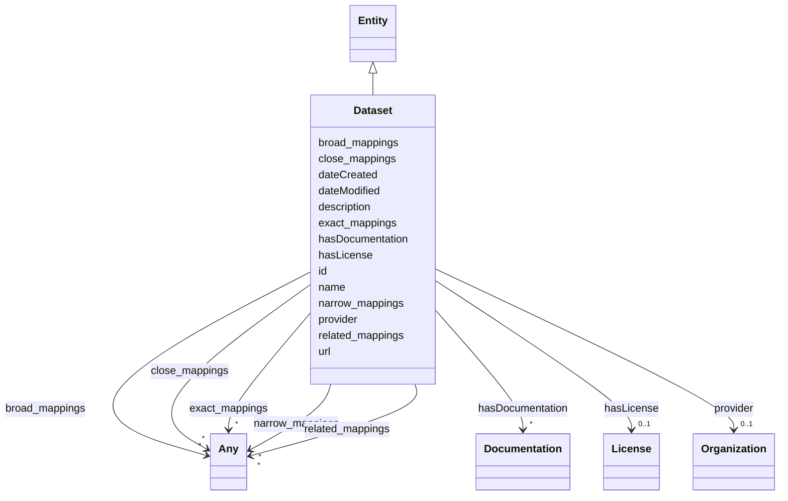

# Class: Dataset

_A body of structured information describing some topic(s) of interest._

URI: [schema:Dataset](http://schema.org/Dataset)



## Inheritance

- [Entity](Entity.md)
  - **Dataset**

## Slots

| Name                                    | Cardinality and Range                      | Description                                                                      | Inheritance         |
| --------------------------------------- | ------------------------------------------ | -------------------------------------------------------------------------------- | ------------------- |
| [hasLicense](hasLicense.md)             | 0..1 <br/> [License](License.md)           | Indicates licenses associated with a resource                                    | direct              |
| [hasDocumentation](hasDocumentation.md) | \* <br/> [Documentation](Documentation.md) | Indicates documentation associated with an entity                                | direct              |
| [provider](provider.md)                 | 0..1 <br/> [Organization](Organization.md) | A relationship to the Organization instance that provides this instance          | direct              |
| [id](id.md)                             | 1 <br/> [String](String.md)                | A unique identifier to this instance of the model element                        | [Entity](Entity.md) |
| [name](name.md)                         | 0..1 <br/> [String](String.md)             | A text name of this instance                                                     | [Entity](Entity.md) |
| [description](description.md)           | 0..1 <br/> [String](String.md)             | The description of an entity                                                     | [Entity](Entity.md) |
| [url](url.md)                           | 0..1 <br/> [Uri](Uri.md)                   | An optional URL associated with this instance                                    | [Entity](Entity.md) |
| [dateCreated](dateCreated.md)           | 0..1 <br/> [Date](Date.md)                 | The date on which the entity was created                                         | [Entity](Entity.md) |
| [dateModified](dateModified.md)         | 0..1 <br/> [Date](Date.md)                 | The date on which the entity was most recently modified                          | [Entity](Entity.md) |
| [exact_mappings](exact_mappings.md)     | \* <br/> [Any](Any.md)                     | The property is used to link two concepts, indicating a high degree of confid... | [Entity](Entity.md) |
| [close_mappings](close_mappings.md)     | \* <br/> [Any](Any.md)                     | The property is used to link two concepts that are sufficiently similar that ... | [Entity](Entity.md) |
| [related_mappings](related_mappings.md) | \* <br/> [Any](Any.md)                     | The property skos:relatedMatch is used to state an associative mapping link b... | [Entity](Entity.md) |
| [narrow_mappings](narrow_mappings.md)   | \* <br/> [Any](Any.md)                     | The property is used to state a hierarchical mapping link between two concept... | [Entity](Entity.md) |
| [broad_mappings](broad_mappings.md)     | \* <br/> [Any](Any.md)                     | The property is used to state a hierarchical mapping link between two concept... | [Entity](Entity.md) |

## Usages

| used by                                     | used in                               | type  | used                  |
| ------------------------------------------- | ------------------------------------- | ----- | --------------------- |
| [Container](Container.md)                   | [datasets](datasets.md)               | range | [Dataset](Dataset.md) |
| [LargeLanguageModel](LargeLanguageModel.md) | [hasTrainingData](hasTrainingData.md) | range | [Dataset](Dataset.md) |
| [AiEval](AiEval.md)                         | [hasDataset](hasDataset.md)           | range | [Dataset](Dataset.md) |
| [Question](Question.md)                     | [hasDataset](hasDataset.md)           | range | [Dataset](Dataset.md) |
| [Questionnaire](Questionnaire.md)           | [hasDataset](hasDataset.md)           | range | [Dataset](Dataset.md) |
| [Adapter](Adapter.md)                       | [hasTrainingData](hasTrainingData.md) | range | [Dataset](Dataset.md) |

## Identifier and Mapping Information

### Schema Source

- from schema: https://ibm.github.io/ai-atlas-nexus/ontology/ai-risk-ontology

## Mappings

| Mapping Type | Mapped Value   |
| ------------ | -------------- |
| self         | schema:Dataset |
| native       | nexus:Dataset  |

## LinkML Source

<!-- TODO: investigate https://stackoverflow.com/questions/37606292/how-to-create-tabbed-code-blocks-in-mkdocs-or-sphinx -->

### Direct

<details>
```yaml
name: Dataset
description: A body of structured information describing some topic(s) of interest.
from_schema: https://ibm.github.io/ai-atlas-nexus/ontology/ai-risk-ontology
is_a: Entity
slots:
- hasLicense
- hasDocumentation
- provider
class_uri: schema:Dataset

````
</details>

### Induced

<details>
```yaml
name: Dataset
description: A body of structured information describing some topic(s) of interest.
from_schema: https://ibm.github.io/ai-atlas-nexus/ontology/ai-risk-ontology
is_a: Entity
attributes:
  hasLicense:
    name: hasLicense
    description: Indicates licenses associated with a resource
    from_schema: https://ibm.github.io/ai-atlas-nexus/ontology/ai-risk-ontology
    rank: 1000
    slot_uri: airo:hasLicense
    alias: hasLicense
    owner: Dataset
    domain_of:
    - Dataset
    - Documentation
    - Vocabulary
    - Taxonomy
    - RiskTaxonomy
    - BaseAi
    - AiEval
    - BenchmarkMetadataCard
    - Adapter
    range: License
  hasDocumentation:
    name: hasDocumentation
    description: Indicates documentation associated with an entity.
    from_schema: https://ibm.github.io/ai-atlas-nexus/ontology/ai-risk-ontology
    rank: 1000
    slot_uri: airo:hasDocumentation
    alias: hasDocumentation
    owner: Dataset
    domain_of:
    - Dataset
    - Vocabulary
    - Taxonomy
    - Concept
    - Group
    - Entry
    - Term
    - Principle
    - RiskTaxonomy
    - Action
    - BaseAi
    - LargeLanguageModelFamily
    - AiEval
    - BenchmarkMetadataCard
    - Adapter
    - LLMIntrinsic
    range: Documentation
    multivalued: true
    inlined: false
  provider:
    name: provider
    description: A relationship to the Organization instance that provides this instance.
    from_schema: https://ibm.github.io/ai-atlas-nexus/ontology/ai-risk-ontology
    rank: 1000
    slot_uri: schema:provider
    alias: provider
    owner: Dataset
    domain_of:
    - Dataset
    range: Organization
  id:
    name: id
    description: A unique identifier to this instance of the model element. Example
      identifiers include UUID, URI, URN, etc.
    from_schema: https://ibm.github.io/ai-atlas-nexus/ontology/ai-risk-ontology
    rank: 1000
    slot_uri: schema:identifier
    identifier: true
    alias: id
    owner: Dataset
    domain_of:
    - Entity
    range: string
    required: true
  name:
    name: name
    description: A text name of this instance.
    from_schema: https://ibm.github.io/ai-atlas-nexus/ontology/ai-risk-ontology
    rank: 1000
    slot_uri: schema:name
    alias: name
    owner: Dataset
    domain_of:
    - Entity
    - BenchmarkMetadataCard
    range: string
  description:
    name: description
    description: The description of an entity
    from_schema: https://ibm.github.io/ai-atlas-nexus/ontology/ai-risk-ontology
    rank: 1000
    slot_uri: schema:description
    alias: description
    owner: Dataset
    domain_of:
    - Entity
    range: string
  url:
    name: url
    description: An optional URL associated with this instance.
    from_schema: https://ibm.github.io/ai-atlas-nexus/ontology/ai-risk-ontology
    rank: 1000
    slot_uri: schema:url
    alias: url
    owner: Dataset
    domain_of:
    - Entity
    range: uri
  dateCreated:
    name: dateCreated
    description: The date on which the entity was created.
    from_schema: https://ibm.github.io/ai-atlas-nexus/ontology/ai-risk-ontology
    rank: 1000
    slot_uri: schema:dateCreated
    alias: dateCreated
    owner: Dataset
    domain_of:
    - Entity
    range: date
    required: false
  dateModified:
    name: dateModified
    description: The date on which the entity was most recently modified.
    from_schema: https://ibm.github.io/ai-atlas-nexus/ontology/ai-risk-ontology
    rank: 1000
    slot_uri: schema:dateModified
    alias: dateModified
    owner: Dataset
    domain_of:
    - Entity
    range: date
    required: false
  exact_mappings:
    name: exact_mappings
    description: The property is used to link two concepts, indicating a high degree
      of confidence that the concepts can be used interchangeably across a wide range
      of information retrieval applications
    from_schema: https://ibm.github.io/ai-atlas-nexus/ontology/ai-risk-ontology
    rank: 1000
    slot_uri: skos:exactMatch
    alias: exact_mappings
    owner: Dataset
    domain_of:
    - Entity
    range: Any
    multivalued: true
    inlined: false
  close_mappings:
    name: close_mappings
    description: The property is used to link two concepts that are sufficiently similar
      that they can be used interchangeably in some information retrieval applications.
    from_schema: https://ibm.github.io/ai-atlas-nexus/ontology/ai-risk-ontology
    rank: 1000
    slot_uri: skos:closeMatch
    alias: close_mappings
    owner: Dataset
    domain_of:
    - Entity
    range: Any
    multivalued: true
    inlined: false
  related_mappings:
    name: related_mappings
    description: The property skos:relatedMatch is used to state an associative mapping
      link between two concepts.
    from_schema: https://ibm.github.io/ai-atlas-nexus/ontology/ai-risk-ontology
    rank: 1000
    slot_uri: skos:relatedMatch
    alias: related_mappings
    owner: Dataset
    domain_of:
    - Entity
    range: Any
    multivalued: true
    inlined: false
  narrow_mappings:
    name: narrow_mappings
    description: The property is used to state a hierarchical mapping link between
      two concepts, indicating that the concept linked to, is a narrower concept than
      the originating concept.
    from_schema: https://ibm.github.io/ai-atlas-nexus/ontology/ai-risk-ontology
    rank: 1000
    slot_uri: skos:narrowMatch
    alias: narrow_mappings
    owner: Dataset
    domain_of:
    - Entity
    range: Any
    multivalued: true
    inlined: false
  broad_mappings:
    name: broad_mappings
    description: The property is used to state a hierarchical mapping link between
      two concepts, indicating that the concept linked to, is a broader concept than
      the originating concept.
    from_schema: https://ibm.github.io/ai-atlas-nexus/ontology/ai-risk-ontology
    rank: 1000
    slot_uri: skos:broadMatch
    alias: broad_mappings
    owner: Dataset
    domain_of:
    - Entity
    range: Any
    multivalued: true
    inlined: false
class_uri: schema:Dataset

````

</details>
