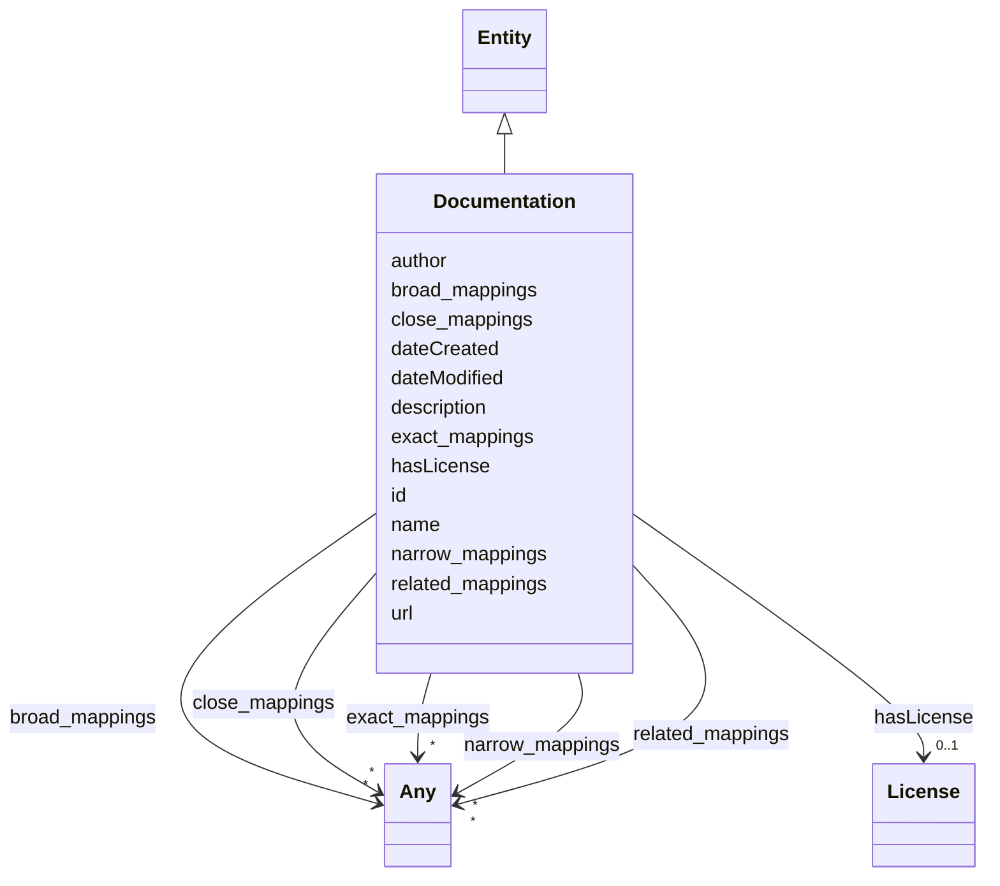

# Class: Documentation

_Documented information about a concept or other topic(s) of interest._

URI: [airo:Documentation](https://w3id.org/airo#Documentation)



## Inheritance

- [Entity](Entity.md)
  - **Documentation**

## Slots

| Name                                    | Cardinality and Range            | Description                                                                      | Inheritance         |
| --------------------------------------- | -------------------------------- | -------------------------------------------------------------------------------- | ------------------- |
| [hasLicense](hasLicense.md)             | 0..1 <br/> [License](License.md) | Indicates licenses associated with a resource                                    | direct              |
| [author](author.md)                     | 0..1 <br/> [String](String.md)   | The author or authors of the documentation                                       | direct              |
| [id](id.md)                             | 1 <br/> [String](String.md)      | A unique identifier to this instance of the model element                        | [Entity](Entity.md) |
| [name](name.md)                         | 0..1 <br/> [String](String.md)   | A text name of this instance                                                     | [Entity](Entity.md) |
| [description](description.md)           | 0..1 <br/> [String](String.md)   | The description of an entity                                                     | [Entity](Entity.md) |
| [url](url.md)                           | 0..1 <br/> [Uri](Uri.md)         | An optional URL associated with this instance                                    | [Entity](Entity.md) |
| [dateCreated](dateCreated.md)           | 0..1 <br/> [Date](Date.md)       | The date on which the entity was created                                         | [Entity](Entity.md) |
| [dateModified](dateModified.md)         | 0..1 <br/> [Date](Date.md)       | The date on which the entity was most recently modified                          | [Entity](Entity.md) |
| [exact_mappings](exact_mappings.md)     | \* <br/> [Any](Any.md)           | The property is used to link two concepts, indicating a high degree of confid... | [Entity](Entity.md) |
| [close_mappings](close_mappings.md)     | \* <br/> [Any](Any.md)           | The property is used to link two concepts that are sufficiently similar that ... | [Entity](Entity.md) |
| [related_mappings](related_mappings.md) | \* <br/> [Any](Any.md)           | The property skos:relatedMatch is used to state an associative mapping link b... | [Entity](Entity.md) |
| [narrow_mappings](narrow_mappings.md)   | \* <br/> [Any](Any.md)           | The property is used to state a hierarchical mapping link between two concept... | [Entity](Entity.md) |
| [broad_mappings](broad_mappings.md)     | \* <br/> [Any](Any.md)           | The property is used to state a hierarchical mapping link between two concept... | [Entity](Entity.md) |

## Usages

| used by                                                 | used in                                 | type  | used                              |
| ------------------------------------------------------- | --------------------------------------- | ----- | --------------------------------- |
| [Container](Container.md)                               | [documents](documents.md)               | range | [Documentation](Documentation.md) |
| [Dataset](Dataset.md)                                   | [hasDocumentation](hasDocumentation.md) | range | [Documentation](Documentation.md) |
| [Vocabulary](Vocabulary.md)                             | [hasDocumentation](hasDocumentation.md) | range | [Documentation](Documentation.md) |
| [Taxonomy](Taxonomy.md)                                 | [hasDocumentation](hasDocumentation.md) | range | [Documentation](Documentation.md) |
| [Concept](Concept.md)                                   | [hasDocumentation](hasDocumentation.md) | range | [Documentation](Documentation.md) |
| [Group](Group.md)                                       | [hasDocumentation](hasDocumentation.md) | range | [Documentation](Documentation.md) |
| [Entry](Entry.md)                                       | [hasDocumentation](hasDocumentation.md) | range | [Documentation](Documentation.md) |
| [Term](Term.md)                                         | [hasDocumentation](hasDocumentation.md) | range | [Documentation](Documentation.md) |
| [Principle](Principle.md)                               | [hasDocumentation](hasDocumentation.md) | range | [Documentation](Documentation.md) |
| [RiskTaxonomy](RiskTaxonomy.md)                         | [hasDocumentation](hasDocumentation.md) | range | [Documentation](Documentation.md) |
| [RiskGroup](RiskGroup.md)                               | [hasDocumentation](hasDocumentation.md) | range | [Documentation](Documentation.md) |
| [Risk](Risk.md)                                         | [hasDocumentation](hasDocumentation.md) | range | [Documentation](Documentation.md) |
| [RiskConcept](RiskConcept.md)                           | [hasDocumentation](hasDocumentation.md) | range | [Documentation](Documentation.md) |
| [RiskControl](RiskControl.md)                           | [hasDocumentation](hasDocumentation.md) | range | [Documentation](Documentation.md) |
| [Action](Action.md)                                     | [hasDocumentation](hasDocumentation.md) | range | [Documentation](Documentation.md) |
| [RiskIncident](RiskIncident.md)                         | [hasDocumentation](hasDocumentation.md) | range | [Documentation](Documentation.md) |
| [Impact](Impact.md)                                     | [hasDocumentation](hasDocumentation.md) | range | [Documentation](Documentation.md) |
| [BaseAi](BaseAi.md)                                     | [hasDocumentation](hasDocumentation.md) | range | [Documentation](Documentation.md) |
| [AiSystem](AiSystem.md)                                 | [hasDocumentation](hasDocumentation.md) | range | [Documentation](Documentation.md) |
| [AiAgent](AiAgent.md)                                   | [hasDocumentation](hasDocumentation.md) | range | [Documentation](Documentation.md) |
| [AiModel](AiModel.md)                                   | [hasDocumentation](hasDocumentation.md) | range | [Documentation](Documentation.md) |
| [LargeLanguageModel](LargeLanguageModel.md)             | [hasDocumentation](hasDocumentation.md) | range | [Documentation](Documentation.md) |
| [LargeLanguageModelFamily](LargeLanguageModelFamily.md) | [hasDocumentation](hasDocumentation.md) | range | [Documentation](Documentation.md) |
| [AiTask](AiTask.md)                                     | [hasDocumentation](hasDocumentation.md) | range | [Documentation](Documentation.md) |
| [CapabilityTaxonomy](CapabilityTaxonomy.md)             | [hasDocumentation](hasDocumentation.md) | range | [Documentation](Documentation.md) |
| [CapabilityConcept](CapabilityConcept.md)               | [hasDocumentation](hasDocumentation.md) | range | [Documentation](Documentation.md) |
| [CapabilityDomain](CapabilityDomain.md)                 | [hasDocumentation](hasDocumentation.md) | range | [Documentation](Documentation.md) |
| [CapabilityGroup](CapabilityGroup.md)                   | [hasDocumentation](hasDocumentation.md) | range | [Documentation](Documentation.md) |
| [Capability](Capability.md)                             | [hasDocumentation](hasDocumentation.md) | range | [Documentation](Documentation.md) |
| [AiEval](AiEval.md)                                     | [hasDocumentation](hasDocumentation.md) | range | [Documentation](Documentation.md) |
| [BenchmarkMetadataCard](BenchmarkMetadataCard.md)       | [hasDocumentation](hasDocumentation.md) | range | [Documentation](Documentation.md) |
| [Question](Question.md)                                 | [hasDocumentation](hasDocumentation.md) | range | [Documentation](Documentation.md) |
| [Questionnaire](Questionnaire.md)                       | [hasDocumentation](hasDocumentation.md) | range | [Documentation](Documentation.md) |
| [Adapter](Adapter.md)                                   | [hasDocumentation](hasDocumentation.md) | range | [Documentation](Documentation.md) |
| [LLMIntrinsic](LLMIntrinsic.md)                         | [hasDocumentation](hasDocumentation.md) | range | [Documentation](Documentation.md) |
| [StakeholderGroup](StakeholderGroup.md)                 | [hasDocumentation](hasDocumentation.md) | range | [Documentation](Documentation.md) |

## Identifier and Mapping Information

### Schema Source

- from schema: https://ibm.github.io/ai-atlas-nexus/ontology/ai-risk-ontology

## Mappings

| Mapping Type | Mapped Value        |
| ------------ | ------------------- |
| self         | airo:Documentation  |
| native       | nexus:Documentation |

## LinkML Source

<!-- TODO: investigate https://stackoverflow.com/questions/37606292/how-to-create-tabbed-code-blocks-in-mkdocs-or-sphinx -->

### Direct

<details>
```yaml
name: Documentation
description: Documented information about a concept or other topic(s) of interest.
from_schema: https://ibm.github.io/ai-atlas-nexus/ontology/ai-risk-ontology
is_a: Entity
slots:
- hasLicense
attributes:
  author:
    name: author
    description: The author or authors of the documentation
    from_schema: https://ibm.github.io/ai-atlas-nexus/ontology/common
    rank: 1000
    domain_of:
    - Documentation
    - RiskIncident
class_uri: airo:Documentation

````
</details>

### Induced

<details>
```yaml
name: Documentation
description: Documented information about a concept or other topic(s) of interest.
from_schema: https://ibm.github.io/ai-atlas-nexus/ontology/ai-risk-ontology
is_a: Entity
attributes:
  author:
    name: author
    description: The author or authors of the documentation
    from_schema: https://ibm.github.io/ai-atlas-nexus/ontology/common
    rank: 1000
    alias: author
    owner: Documentation
    domain_of:
    - Documentation
    - RiskIncident
    range: string
  hasLicense:
    name: hasLicense
    description: Indicates licenses associated with a resource
    from_schema: https://ibm.github.io/ai-atlas-nexus/ontology/ai-risk-ontology
    rank: 1000
    slot_uri: airo:hasLicense
    alias: hasLicense
    owner: Documentation
    domain_of:
    - Dataset
    - Documentation
    - Vocabulary
    - Taxonomy
    - RiskTaxonomy
    - BaseAi
    - AiEval
    - BenchmarkMetadataCard
    - Adapter
    range: License
  id:
    name: id
    description: A unique identifier to this instance of the model element. Example
      identifiers include UUID, URI, URN, etc.
    from_schema: https://ibm.github.io/ai-atlas-nexus/ontology/ai-risk-ontology
    rank: 1000
    slot_uri: schema:identifier
    identifier: true
    alias: id
    owner: Documentation
    domain_of:
    - Entity
    range: string
    required: true
  name:
    name: name
    description: A text name of this instance.
    from_schema: https://ibm.github.io/ai-atlas-nexus/ontology/ai-risk-ontology
    rank: 1000
    slot_uri: schema:name
    alias: name
    owner: Documentation
    domain_of:
    - Entity
    - BenchmarkMetadataCard
    range: string
  description:
    name: description
    description: The description of an entity
    from_schema: https://ibm.github.io/ai-atlas-nexus/ontology/ai-risk-ontology
    rank: 1000
    slot_uri: schema:description
    alias: description
    owner: Documentation
    domain_of:
    - Entity
    range: string
  url:
    name: url
    description: An optional URL associated with this instance.
    from_schema: https://ibm.github.io/ai-atlas-nexus/ontology/ai-risk-ontology
    rank: 1000
    slot_uri: schema:url
    alias: url
    owner: Documentation
    domain_of:
    - Entity
    range: uri
  dateCreated:
    name: dateCreated
    description: The date on which the entity was created.
    from_schema: https://ibm.github.io/ai-atlas-nexus/ontology/ai-risk-ontology
    rank: 1000
    slot_uri: schema:dateCreated
    alias: dateCreated
    owner: Documentation
    domain_of:
    - Entity
    range: date
    required: false
  dateModified:
    name: dateModified
    description: The date on which the entity was most recently modified.
    from_schema: https://ibm.github.io/ai-atlas-nexus/ontology/ai-risk-ontology
    rank: 1000
    slot_uri: schema:dateModified
    alias: dateModified
    owner: Documentation
    domain_of:
    - Entity
    range: date
    required: false
  exact_mappings:
    name: exact_mappings
    description: The property is used to link two concepts, indicating a high degree
      of confidence that the concepts can be used interchangeably across a wide range
      of information retrieval applications
    from_schema: https://ibm.github.io/ai-atlas-nexus/ontology/ai-risk-ontology
    rank: 1000
    slot_uri: skos:exactMatch
    alias: exact_mappings
    owner: Documentation
    domain_of:
    - Entity
    range: Any
    multivalued: true
    inlined: false
  close_mappings:
    name: close_mappings
    description: The property is used to link two concepts that are sufficiently similar
      that they can be used interchangeably in some information retrieval applications.
    from_schema: https://ibm.github.io/ai-atlas-nexus/ontology/ai-risk-ontology
    rank: 1000
    slot_uri: skos:closeMatch
    alias: close_mappings
    owner: Documentation
    domain_of:
    - Entity
    range: Any
    multivalued: true
    inlined: false
  related_mappings:
    name: related_mappings
    description: The property skos:relatedMatch is used to state an associative mapping
      link between two concepts.
    from_schema: https://ibm.github.io/ai-atlas-nexus/ontology/ai-risk-ontology
    rank: 1000
    slot_uri: skos:relatedMatch
    alias: related_mappings
    owner: Documentation
    domain_of:
    - Entity
    range: Any
    multivalued: true
    inlined: false
  narrow_mappings:
    name: narrow_mappings
    description: The property is used to state a hierarchical mapping link between
      two concepts, indicating that the concept linked to, is a narrower concept than
      the originating concept.
    from_schema: https://ibm.github.io/ai-atlas-nexus/ontology/ai-risk-ontology
    rank: 1000
    slot_uri: skos:narrowMatch
    alias: narrow_mappings
    owner: Documentation
    domain_of:
    - Entity
    range: Any
    multivalued: true
    inlined: false
  broad_mappings:
    name: broad_mappings
    description: The property is used to state a hierarchical mapping link between
      two concepts, indicating that the concept linked to, is a broader concept than
      the originating concept.
    from_schema: https://ibm.github.io/ai-atlas-nexus/ontology/ai-risk-ontology
    rank: 1000
    slot_uri: skos:broadMatch
    alias: broad_mappings
    owner: Documentation
    domain_of:
    - Entity
    range: Any
    multivalued: true
    inlined: false
class_uri: airo:Documentation

````

</details>
