# Class: Entity

_A generic grouping for any identifiable entity._

- **NOTE**: this is an abstract class and should not be instantiated directly

URI: [schema:Thing](http://schema.org/Thing)

```mermaid
 classDiagram
    class Entity
    click Entity href "../Entity/"
      Entity <|-- Organization
        click Organization href "../Organization/"
      Entity <|-- License
        click License href "../License/"
      Entity <|-- Dataset
        click Dataset href "../Dataset/"
      Entity <|-- Documentation
        click Documentation href "../Documentation/"
      Entity <|-- Vocabulary
        click Vocabulary href "../Vocabulary/"
      Entity <|-- Taxonomy
        click Taxonomy href "../Taxonomy/"
      Entity <|-- Concept
        click Concept href "../Concept/"
      Entity <|-- Control
        click Control href "../Control/"
      Entity <|-- Group
        click Group href "../Group/"
      Entity <|-- Entry
        click Entry href "../Entry/"
      Entity <|-- Policy
        click Policy href "../Policy/"
      Entity <|-- Rule
        click Rule href "../Rule/"
      Entity <|-- RiskIncident
        click RiskIncident href "../RiskIncident/"
      Entity <|-- Impact
        click Impact href "../Impact/"
      Entity <|-- IncidentStatus
        click IncidentStatus href "../IncidentStatus/"
      Entity <|-- Severity
        click Severity href "../Severity/"
      Entity <|-- Likelihood
        click Likelihood href "../Likelihood/"
      Entity <|-- Consequence
        click Consequence href "../Consequence/"
      Entity <|-- BaseAi
        click BaseAi href "../BaseAi/"
      Entity <|-- LargeLanguageModelFamily
        click LargeLanguageModelFamily href "../LargeLanguageModelFamily/"
      Entity <|-- AiLifecyclePhase
        click AiLifecyclePhase href "../AiLifecyclePhase/"
      Entity <|-- Modality
        click Modality href "../Modality/"
      Entity <|-- Input
        click Input href "../Input/"
      Entity <|-- AiEval
        click AiEval href "../AiEval/"
      Entity <|-- AiEvalResult
        click AiEvalResult href "../AiEvalResult/"
      Entity <|-- BenchmarkMetadataCard
        click BenchmarkMetadataCard href "../BenchmarkMetadataCard/"
      Entity <|-- Stakeholder
        click Stakeholder href "../Stakeholder/"

      Entity : broad_mappings





        Entity --> "*" Any : broad_mappings
        click Any href "../Any/"



      Entity : close_mappings





        Entity --> "*" Any : close_mappings
        click Any href "../Any/"



      Entity : dateCreated

      Entity : dateModified

      Entity : description

      Entity : exact_mappings





        Entity --> "*" Any : exact_mappings
        click Any href "../Any/"



      Entity : id

      Entity : name

      Entity : narrow_mappings





        Entity --> "*" Any : narrow_mappings
        click Any href "../Any/"



      Entity : related_mappings





        Entity --> "*" Any : related_mappings
        click Any href "../Any/"



      Entity : url


```



## Inheritance

- **Entity**
  - [Organization](Organization.md)
  - [License](License.md)
  - [Dataset](Dataset.md)
  - [Documentation](Documentation.md)
  - [Vocabulary](Vocabulary.md)
  - [Taxonomy](Taxonomy.md)
  - [Concept](Concept.md)
  - [Control](Control.md)
  - [Group](Group.md)
  - [Entry](Entry.md)
  - [Policy](Policy.md)
  - [Rule](Rule.md)
  - [RiskIncident](RiskIncident.md) [ [RiskConcept](RiskConcept.md)]
  - [Impact](Impact.md) [ [RiskConcept](RiskConcept.md)]
  - [IncidentStatus](IncidentStatus.md)
  - [Severity](Severity.md)
  - [Likelihood](Likelihood.md)
  - [Consequence](Consequence.md)
  - [BaseAi](BaseAi.md)
  - [LargeLanguageModelFamily](LargeLanguageModelFamily.md)
  - [AiLifecyclePhase](AiLifecyclePhase.md)
  - [Modality](Modality.md)
  - [Input](Input.md)
  - [AiEval](AiEval.md)
  - [AiEvalResult](AiEvalResult.md) [ [Fact](Fact.md)]
  - [BenchmarkMetadataCard](BenchmarkMetadataCard.md)
  - [Stakeholder](Stakeholder.md)

## Slots

| Name                                    | Cardinality and Range          | Description                                                                      | Inheritance |
| --------------------------------------- | ------------------------------ | -------------------------------------------------------------------------------- | ----------- |
| [id](id.md)                             | 1 <br/> [String](String.md)    | A unique identifier to this instance of the model element                        | direct      |
| [name](name.md)                         | 0..1 <br/> [String](String.md) | A text name of this instance                                                     | direct      |
| [description](description.md)           | 0..1 <br/> [String](String.md) | The description of an entity                                                     | direct      |
| [url](url.md)                           | 0..1 <br/> [Uri](Uri.md)       | An optional URL associated with this instance                                    | direct      |
| [dateCreated](dateCreated.md)           | 0..1 <br/> [Date](Date.md)     | The date on which the entity was created                                         | direct      |
| [dateModified](dateModified.md)         | 0..1 <br/> [Date](Date.md)     | The date on which the entity was most recently modified                          | direct      |
| [exact_mappings](exact_mappings.md)     | \* <br/> [Any](Any.md)         | The property is used to link two concepts, indicating a high degree of confid... | direct      |
| [close_mappings](close_mappings.md)     | \* <br/> [Any](Any.md)         | The property is used to link two concepts that are sufficiently similar that ... | direct      |
| [related_mappings](related_mappings.md) | \* <br/> [Any](Any.md)         | The property skos:relatedMatch is used to state an associative mapping link b... | direct      |
| [narrow_mappings](narrow_mappings.md)   | \* <br/> [Any](Any.md)         | The property is used to state a hierarchical mapping link between two concept... | direct      |
| [broad_mappings](broad_mappings.md)     | \* <br/> [Any](Any.md)         | The property is used to state a hierarchical mapping link between two concept... | direct      |

## Mixin Usage

| mixed into | description |
| ---------- | ----------- |

## Identifier and Mapping Information

### Schema Source

- from schema: https://ibm.github.io/ai-atlas-nexus/ontology/ai-risk-ontology

## Mappings

| Mapping Type | Mapped Value |
| ------------ | ------------ |
| self         | schema:Thing |
| native       | nexus:Entity |

## LinkML Source

<!-- TODO: investigate https://stackoverflow.com/questions/37606292/how-to-create-tabbed-code-blocks-in-mkdocs-or-sphinx -->

### Direct

<details>
```yaml
name: Entity
description: A generic grouping for any identifiable entity.
from_schema: https://ibm.github.io/ai-atlas-nexus/ontology/ai-risk-ontology
abstract: true
mixin: true
slots:
- id
- name
- description
- url
- dateCreated
- dateModified
- exact_mappings
- close_mappings
- related_mappings
- narrow_mappings
- broad_mappings
class_uri: schema:Thing

````
</details>

### Induced

<details>
```yaml
name: Entity
description: A generic grouping for any identifiable entity.
from_schema: https://ibm.github.io/ai-atlas-nexus/ontology/ai-risk-ontology
abstract: true
mixin: true
attributes:
  id:
    name: id
    description: A unique identifier to this instance of the model element. Example
      identifiers include UUID, URI, URN, etc.
    from_schema: https://ibm.github.io/ai-atlas-nexus/ontology/ai-risk-ontology
    rank: 1000
    slot_uri: schema:identifier
    identifier: true
    alias: id
    owner: Entity
    domain_of:
    - Entity
    range: string
    required: true
  name:
    name: name
    description: A text name of this instance.
    from_schema: https://ibm.github.io/ai-atlas-nexus/ontology/ai-risk-ontology
    rank: 1000
    slot_uri: schema:name
    alias: name
    owner: Entity
    domain_of:
    - Entity
    - BenchmarkMetadataCard
    range: string
  description:
    name: description
    description: The description of an entity
    from_schema: https://ibm.github.io/ai-atlas-nexus/ontology/ai-risk-ontology
    rank: 1000
    slot_uri: schema:description
    alias: description
    owner: Entity
    domain_of:
    - Entity
    range: string
  url:
    name: url
    description: An optional URL associated with this instance.
    from_schema: https://ibm.github.io/ai-atlas-nexus/ontology/ai-risk-ontology
    rank: 1000
    slot_uri: schema:url
    alias: url
    owner: Entity
    domain_of:
    - Entity
    range: uri
  dateCreated:
    name: dateCreated
    description: The date on which the entity was created.
    from_schema: https://ibm.github.io/ai-atlas-nexus/ontology/ai-risk-ontology
    rank: 1000
    slot_uri: schema:dateCreated
    alias: dateCreated
    owner: Entity
    domain_of:
    - Entity
    range: date
    required: false
  dateModified:
    name: dateModified
    description: The date on which the entity was most recently modified.
    from_schema: https://ibm.github.io/ai-atlas-nexus/ontology/ai-risk-ontology
    rank: 1000
    slot_uri: schema:dateModified
    alias: dateModified
    owner: Entity
    domain_of:
    - Entity
    range: date
    required: false
  exact_mappings:
    name: exact_mappings
    description: The property is used to link two concepts, indicating a high degree
      of confidence that the concepts can be used interchangeably across a wide range
      of information retrieval applications
    from_schema: https://ibm.github.io/ai-atlas-nexus/ontology/ai-risk-ontology
    rank: 1000
    slot_uri: skos:exactMatch
    alias: exact_mappings
    owner: Entity
    domain_of:
    - Entity
    range: Any
    multivalued: true
    inlined: false
  close_mappings:
    name: close_mappings
    description: The property is used to link two concepts that are sufficiently similar
      that they can be used interchangeably in some information retrieval applications.
    from_schema: https://ibm.github.io/ai-atlas-nexus/ontology/ai-risk-ontology
    rank: 1000
    slot_uri: skos:closeMatch
    alias: close_mappings
    owner: Entity
    domain_of:
    - Entity
    range: Any
    multivalued: true
    inlined: false
  related_mappings:
    name: related_mappings
    description: The property skos:relatedMatch is used to state an associative mapping
      link between two concepts.
    from_schema: https://ibm.github.io/ai-atlas-nexus/ontology/ai-risk-ontology
    rank: 1000
    slot_uri: skos:relatedMatch
    alias: related_mappings
    owner: Entity
    domain_of:
    - Entity
    range: Any
    multivalued: true
    inlined: false
  narrow_mappings:
    name: narrow_mappings
    description: The property is used to state a hierarchical mapping link between
      two concepts, indicating that the concept linked to, is a narrower concept than
      the originating concept.
    from_schema: https://ibm.github.io/ai-atlas-nexus/ontology/ai-risk-ontology
    rank: 1000
    slot_uri: skos:narrowMatch
    alias: narrow_mappings
    owner: Entity
    domain_of:
    - Entity
    range: Any
    multivalued: true
    inlined: false
  broad_mappings:
    name: broad_mappings
    description: The property is used to state a hierarchical mapping link between
      two concepts, indicating that the concept linked to, is a broader concept than
      the originating concept.
    from_schema: https://ibm.github.io/ai-atlas-nexus/ontology/ai-risk-ontology
    rank: 1000
    slot_uri: skos:broadMatch
    alias: broad_mappings
    owner: Entity
    domain_of:
    - Entity
    range: Any
    multivalued: true
    inlined: false
class_uri: schema:Thing

````

</details>
