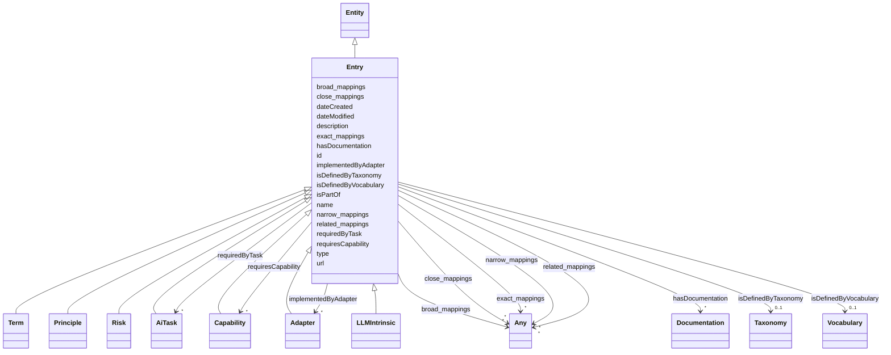

# Class: Entry


_An entry and its definitions._


* __NOTE__: this is an abstract class and should not be instantiated directly


URI: [nexus:Entry](https://ibm.github.io/ai-atlas-nexus/ontology/Entry)





## Inheritance
* [Entity](Entity.md)
    * **Entry**
        * [Term](Term.md)
        * [Principle](Principle.md)
        * [Risk](Risk.md) [ [RiskConcept](RiskConcept.md)]
        * [AiTask](AiTask.md)
        * [Capability](Capability.md) [ [CapabilityConcept](CapabilityConcept.md)]
        * [Adapter](Adapter.md) [ [LargeLanguageModel](LargeLanguageModel.md)]
        * [LLMIntrinsic](LLMIntrinsic.md)


## Slots

| Name | Cardinality and Range | Description | Inheritance |
| ---  | --- | --- | --- |
| [isDefinedByTaxonomy](isDefinedByTaxonomy.md) | 0..1 <br/> [Taxonomy](Taxonomy.md) | A relationship where a concept or a concept group is defined by a taxonomy | direct |
| [isDefinedByVocabulary](isDefinedByVocabulary.md) | 0..1 <br/> [Vocabulary](Vocabulary.md) | A relationship where a term or a term group is defined by a vocabulary | direct |
| [hasDocumentation](hasDocumentation.md) | * <br/> [Documentation](Documentation.md) | Indicates documentation associated with an entity | direct |
| [isPartOf](isPartOf.md) | 0..1 <br/> [String](String.md) | A relationship where an entity is part of another entity | direct |
| [requiredByTask](requiredByTask.md) | * <br/> [AiTask](AiTask.md) | Indicates that this entry is required to perform a specific AI task | direct |
| [requiresCapability](requiresCapability.md) | * <br/> [Capability](Capability.md) | Indicates that this entry requires a specific capability | direct |
| [implementedByAdapter](implementedByAdapter.md) | * <br/> [Adapter](Adapter.md) | Indicates that this capability is implemented by a specific adapter | direct |
| [type](type.md) | 0..1 <br/> [String](String.md) |  | direct |
| [id](id.md) | 1 <br/> [String](String.md) | A unique identifier to this instance of the model element | [Entity](Entity.md) |
| [name](name.md) | 0..1 <br/> [String](String.md) | A text name of this instance | [Entity](Entity.md) |
| [description](description.md) | 0..1 <br/> [String](String.md) | The description of an entity | [Entity](Entity.md) |
| [url](url.md) | 0..1 <br/> [Uri](Uri.md) | An optional URL associated with this instance | [Entity](Entity.md) |
| [dateCreated](dateCreated.md) | 0..1 <br/> [Date](Date.md) | The date on which the entity was created | [Entity](Entity.md) |
| [dateModified](dateModified.md) | 0..1 <br/> [Date](Date.md) | The date on which the entity was most recently modified | [Entity](Entity.md) |
| [exact_mappings](exact_mappings.md) | * <br/> [Any](Any.md) | The property is used to link two concepts, indicating a high degree of confid... | [Entity](Entity.md) |
| [close_mappings](close_mappings.md) | * <br/> [Any](Any.md) | The property is used to link two concepts that are sufficiently similar that ... | [Entity](Entity.md) |
| [related_mappings](related_mappings.md) | * <br/> [Any](Any.md) | The property skos:relatedMatch is used to state an associative mapping link b... | [Entity](Entity.md) |
| [narrow_mappings](narrow_mappings.md) | * <br/> [Any](Any.md) | The property is used to state a hierarchical mapping link between two concept... | [Entity](Entity.md) |
| [broad_mappings](broad_mappings.md) | * <br/> [Any](Any.md) | The property is used to state a hierarchical mapping link between two concept... | [Entity](Entity.md) |


## Usages

| used by | used in | type | used |
| ---  | --- | --- | --- |
| [Container](Container.md) | [entries](entries.md) | range | [Entry](Entry.md) |


## Identifier and Mapping Information


### Schema Source


* from schema: https://ibm.github.io/ai-atlas-nexus/ontology/ai-risk-ontology


## Mappings

| Mapping Type | Mapped Value |
| ---  | ---  |
| self | nexus:Entry |
| native | nexus:Entry |


## LinkML Source

<!-- TODO: investigate https://stackoverflow.com/questions/37606292/how-to-create-tabbed-code-blocks-in-mkdocs-or-sphinx -->

### Direct

<details>
```yaml
name: Entry
description: An entry and its definitions.
from_schema: https://ibm.github.io/ai-atlas-nexus/ontology/ai-risk-ontology
is_a: Entity
abstract: true
slots:
- isDefinedByTaxonomy
- isDefinedByVocabulary
- hasDocumentation
- isPartOf
- requiredByTask
- requiresCapability
- implementedByAdapter
attributes:
  type:
    name: type
    from_schema: https://ibm.github.io/ai-atlas-nexus/ontology/common
    designates_type: true
    domain_of:
    - Vocabulary
    - Taxonomy
    - Concept
    - Control
    - Group
    - Entry
    - Policy
    range: string
class_uri: nexus:Entry

```
</details>

### Induced

<details>
```yaml
name: Entry
description: An entry and its definitions.
from_schema: https://ibm.github.io/ai-atlas-nexus/ontology/ai-risk-ontology
is_a: Entity
abstract: true
attributes:
  type:
    name: type
    from_schema: https://ibm.github.io/ai-atlas-nexus/ontology/common
    designates_type: true
    alias: type
    owner: Entry
    domain_of:
    - Vocabulary
    - Taxonomy
    - Concept
    - Control
    - Group
    - Entry
    - Policy
    range: string
  isDefinedByTaxonomy:
    name: isDefinedByTaxonomy
    description: A relationship where a concept or a concept group is defined by a
      taxonomy
    from_schema: https://ibm.github.io/ai-atlas-nexus/ontology/ai-risk-ontology
    rank: 1000
    slot_uri: schema:isPartOf
    alias: isDefinedByTaxonomy
    owner: Entry
    domain_of:
    - Concept
    - Control
    - Group
    - Entry
    - Policy
    - RiskGroup
    - Risk
    - RiskControl
    - Action
    - RiskIncident
    - CapabilityGroup
    - StakeholderGroup
    - Stakeholder
    range: Taxonomy
  isDefinedByVocabulary:
    name: isDefinedByVocabulary
    description: A relationship where a term or a term group is defined by a vocabulary
    from_schema: https://ibm.github.io/ai-atlas-nexus/ontology/ai-risk-ontology
    rank: 1000
    slot_uri: schema:isPartOf
    alias: isDefinedByVocabulary
    owner: Entry
    domain_of:
    - Entry
    - Term
    - Adapter
    - LLMIntrinsic
    range: Vocabulary
  hasDocumentation:
    name: hasDocumentation
    description: Indicates documentation associated with an entity.
    from_schema: https://ibm.github.io/ai-atlas-nexus/ontology/ai-risk-ontology
    rank: 1000
    slot_uri: airo:hasDocumentation
    alias: hasDocumentation
    owner: Entry
    domain_of:
    - Dataset
    - Vocabulary
    - Taxonomy
    - Concept
    - Group
    - Entry
    - Term
    - Principle
    - RiskTaxonomy
    - Action
    - BaseAi
    - LargeLanguageModelFamily
    - AiEval
    - BenchmarkMetadataCard
    - Adapter
    - LLMIntrinsic
    range: Documentation
    multivalued: true
    inlined: false
  isPartOf:
    name: isPartOf
    description: A relationship where an entity is part of another entity
    from_schema: https://ibm.github.io/ai-atlas-nexus/ontology/ai-risk-ontology
    rank: 1000
    slot_uri: schema:isPartOf
    alias: isPartOf
    owner: Entry
    domain_of:
    - Entry
    - Risk
    - LargeLanguageModel
    - CapabilityGroup
    - Stakeholder
    range: string
  requiredByTask:
    name: requiredByTask
    description: Indicates that this entry is required to perform a specific AI task.
    from_schema: https://ibm.github.io/ai-atlas-nexus/ontology/ai-risk-ontology
    rank: 1000
    alias: requiredByTask
    owner: Entry
    domain_of:
    - Entry
    - Capability
    inverse: requiresCapability
    range: AiTask
    multivalued: true
    inlined: false
  requiresCapability:
    name: requiresCapability
    description: Indicates that this entry requires a specific capability
    from_schema: https://ibm.github.io/ai-atlas-nexus/ontology/ai-risk-ontology
    rank: 1000
    domain: Any
    alias: requiresCapability
    owner: Entry
    domain_of:
    - Entry
    - LargeLanguageModel
    - AiTask
    - Adapter
    inverse: requiredByTask
    range: Capability
    multivalued: true
    inlined: false
  implementedByAdapter:
    name: implementedByAdapter
    description: 'Indicates that this capability is implemented by a specific adapter.
      This relationship distinguishes the abstract capability (what can be done) from
      the technical implementation mechanism (how it is added/extended via adapters).

      '
    from_schema: https://ibm.github.io/ai-atlas-nexus/ontology/ai-risk-ontology
    rank: 1000
    domain: Any
    alias: implementedByAdapter
    owner: Entry
    domain_of:
    - Entry
    - Capability
    inverse: implementsCapability
    range: Adapter
    multivalued: true
    inlined: false
  id:
    name: id
    description: A unique identifier to this instance of the model element. Example
      identifiers include UUID, URI, URN, etc.
    from_schema: https://ibm.github.io/ai-atlas-nexus/ontology/ai-risk-ontology
    rank: 1000
    slot_uri: schema:identifier
    identifier: true
    alias: id
    owner: Entry
    domain_of:
    - Entity
    range: string
    required: true
  name:
    name: name
    description: A text name of this instance.
    from_schema: https://ibm.github.io/ai-atlas-nexus/ontology/ai-risk-ontology
    rank: 1000
    slot_uri: schema:name
    alias: name
    owner: Entry
    domain_of:
    - Entity
    - BenchmarkMetadataCard
    range: string
  description:
    name: description
    description: The description of an entity
    from_schema: https://ibm.github.io/ai-atlas-nexus/ontology/ai-risk-ontology
    rank: 1000
    slot_uri: schema:description
    alias: description
    owner: Entry
    domain_of:
    - Entity
    range: string
  url:
    name: url
    description: An optional URL associated with this instance.
    from_schema: https://ibm.github.io/ai-atlas-nexus/ontology/ai-risk-ontology
    rank: 1000
    slot_uri: schema:url
    alias: url
    owner: Entry
    domain_of:
    - Entity
    range: uri
  dateCreated:
    name: dateCreated
    description: The date on which the entity was created.
    from_schema: https://ibm.github.io/ai-atlas-nexus/ontology/ai-risk-ontology
    rank: 1000
    slot_uri: schema:dateCreated
    alias: dateCreated
    owner: Entry
    domain_of:
    - Entity
    range: date
    required: false
  dateModified:
    name: dateModified
    description: The date on which the entity was most recently modified.
    from_schema: https://ibm.github.io/ai-atlas-nexus/ontology/ai-risk-ontology
    rank: 1000
    slot_uri: schema:dateModified
    alias: dateModified
    owner: Entry
    domain_of:
    - Entity
    range: date
    required: false
  exact_mappings:
    name: exact_mappings
    description: The property is used to link two concepts, indicating a high degree
      of confidence that the concepts can be used interchangeably across a wide range
      of information retrieval applications
    from_schema: https://ibm.github.io/ai-atlas-nexus/ontology/ai-risk-ontology
    rank: 1000
    slot_uri: skos:exactMatch
    alias: exact_mappings
    owner: Entry
    domain_of:
    - Entity
    range: Any
    multivalued: true
    inlined: false
  close_mappings:
    name: close_mappings
    description: The property is used to link two concepts that are sufficiently similar
      that they can be used interchangeably in some information retrieval applications.
    from_schema: https://ibm.github.io/ai-atlas-nexus/ontology/ai-risk-ontology
    rank: 1000
    slot_uri: skos:closeMatch
    alias: close_mappings
    owner: Entry
    domain_of:
    - Entity
    range: Any
    multivalued: true
    inlined: false
  related_mappings:
    name: related_mappings
    description: The property skos:relatedMatch is used to state an associative mapping
      link between two concepts.
    from_schema: https://ibm.github.io/ai-atlas-nexus/ontology/ai-risk-ontology
    rank: 1000
    slot_uri: skos:relatedMatch
    alias: related_mappings
    owner: Entry
    domain_of:
    - Entity
    range: Any
    multivalued: true
    inlined: false
  narrow_mappings:
    name: narrow_mappings
    description: The property is used to state a hierarchical mapping link between
      two concepts, indicating that the concept linked to, is a narrower concept than
      the originating concept.
    from_schema: https://ibm.github.io/ai-atlas-nexus/ontology/ai-risk-ontology
    rank: 1000
    slot_uri: skos:narrowMatch
    alias: narrow_mappings
    owner: Entry
    domain_of:
    - Entity
    range: Any
    multivalued: true
    inlined: false
  broad_mappings:
    name: broad_mappings
    description: The property is used to state a hierarchical mapping link between
      two concepts, indicating that the concept linked to, is a broader concept than
      the originating concept.
    from_schema: https://ibm.github.io/ai-atlas-nexus/ontology/ai-risk-ontology
    rank: 1000
    slot_uri: skos:broadMatch
    alias: broad_mappings
    owner: Entry
    domain_of:
    - Entity
    range: Any
    multivalued: true
    inlined: false
class_uri: nexus:Entry

```
</details>
