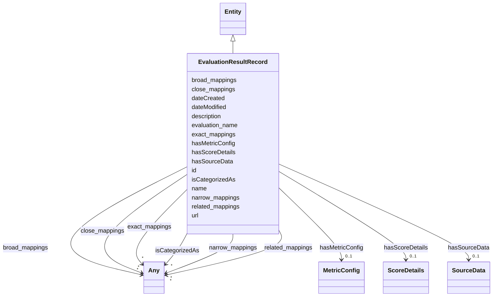

# Class: EvaluationResultRecord

_A single evaluation result record_

URI: [nexus:evaluationresultrecord](https://ibm.github.io/ai-atlas-nexus/ontology/evaluationresultrecord)



## Inheritance

- [Entity](Entity.md)
  - **EvaluationResultRecord**

## Class Properties

| Property  | Value                                                                                                |
| --------- | ---------------------------------------------------------------------------------------------------- |
| Class URI | [nexus:evaluationresultrecord](https://ibm.github.io/ai-atlas-nexus/ontology/evaluationresultrecord) |

## Slots

| Name                                    | Cardinality and Range                      | Description                                                                      | Inheritance         |
| --------------------------------------- | ------------------------------------------ | -------------------------------------------------------------------------------- | ------------------- |
| [hasSourceData](hasSourceData.md)       | 0..1 <br/> [SourceData](SourceData.md)     | Source data information                                                          | direct              |
| [hasMetricConfig](hasMetricConfig.md)   | 0..1 <br/> [MetricConfig](MetricConfig.md) | Metric configuration                                                             | direct              |
| [hasScoreDetails](hasScoreDetails.md)   | 0..1 <br/> [ScoreDetails](ScoreDetails.md) | Score details                                                                    | direct              |
| [evaluation_name](evaluation_name.md)   | 0..1 <br/> [String](String.md)             | Name of the evaluation benchmark                                                 | direct              |
| [id](id.md)                             | 1 <br/> [String](String.md)                | A unique identifier to this instance of the model element                        | [Entity](Entity.md) |
| [name](name.md)                         | 0..1 <br/> [String](String.md)             | A text name of this instance                                                     | [Entity](Entity.md) |
| [description](description.md)           | 0..1 <br/> [String](String.md)             | The description of an entity                                                     | [Entity](Entity.md) |
| [url](url.md)                           | 0..1 <br/> [Uri](Uri.md)                   | An optional URL associated with this instance                                    | [Entity](Entity.md) |
| [dateCreated](dateCreated.md)           | 0..1 <br/> [Date](Date.md)                 | The date on which the entity was created                                         | [Entity](Entity.md) |
| [dateModified](dateModified.md)         | 0..1 <br/> [Date](Date.md)                 | The date on which the entity was most recently modified                          | [Entity](Entity.md) |
| [exact_mappings](exact_mappings.md)     | \* <br/> [Any](Any.md)                     | The property is used to link two concepts, indicating a high degree of confid... | [Entity](Entity.md) |
| [close_mappings](close_mappings.md)     | \* <br/> [Any](Any.md)                     | The property is used to link two concepts that are sufficiently similar that ... | [Entity](Entity.md) |
| [related_mappings](related_mappings.md) | \* <br/> [Any](Any.md)                     | The property skos:relatedMatch is used to state an associative mapping link b... | [Entity](Entity.md) |
| [narrow_mappings](narrow_mappings.md)   | \* <br/> [Any](Any.md)                     | The property is used to state a hierarchical mapping link between two concept... | [Entity](Entity.md) |
| [broad_mappings](broad_mappings.md)     | \* <br/> [Any](Any.md)                     | The property is used to state a hierarchical mapping link between two concept... | [Entity](Entity.md) |
| [isCategorizedAs](isCategorizedAs.md)   | \* <br/> [Any](Any.md)                     | A relationship where an entity has been deemed to be categorized                 | [Entity](Entity.md) |

## Usages

| used by                                             | used in                                         | type   | used                                                |
| --------------------------------------------------- | ----------------------------------------------- | ------ | --------------------------------------------------- |
| [EvaluationResultRecord](EvaluationResultRecord.md) | [hasSourceData](hasSourceData.md)               | domain | [EvaluationResultRecord](EvaluationResultRecord.md) |
| [EvaluationResultRecord](EvaluationResultRecord.md) | [hasMetricConfig](hasMetricConfig.md)           | domain | [EvaluationResultRecord](EvaluationResultRecord.md) |
| [EvaluationResultRecord](EvaluationResultRecord.md) | [hasScoreDetails](hasScoreDetails.md)           | domain | [EvaluationResultRecord](EvaluationResultRecord.md) |
| [EveryEvalAIResult](EveryEvalAIResult.md)           | [hasEvaluationResults](hasEvaluationResults.md) | range  | [EvaluationResultRecord](EvaluationResultRecord.md) |

## Identifier and Mapping Information

### Schema Source

- from schema: https://ibm.github.io/ai-atlas-nexus/ontology/ai-risk-ontology

## Mappings

| Mapping Type | Mapped Value                 |
| ------------ | ---------------------------- |
| self         | nexus:evaluationresultrecord |
| native       | nexus:EvaluationResultRecord |

## LinkML Source

<!-- TODO: investigate https://stackoverflow.com/questions/37606292/how-to-create-tabbed-code-blocks-in-mkdocs-or-sphinx -->

### Direct

<details>
```yaml
name: EvaluationResultRecord
description: A single evaluation result record
from_schema: https://ibm.github.io/ai-atlas-nexus/ontology/ai-risk-ontology
is_a: Entity
slots:
- hasSourceData
- hasMetricConfig
- hasScoreDetails
attributes:
  evaluation_name:
    name: evaluation_name
    description: Name of the evaluation benchmark
    from_schema: https://ibm.github.io/ai-atlas-nexus/ontology/ai_eval
    rank: 1000
    domain_of:
    - EvaluationResultRecord
    range: string
class_uri: nexus:evaluationresultrecord

````
</details>

### Induced

<details>
```yaml
name: EvaluationResultRecord
description: A single evaluation result record
from_schema: https://ibm.github.io/ai-atlas-nexus/ontology/ai-risk-ontology
is_a: Entity
attributes:
  evaluation_name:
    name: evaluation_name
    description: Name of the evaluation benchmark
    from_schema: https://ibm.github.io/ai-atlas-nexus/ontology/ai_eval
    rank: 1000
    alias: evaluation_name
    owner: EvaluationResultRecord
    domain_of:
    - EvaluationResultRecord
    range: string
  hasSourceData:
    name: hasSourceData
    description: Source data information
    from_schema: https://ibm.github.io/ai-atlas-nexus/ontology/ai-risk-ontology
    rank: 1000
    domain: EvaluationResultRecord
    alias: hasSourceData
    owner: EvaluationResultRecord
    domain_of:
    - EvaluationResultRecord
    range: SourceData
    inlined: true
  hasMetricConfig:
    name: hasMetricConfig
    description: Metric configuration
    from_schema: https://ibm.github.io/ai-atlas-nexus/ontology/ai-risk-ontology
    rank: 1000
    domain: EvaluationResultRecord
    alias: hasMetricConfig
    owner: EvaluationResultRecord
    domain_of:
    - EvaluationResultRecord
    range: MetricConfig
    inlined: true
  hasScoreDetails:
    name: hasScoreDetails
    description: Score details
    from_schema: https://ibm.github.io/ai-atlas-nexus/ontology/ai-risk-ontology
    rank: 1000
    domain: EvaluationResultRecord
    alias: hasScoreDetails
    owner: EvaluationResultRecord
    domain_of:
    - EvaluationResultRecord
    range: ScoreDetails
    inlined: true
  id:
    name: id
    description: A unique identifier to this instance of the model element. Example
      identifiers include UUID, URI, URN, etc.
    from_schema: https://ibm.github.io/ai-atlas-nexus/ontology/ai-risk-ontology
    rank: 1000
    slot_uri: schema:identifier
    identifier: true
    alias: id
    owner: EvaluationResultRecord
    domain_of:
    - Entity
    range: string
    required: true
  name:
    name: name
    description: A text name of this instance.
    from_schema: https://ibm.github.io/ai-atlas-nexus/ontology/ai-risk-ontology
    rank: 1000
    slot_uri: schema:name
    alias: name
    owner: EvaluationResultRecord
    domain_of:
    - Entity
    - BenchmarkMetadataCard
    range: string
  description:
    name: description
    description: The description of an entity
    from_schema: https://ibm.github.io/ai-atlas-nexus/ontology/ai-risk-ontology
    rank: 1000
    slot_uri: schema:description
    alias: description
    owner: EvaluationResultRecord
    domain_of:
    - Entity
    range: string
  url:
    name: url
    description: An optional URL associated with this instance.
    from_schema: https://ibm.github.io/ai-atlas-nexus/ontology/ai-risk-ontology
    rank: 1000
    slot_uri: schema:url
    alias: url
    owner: EvaluationResultRecord
    domain_of:
    - Entity
    range: uri
  dateCreated:
    name: dateCreated
    description: The date on which the entity was created.
    from_schema: https://ibm.github.io/ai-atlas-nexus/ontology/ai-risk-ontology
    rank: 1000
    slot_uri: schema:dateCreated
    alias: dateCreated
    owner: EvaluationResultRecord
    domain_of:
    - Entity
    range: date
    required: false
  dateModified:
    name: dateModified
    description: The date on which the entity was most recently modified.
    from_schema: https://ibm.github.io/ai-atlas-nexus/ontology/ai-risk-ontology
    rank: 1000
    slot_uri: schema:dateModified
    alias: dateModified
    owner: EvaluationResultRecord
    domain_of:
    - Entity
    range: date
    required: false
  exact_mappings:
    name: exact_mappings
    description: The property is used to link two concepts, indicating a high degree
      of confidence that the concepts can be used interchangeably across a wide range
      of information retrieval applications
    from_schema: https://ibm.github.io/ai-atlas-nexus/ontology/ai-risk-ontology
    rank: 1000
    slot_uri: skos:exactMatch
    alias: exact_mappings
    owner: EvaluationResultRecord
    domain_of:
    - Entity
    range: Any
    multivalued: true
    inlined: false
  close_mappings:
    name: close_mappings
    description: The property is used to link two concepts that are sufficiently similar
      that they can be used interchangeably in some information retrieval applications.
    from_schema: https://ibm.github.io/ai-atlas-nexus/ontology/ai-risk-ontology
    rank: 1000
    slot_uri: skos:closeMatch
    alias: close_mappings
    owner: EvaluationResultRecord
    domain_of:
    - Entity
    range: Any
    multivalued: true
    inlined: false
  related_mappings:
    name: related_mappings
    description: The property skos:relatedMatch is used to state an associative mapping
      link between two concepts.
    from_schema: https://ibm.github.io/ai-atlas-nexus/ontology/ai-risk-ontology
    rank: 1000
    slot_uri: skos:relatedMatch
    alias: related_mappings
    owner: EvaluationResultRecord
    domain_of:
    - Entity
    range: Any
    multivalued: true
    inlined: false
  narrow_mappings:
    name: narrow_mappings
    description: The property is used to state a hierarchical mapping link between
      two concepts, indicating that the concept linked to, is a narrower concept than
      the originating concept.
    from_schema: https://ibm.github.io/ai-atlas-nexus/ontology/ai-risk-ontology
    rank: 1000
    slot_uri: skos:narrowMatch
    alias: narrow_mappings
    owner: EvaluationResultRecord
    domain_of:
    - Entity
    range: Any
    multivalued: true
    inlined: false
  broad_mappings:
    name: broad_mappings
    description: The property is used to state a hierarchical mapping link between
      two concepts, indicating that the concept linked to, is a broader concept than
      the originating concept.
    from_schema: https://ibm.github.io/ai-atlas-nexus/ontology/ai-risk-ontology
    rank: 1000
    slot_uri: skos:broadMatch
    alias: broad_mappings
    owner: EvaluationResultRecord
    domain_of:
    - Entity
    range: Any
    multivalued: true
    inlined: false
  isCategorizedAs:
    name: isCategorizedAs
    description: A relationship where an entity has been deemed to be categorized
    from_schema: https://ibm.github.io/ai-atlas-nexus/ontology/ai-risk-ontology
    rank: 1000
    slot_uri: nexus:isCategorizedAs
    alias: isCategorizedAs
    owner: EvaluationResultRecord
    domain_of:
    - Entity
    range: Any
    multivalued: true
    inlined: false
class_uri: nexus:evaluationresultrecord

````

</details>
