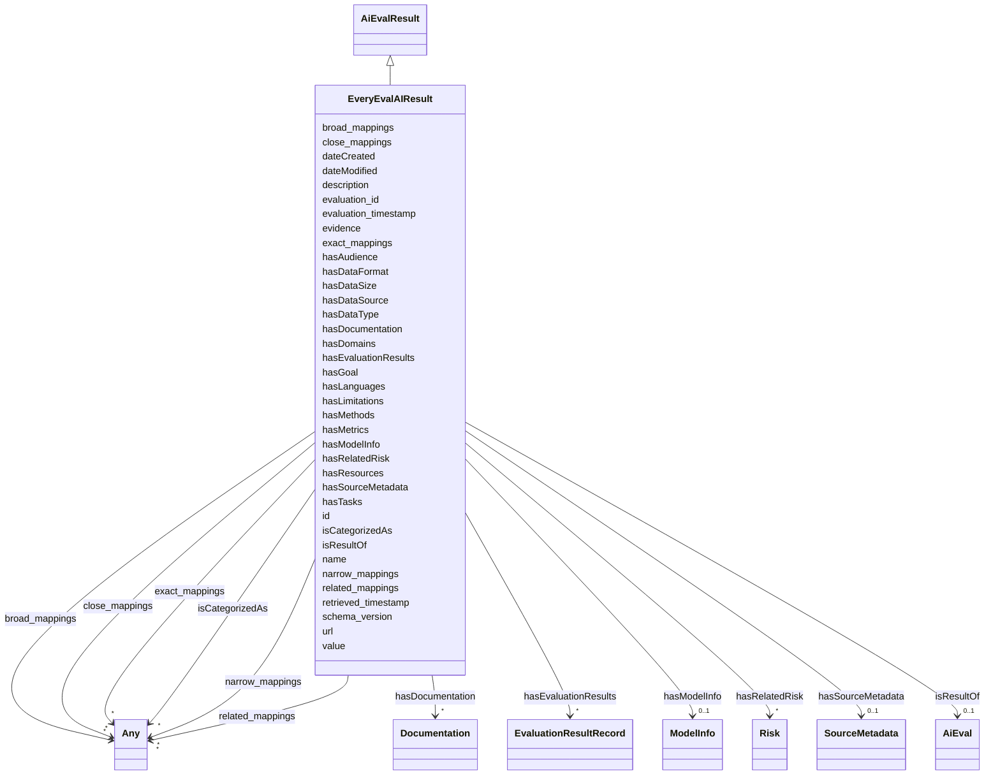

# Class: EveryEvalAIResult

_An evaluation result from the Every Eval Ever dataset, capturing evaluation metadata and results from the EEE_datastore._

URI: [nexus:everyevalairesult](https://ibm.github.io/ai-atlas-nexus/ontology/everyevalairesult)



## Inheritance

- [Entity](Entity.md)
  - [AiEvalResult](AiEvalResult.md) [ [Fact](Fact.md)]
    - **EveryEvalAIResult**

## Class Properties

| Property  | Value                                                                                      |
| --------- | ------------------------------------------------------------------------------------------ |
| Class URI | [nexus:everyevalairesult](https://ibm.github.io/ai-atlas-nexus/ontology/everyevalairesult) |

## Slots

| Name                                            | Cardinality and Range                                                                                        | Description                                                                      | Inheritance                     |
| ----------------------------------------------- | ------------------------------------------------------------------------------------------------------------ | -------------------------------------------------------------------------------- | ------------------------------- |
| [hasSourceMetadata](hasSourceMetadata.md)       | 0..1 <br/> [SourceMetadata](SourceMetadata.md)                                                               | Source metadata for the evaluation                                               | direct                          |
| [hasModelInfo](hasModelInfo.md)                 | 0..1 <br/> [ModelInfo](ModelInfo.md)                                                                         | Model information for the evaluation                                             | direct                          |
| [hasEvaluationResults](hasEvaluationResults.md) | \* <br/> [EvaluationResultRecord](EvaluationResultRecord.md)                                                 | Array of evaluation results                                                      | direct                          |
| [hasDataType](hasDataType.md)                   | \* <br/> [String](String.md)                                                                                 | The type of data used in the benchmark (e                                        | direct                          |
| [hasDomains](hasDomains.md)                     | \* <br/> [String](String.md)                                                                                 | The specific domains or areas where the benchmark is applied (e                  | direct                          |
| [hasLanguages](hasLanguages.md)                 | \* <br/> [String](String.md)                                                                                 | The languages included in the dataset used by the benchmark (e                   | direct                          |
| [hasTasks](hasTasks.md)                         | \* <br/> [String](String.md)                                                                                 | The tasks or evaluations the benchmark is intended to assess                     | direct                          |
| [hasDataSource](hasDataSource.md)               | \* <br/> [String](String.md)                                                                                 | The origin or source of the data used in the benchmark (e                        | direct                          |
| [hasDataSize](hasDataSize.md)                   | 0..1 <br/> [String](String.md)                                                                               | The size of the dataset, including the number of data points or examples         | direct                          |
| [hasDataFormat](hasDataFormat.md)               | \* <br/> [String](String.md)                                                                                 | The structure and modality of the data (e                                        | direct                          |
| [hasMethods](hasMethods.md)                     | \* <br/> [String](String.md)                                                                                 | The evaluation techniques applied within the benchmark                           | direct                          |
| [hasMetrics](hasMetrics.md)                     | \* <br/> [String](String.md)                                                                                 | The specific performance metrics used to assess models (e                        | direct                          |
| [hasLimitations](hasLimitations.md)             | \* <br/> [String](String.md)                                                                                 | Limitations in evaluating or addressing risks, such as gaps in demographic co... | direct                          |
| [hasGoal](hasGoal.md)                           | 0..1 <br/> [String](String.md)                                                                               | The specific goal or primary use case the benchmark is designed for              | direct                          |
| [hasAudience](hasAudience.md)                   | \* <br/> [String](String.md)                                                                                 | The intended audience, such as researchers, developers, policymakers, etc        | direct                          |
| [hasResources](hasResources.md)                 | \* <br/> [String](String.md)                                                                                 | Links to relevant resources, such as repositories or papers related to the be... | direct                          |
| [hasDocumentation](hasDocumentation.md)         | \* <br/> [Documentation](Documentation.md)                                                                   | Indicates documentation associated with an entity                                | direct                          |
| [hasRelatedRisk](hasRelatedRisk.md)             | \* <br/> [Term](Term.md)&nbsp;or&nbsp;<br />[Risk](Risk.md)&nbsp;or&nbsp;<br />[RiskConcept](RiskConcept.md) | A relationship where an entity relates to a risk                                 | direct                          |
| [schema_version](schema_version.md)             | 0..1 <br/> [String](String.md)                                                                               | Version of the evaluation schema                                                 | direct                          |
| [evaluation_id](evaluation_id.md)               | 0..1 <br/> [String](String.md)                                                                               | Unique identifier for this evaluation                                            | direct                          |
| [evaluation_timestamp](evaluation_timestamp.md) | 0..1 <br/> [Datetime](Datetime.md)                                                                           | ISO 8601 timestamp when evaluation was performed                                 | direct                          |
| [retrieved_timestamp](retrieved_timestamp.md)   | 0..1 <br/> [String](String.md)                                                                               | Unix timestamp when the data was retrieved                                       | direct                          |
| [isResultOf](isResultOf.md)                     | 0..1 <br/> [AiEval](AiEval.md)                                                                               | A relationship indicating that an entity is the result of an AI evaluation       | [AiEvalResult](AiEvalResult.md) |
| [value](value.md)                               | 1 <br/> [String](String.md)                                                                                  | Some numeric or string value                                                     | [Fact](Fact.md)                 |
| [evidence](evidence.md)                         | 0..1 <br/> [String](String.md)                                                                               | Evidence provides a source (typical a chunk, paragraph or link) describing wh... | [Fact](Fact.md)                 |
| [id](id.md)                                     | 1 <br/> [String](String.md)                                                                                  | A unique identifier to this instance of the model element                        | [Entity](Entity.md)             |
| [name](name.md)                                 | 0..1 <br/> [String](String.md)                                                                               | A text name of this instance                                                     | [Entity](Entity.md)             |
| [description](description.md)                   | 0..1 <br/> [String](String.md)                                                                               | The description of an entity                                                     | [Entity](Entity.md)             |
| [url](url.md)                                   | 0..1 <br/> [Uri](Uri.md)                                                                                     | An optional URL associated with this instance                                    | [Entity](Entity.md)             |
| [dateCreated](dateCreated.md)                   | 0..1 <br/> [Date](Date.md)                                                                                   | The date on which the entity was created                                         | [Entity](Entity.md)             |
| [dateModified](dateModified.md)                 | 0..1 <br/> [Date](Date.md)                                                                                   | The date on which the entity was most recently modified                          | [Entity](Entity.md)             |
| [exact_mappings](exact_mappings.md)             | \* <br/> [Any](Any.md)                                                                                       | The property is used to link two concepts, indicating a high degree of confid... | [Entity](Entity.md)             |
| [close_mappings](close_mappings.md)             | \* <br/> [Any](Any.md)                                                                                       | The property is used to link two concepts that are sufficiently similar that ... | [Entity](Entity.md)             |
| [related_mappings](related_mappings.md)         | \* <br/> [Any](Any.md)                                                                                       | The property skos:relatedMatch is used to state an associative mapping link b... | [Entity](Entity.md)             |
| [narrow_mappings](narrow_mappings.md)           | \* <br/> [Any](Any.md)                                                                                       | The property is used to state a hierarchical mapping link between two concept... | [Entity](Entity.md)             |
| [broad_mappings](broad_mappings.md)             | \* <br/> [Any](Any.md)                                                                                       | The property is used to state a hierarchical mapping link between two concept... | [Entity](Entity.md)             |
| [isCategorizedAs](isCategorizedAs.md)           | \* <br/> [Any](Any.md)                                                                                       | A relationship where an entity has been deemed to be categorized                 | [Entity](Entity.md)             |

## Usages

| used by                                   | used in                                         | type   | used                                      |
| ----------------------------------------- | ----------------------------------------------- | ------ | ----------------------------------------- |
| [EveryEvalAIResult](EveryEvalAIResult.md) | [hasSourceMetadata](hasSourceMetadata.md)       | domain | [EveryEvalAIResult](EveryEvalAIResult.md) |
| [EveryEvalAIResult](EveryEvalAIResult.md) | [hasModelInfo](hasModelInfo.md)                 | domain | [EveryEvalAIResult](EveryEvalAIResult.md) |
| [EveryEvalAIResult](EveryEvalAIResult.md) | [hasEvaluationResults](hasEvaluationResults.md) | domain | [EveryEvalAIResult](EveryEvalAIResult.md) |

## Identifier and Mapping Information

### Schema Source

- from schema: https://ibm.github.io/ai-atlas-nexus/ontology/ai-risk-ontology

## Mappings

| Mapping Type | Mapped Value            |
| ------------ | ----------------------- |
| self         | nexus:everyevalairesult |
| native       | nexus:EveryEvalAIResult |

## LinkML Source

<!-- TODO: investigate https://stackoverflow.com/questions/37606292/how-to-create-tabbed-code-blocks-in-mkdocs-or-sphinx -->

### Direct

<details>
```yaml
name: EveryEvalAIResult
description: An evaluation result from the Every Eval Ever dataset, capturing evaluation
  metadata and results from the EEE_datastore.
from_schema: https://ibm.github.io/ai-atlas-nexus/ontology/ai-risk-ontology
is_a: AiEvalResult
slots:
- hasSourceMetadata
- hasModelInfo
- hasEvaluationResults
- hasDataType
- hasDomains
- hasLanguages
- hasTasks
- hasDataSource
- hasDataSize
- hasDataFormat
- hasMethods
- hasMetrics
- hasLimitations
- hasGoal
- hasAudience
- hasResources
- hasDocumentation
- hasRelatedRisk
attributes:
  schema_version:
    name: schema_version
    description: Version of the evaluation schema
    from_schema: https://ibm.github.io/ai-atlas-nexus/ontology/ai_eval
    rank: 1000
    domain_of:
    - EveryEvalAIResult
    range: string
  evaluation_id:
    name: evaluation_id
    description: Unique identifier for this evaluation
    from_schema: https://ibm.github.io/ai-atlas-nexus/ontology/ai_eval
    rank: 1000
    domain_of:
    - EveryEvalAIResult
    range: string
  evaluation_timestamp:
    name: evaluation_timestamp
    description: ISO 8601 timestamp when evaluation was performed
    from_schema: https://ibm.github.io/ai-atlas-nexus/ontology/ai_eval
    rank: 1000
    domain_of:
    - EveryEvalAIResult
    range: datetime
  retrieved_timestamp:
    name: retrieved_timestamp
    description: Unix timestamp when the data was retrieved
    from_schema: https://ibm.github.io/ai-atlas-nexus/ontology/ai_eval
    rank: 1000
    domain_of:
    - EveryEvalAIResult
    range: string
class_uri: nexus:everyevalairesult

````
</details>

### Induced

<details>
```yaml
name: EveryEvalAIResult
description: An evaluation result from the Every Eval Ever dataset, capturing evaluation
  metadata and results from the EEE_datastore.
from_schema: https://ibm.github.io/ai-atlas-nexus/ontology/ai-risk-ontology
is_a: AiEvalResult
attributes:
  schema_version:
    name: schema_version
    description: Version of the evaluation schema
    from_schema: https://ibm.github.io/ai-atlas-nexus/ontology/ai_eval
    rank: 1000
    alias: schema_version
    owner: EveryEvalAIResult
    domain_of:
    - EveryEvalAIResult
    range: string
  evaluation_id:
    name: evaluation_id
    description: Unique identifier for this evaluation
    from_schema: https://ibm.github.io/ai-atlas-nexus/ontology/ai_eval
    rank: 1000
    alias: evaluation_id
    owner: EveryEvalAIResult
    domain_of:
    - EveryEvalAIResult
    range: string
  evaluation_timestamp:
    name: evaluation_timestamp
    description: ISO 8601 timestamp when evaluation was performed
    from_schema: https://ibm.github.io/ai-atlas-nexus/ontology/ai_eval
    rank: 1000
    alias: evaluation_timestamp
    owner: EveryEvalAIResult
    domain_of:
    - EveryEvalAIResult
    range: datetime
  retrieved_timestamp:
    name: retrieved_timestamp
    description: Unix timestamp when the data was retrieved
    from_schema: https://ibm.github.io/ai-atlas-nexus/ontology/ai_eval
    rank: 1000
    alias: retrieved_timestamp
    owner: EveryEvalAIResult
    domain_of:
    - EveryEvalAIResult
    range: string
  hasSourceMetadata:
    name: hasSourceMetadata
    description: Source metadata for the evaluation
    from_schema: https://ibm.github.io/ai-atlas-nexus/ontology/ai-risk-ontology
    rank: 1000
    domain: EveryEvalAIResult
    alias: hasSourceMetadata
    owner: EveryEvalAIResult
    domain_of:
    - EveryEvalAIResult
    range: SourceMetadata
    inlined: true
  hasModelInfo:
    name: hasModelInfo
    description: Model information for the evaluation
    from_schema: https://ibm.github.io/ai-atlas-nexus/ontology/ai-risk-ontology
    rank: 1000
    domain: EveryEvalAIResult
    alias: hasModelInfo
    owner: EveryEvalAIResult
    domain_of:
    - EveryEvalAIResult
    range: ModelInfo
    inlined: true
  hasEvaluationResults:
    name: hasEvaluationResults
    description: Array of evaluation results
    from_schema: https://ibm.github.io/ai-atlas-nexus/ontology/ai-risk-ontology
    rank: 1000
    domain: EveryEvalAIResult
    alias: hasEvaluationResults
    owner: EveryEvalAIResult
    domain_of:
    - EveryEvalAIResult
    range: EvaluationResultRecord
    multivalued: true
    inlined: true
  hasDataType:
    name: hasDataType
    description: The type of data used in the benchmark (e.g., text, images, or multi-modal)
    from_schema: https://ibm.github.io/ai-atlas-nexus/ontology/ai-risk-ontology
    rank: 1000
    alias: hasDataType
    owner: EveryEvalAIResult
    domain_of:
    - EveryEvalAIResult
    - BenchmarkMetadataCard
    range: string
    multivalued: true
  hasDomains:
    name: hasDomains
    description: The specific domains or areas where the benchmark is applied (e.g.,
      natural language processing, computer vision).
    from_schema: https://ibm.github.io/ai-atlas-nexus/ontology/ai-risk-ontology
    rank: 1000
    alias: hasDomains
    owner: EveryEvalAIResult
    domain_of:
    - EveryEvalAIResult
    - BenchmarkMetadataCard
    range: string
    multivalued: true
  hasLanguages:
    name: hasLanguages
    description: The languages included in the dataset used by the benchmark (e.g.,
      English, multilingual).
    from_schema: https://ibm.github.io/ai-atlas-nexus/ontology/ai-risk-ontology
    rank: 1000
    alias: hasLanguages
    owner: EveryEvalAIResult
    domain_of:
    - EveryEvalAIResult
    - BenchmarkMetadataCard
    range: string
    multivalued: true
  hasTasks:
    name: hasTasks
    description: The tasks or evaluations the benchmark is intended to assess.
    from_schema: https://ibm.github.io/ai-atlas-nexus/ontology/ai-risk-ontology
    rank: 1000
    alias: hasTasks
    owner: EveryEvalAIResult
    domain_of:
    - AiEval
    - EveryEvalAIResult
    - BenchmarkMetadataCard
    range: string
    multivalued: true
    inlined: false
  hasDataSource:
    name: hasDataSource
    description: The origin or source of the data used in the benchmark (e.g., curated
      datasets, user submissions).
    from_schema: https://ibm.github.io/ai-atlas-nexus/ontology/ai-risk-ontology
    rank: 1000
    alias: hasDataSource
    owner: EveryEvalAIResult
    domain_of:
    - EveryEvalAIResult
    - BenchmarkMetadataCard
    range: string
    multivalued: true
  hasDataSize:
    name: hasDataSize
    description: The size of the dataset, including the number of data points or examples.
    from_schema: https://ibm.github.io/ai-atlas-nexus/ontology/ai-risk-ontology
    rank: 1000
    alias: hasDataSize
    owner: EveryEvalAIResult
    domain_of:
    - EveryEvalAIResult
    - BenchmarkMetadataCard
    range: string
  hasDataFormat:
    name: hasDataFormat
    description: The structure and modality of the data (e.g., sentence pairs, question-answer
      format, tabular data).
    from_schema: https://ibm.github.io/ai-atlas-nexus/ontology/ai-risk-ontology
    rank: 1000
    alias: hasDataFormat
    owner: EveryEvalAIResult
    domain_of:
    - EveryEvalAIResult
    - BenchmarkMetadataCard
    range: string
    multivalued: true
  hasMethods:
    name: hasMethods
    description: The evaluation techniques applied within the benchmark.
    from_schema: https://ibm.github.io/ai-atlas-nexus/ontology/ai-risk-ontology
    rank: 1000
    alias: hasMethods
    owner: EveryEvalAIResult
    domain_of:
    - EveryEvalAIResult
    - BenchmarkMetadataCard
    range: string
    multivalued: true
  hasMetrics:
    name: hasMetrics
    description: The specific performance metrics used to assess models (e.g., accuracy,
      F1 score, precision, recall).
    from_schema: https://ibm.github.io/ai-atlas-nexus/ontology/ai-risk-ontology
    rank: 1000
    alias: hasMetrics
    owner: EveryEvalAIResult
    domain_of:
    - EveryEvalAIResult
    - BenchmarkMetadataCard
    range: string
    multivalued: true
  hasLimitations:
    name: hasLimitations
    description: Limitations in evaluating or addressing risks, such as gaps in demographic
      coverage or specific domains.
    from_schema: https://ibm.github.io/ai-atlas-nexus/ontology/ai-risk-ontology
    rank: 1000
    alias: hasLimitations
    owner: EveryEvalAIResult
    domain_of:
    - EveryEvalAIResult
    - BenchmarkMetadataCard
    range: string
    multivalued: true
  hasGoal:
    name: hasGoal
    description: The specific goal or primary use case the benchmark is designed for.
    from_schema: https://ibm.github.io/ai-atlas-nexus/ontology/ai-risk-ontology
    rank: 1000
    alias: hasGoal
    owner: EveryEvalAIResult
    domain_of:
    - EveryEvalAIResult
    - BenchmarkMetadataCard
    range: string
  hasAudience:
    name: hasAudience
    description: The intended audience, such as researchers, developers, policymakers,
      etc.
    from_schema: https://ibm.github.io/ai-atlas-nexus/ontology/ai-risk-ontology
    rank: 1000
    alias: hasAudience
    owner: EveryEvalAIResult
    domain_of:
    - EveryEvalAIResult
    - BenchmarkMetadataCard
    range: string
    multivalued: true
  hasResources:
    name: hasResources
    description: Links to relevant resources, such as repositories or papers related
      to the benchmark.
    from_schema: https://ibm.github.io/ai-atlas-nexus/ontology/ai-risk-ontology
    rank: 1000
    alias: hasResources
    owner: EveryEvalAIResult
    domain_of:
    - EveryEvalAIResult
    - BenchmarkMetadataCard
    range: string
    multivalued: true
  hasDocumentation:
    name: hasDocumentation
    description: Indicates documentation associated with an entity.
    from_schema: https://ibm.github.io/ai-atlas-nexus/ontology/ai-risk-ontology
    rank: 1000
    slot_uri: airo:hasDocumentation
    alias: hasDocumentation
    owner: EveryEvalAIResult
    domain_of:
    - Dataset
    - Vocabulary
    - Taxonomy
    - Concept
    - Group
    - Entry
    - Term
    - Principle
    - RiskTaxonomy
    - RiskControlGroupTaxonomy
    - Action
    - BaseAi
    - LargeLanguageModelFamily
    - AiEval
    - EveryEvalAIResult
    - BenchmarkMetadataCard
    - Adapter
    - LLMIntrinsic
    range: Documentation
    multivalued: true
    inlined: false
  hasRelatedRisk:
    name: hasRelatedRisk
    description: A relationship where an entity relates to a risk
    from_schema: https://ibm.github.io/ai-atlas-nexus/ontology/ai-risk-ontology
    rank: 1000
    domain: Any
    alias: hasRelatedRisk
    owner: EveryEvalAIResult
    domain_of:
    - Term
    - LLMQuestionPolicy
    - Action
    - AiSystem
    - AiEval
    - EveryEvalAIResult
    - BenchmarkMetadataCard
    - Adapter
    - LLMIntrinsic
    range: Risk
    multivalued: true
    inlined: false
    any_of:
    - range: RiskConcept
    - range: Term
  isResultOf:
    name: isResultOf
    description: A relationship indicating that an entity is the result of an AI evaluation.
    from_schema: https://ibm.github.io/ai-atlas-nexus/ontology/ai-risk-ontology
    rank: 1000
    slot_uri: dqv:isMeasurementOf
    alias: isResultOf
    owner: EveryEvalAIResult
    domain_of:
    - AiEvalResult
    range: AiEval
    multivalued: false
    inlined: false
  value:
    name: value
    description: Some numeric or string value
    from_schema: https://ibm.github.io/ai-atlas-nexus/ontology/ai-risk-ontology
    rank: 1000
    alias: value
    owner: EveryEvalAIResult
    domain_of:
    - Fact
    range: string
    required: true
  evidence:
    name: evidence
    description: Evidence provides a source (typical a chunk, paragraph or link) describing
      where some value was found or how it was generated.
    from_schema: https://ibm.github.io/ai-atlas-nexus/ontology/ai-risk-ontology
    rank: 1000
    alias: evidence
    owner: EveryEvalAIResult
    domain_of:
    - Fact
    range: string
  id:
    name: id
    description: A unique identifier to this instance of the model element. Example
      identifiers include UUID, URI, URN, etc.
    from_schema: https://ibm.github.io/ai-atlas-nexus/ontology/ai-risk-ontology
    rank: 1000
    slot_uri: schema:identifier
    identifier: true
    alias: id
    owner: EveryEvalAIResult
    domain_of:
    - Entity
    range: string
    required: true
  name:
    name: name
    description: A text name of this instance.
    from_schema: https://ibm.github.io/ai-atlas-nexus/ontology/ai-risk-ontology
    rank: 1000
    slot_uri: schema:name
    alias: name
    owner: EveryEvalAIResult
    domain_of:
    - Entity
    - BenchmarkMetadataCard
    range: string
  description:
    name: description
    description: The description of an entity
    from_schema: https://ibm.github.io/ai-atlas-nexus/ontology/ai-risk-ontology
    rank: 1000
    slot_uri: schema:description
    alias: description
    owner: EveryEvalAIResult
    domain_of:
    - Entity
    range: string
  url:
    name: url
    description: An optional URL associated with this instance.
    from_schema: https://ibm.github.io/ai-atlas-nexus/ontology/ai-risk-ontology
    rank: 1000
    slot_uri: schema:url
    alias: url
    owner: EveryEvalAIResult
    domain_of:
    - Entity
    range: uri
  dateCreated:
    name: dateCreated
    description: The date on which the entity was created.
    from_schema: https://ibm.github.io/ai-atlas-nexus/ontology/ai-risk-ontology
    rank: 1000
    slot_uri: schema:dateCreated
    alias: dateCreated
    owner: EveryEvalAIResult
    domain_of:
    - Entity
    range: date
    required: false
  dateModified:
    name: dateModified
    description: The date on which the entity was most recently modified.
    from_schema: https://ibm.github.io/ai-atlas-nexus/ontology/ai-risk-ontology
    rank: 1000
    slot_uri: schema:dateModified
    alias: dateModified
    owner: EveryEvalAIResult
    domain_of:
    - Entity
    range: date
    required: false
  exact_mappings:
    name: exact_mappings
    description: The property is used to link two concepts, indicating a high degree
      of confidence that the concepts can be used interchangeably across a wide range
      of information retrieval applications
    from_schema: https://ibm.github.io/ai-atlas-nexus/ontology/ai-risk-ontology
    rank: 1000
    slot_uri: skos:exactMatch
    alias: exact_mappings
    owner: EveryEvalAIResult
    domain_of:
    - Entity
    range: Any
    multivalued: true
    inlined: false
  close_mappings:
    name: close_mappings
    description: The property is used to link two concepts that are sufficiently similar
      that they can be used interchangeably in some information retrieval applications.
    from_schema: https://ibm.github.io/ai-atlas-nexus/ontology/ai-risk-ontology
    rank: 1000
    slot_uri: skos:closeMatch
    alias: close_mappings
    owner: EveryEvalAIResult
    domain_of:
    - Entity
    range: Any
    multivalued: true
    inlined: false
  related_mappings:
    name: related_mappings
    description: The property skos:relatedMatch is used to state an associative mapping
      link between two concepts.
    from_schema: https://ibm.github.io/ai-atlas-nexus/ontology/ai-risk-ontology
    rank: 1000
    slot_uri: skos:relatedMatch
    alias: related_mappings
    owner: EveryEvalAIResult
    domain_of:
    - Entity
    range: Any
    multivalued: true
    inlined: false
  narrow_mappings:
    name: narrow_mappings
    description: The property is used to state a hierarchical mapping link between
      two concepts, indicating that the concept linked to, is a narrower concept than
      the originating concept.
    from_schema: https://ibm.github.io/ai-atlas-nexus/ontology/ai-risk-ontology
    rank: 1000
    slot_uri: skos:narrowMatch
    alias: narrow_mappings
    owner: EveryEvalAIResult
    domain_of:
    - Entity
    range: Any
    multivalued: true
    inlined: false
  broad_mappings:
    name: broad_mappings
    description: The property is used to state a hierarchical mapping link between
      two concepts, indicating that the concept linked to, is a broader concept than
      the originating concept.
    from_schema: https://ibm.github.io/ai-atlas-nexus/ontology/ai-risk-ontology
    rank: 1000
    slot_uri: skos:broadMatch
    alias: broad_mappings
    owner: EveryEvalAIResult
    domain_of:
    - Entity
    range: Any
    multivalued: true
    inlined: false
  isCategorizedAs:
    name: isCategorizedAs
    description: A relationship where an entity has been deemed to be categorized
    from_schema: https://ibm.github.io/ai-atlas-nexus/ontology/ai-risk-ontology
    rank: 1000
    slot_uri: nexus:isCategorizedAs
    alias: isCategorizedAs
    owner: EveryEvalAIResult
    domain_of:
    - Entity
    range: Any
    multivalued: true
    inlined: false
class_uri: nexus:everyevalairesult

````

</details>
