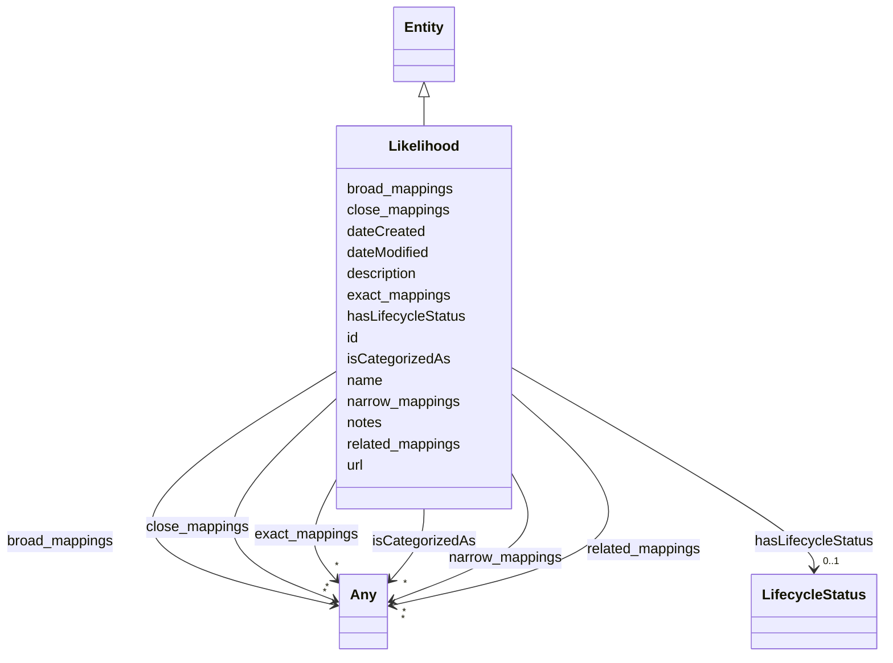

---
search:
  boost: 10.0
---

# Class: Likelihood

<div data-search-exclude markdown="1">

URI: [dpv:Likelihood](https://w3id.org/dpv#Likelihood)



## Inheritance

- [Entity](Entity.md)
  - **Likelihood**

## Class Properties

| Property  | Value                                             |
| --------- | ------------------------------------------------- |
| Class URI | [dpv:Likelihood](https://w3id.org/dpv#Likelihood) |

## Slots

| Name                                        | Cardinality and Range                            | Description                                                                      | Inheritance         |
| ------------------------------------------- | ------------------------------------------------ | -------------------------------------------------------------------------------- | ------------------- |
| [id](id.md)                                 | 1 <br/> [String](String.md)                      | A unique identifier to this instance of the model element                        | [Entity](Entity.md) |
| [name](name.md)                             | 0..1 <br/> [String](String.md)                   | A text name of this instance                                                     | [Entity](Entity.md) |
| [description](description.md)               | 0..1 <br/> [String](String.md)                   | The description of an entity                                                     | [Entity](Entity.md) |
| [url](url.md)                               | 0..1 <br/> [Uri](Uri.md)                         | An optional URL associated with this instance                                    | [Entity](Entity.md) |
| [dateCreated](dateCreated.md)               | 0..1 <br/> [Date](Date.md)                       | The date on which the entity was created                                         | [Entity](Entity.md) |
| [dateModified](dateModified.md)             | 0..1 <br/> [Date](Date.md)                       | The date on which the entity was most recently modified                          | [Entity](Entity.md) |
| [exact_mappings](exact_mappings.md)         | \* <br/> [Any](Any.md)                           | The property is used to link two concepts, indicating a high degree of confid... | [Entity](Entity.md) |
| [close_mappings](close_mappings.md)         | \* <br/> [Any](Any.md)                           | The property is used to link two concepts that are sufficiently similar that ... | [Entity](Entity.md) |
| [related_mappings](related_mappings.md)     | \* <br/> [Any](Any.md)                           | The property skos:relatedMatch is used to state an associative mapping link b... | [Entity](Entity.md) |
| [narrow_mappings](narrow_mappings.md)       | \* <br/> [Any](Any.md)                           | The property is used to state a hierarchical mapping link between two concept... | [Entity](Entity.md) |
| [broad_mappings](broad_mappings.md)         | \* <br/> [Any](Any.md)                           | The property is used to state a hierarchical mapping link between two concept... | [Entity](Entity.md) |
| [isCategorizedAs](isCategorizedAs.md)       | \* <br/> [Any](Any.md)                           | A relationship where an entity has been deemed to be categorized                 | [Entity](Entity.md) |
| [hasLifecycleStatus](hasLifecycleStatus.md) | 0..1 <br/> [LifecycleStatus](LifecycleStatus.md) | The editorial / publication lifecycle state of this entity                       | [Entity](Entity.md) |
| [notes](notes.md)                           | \* <br/> [String](String.md)                     | Free-text editorial notes, source breadcrumbs, or build-time provenance that ... | [Entity](Entity.md) |

## Usages

| used by                         | used in                           | type  | used                        |
| ------------------------------- | --------------------------------- | ----- | --------------------------- |
| [RiskIncident](RiskIncident.md) | [hasLikelihood](hasLikelihood.md) | range | [Likelihood](Likelihood.md) |

## Identifier and Mapping Information

### Schema Source

- from schema: https://w3id.org/ai-atlas-nexus/ai-risk-ontology

## Mappings

| Mapping Type | Mapped Value     |
| ------------ | ---------------- |
| self         | dpv:Likelihood   |
| native       | nexus:Likelihood |

## LinkML Source

<!-- TODO: investigate https://stackoverflow.com/questions/37606292/how-to-create-tabbed-code-blocks-in-mkdocs-or-sphinx -->

### Direct

<details>
```yaml
name: Likelihood
from_schema: https://w3id.org/ai-atlas-nexus/ai-risk-ontology
is_a: Entity
class_uri: dpv:Likelihood

````
</details>

### Induced

<details>
```yaml
name: Likelihood
from_schema: https://w3id.org/ai-atlas-nexus/ai-risk-ontology
is_a: Entity
attributes:
  id:
    name: id
    description: A unique identifier to this instance of the model element. Example
      identifiers include UUID, URI, URN, etc.
    from_schema: https://w3id.org/ai-atlas-nexus/ai-risk-ontology
    rank: 1000
    slot_uri: schema:identifier
    identifier: true
    owner: Likelihood
    domain_of:
    - Entity
    range: string
    required: true
  name:
    name: name
    description: A text name of this instance.
    from_schema: https://w3id.org/ai-atlas-nexus/ai-risk-ontology
    rank: 1000
    slot_uri: schema:name
    owner: Likelihood
    domain_of:
    - Entity
    - BenchmarkMetadataCard
    range: string
  description:
    name: description
    description: The description of an entity
    from_schema: https://w3id.org/ai-atlas-nexus/ai-risk-ontology
    rank: 1000
    slot_uri: schema:description
    owner: Likelihood
    domain_of:
    - Entity
    range: string
  url:
    name: url
    description: An optional URL associated with this instance.
    from_schema: https://w3id.org/ai-atlas-nexus/ai-risk-ontology
    rank: 1000
    slot_uri: schema:url
    owner: Likelihood
    domain_of:
    - Entity
    range: uri
  dateCreated:
    name: dateCreated
    description: The date on which the entity was created.
    from_schema: https://w3id.org/ai-atlas-nexus/ai-risk-ontology
    rank: 1000
    slot_uri: schema:dateCreated
    owner: Likelihood
    domain_of:
    - Entity
    range: date
    required: false
  dateModified:
    name: dateModified
    description: The date on which the entity was most recently modified.
    from_schema: https://w3id.org/ai-atlas-nexus/ai-risk-ontology
    rank: 1000
    slot_uri: schema:dateModified
    owner: Likelihood
    domain_of:
    - Entity
    range: date
    required: false
  exact_mappings:
    name: exact_mappings
    description: The property is used to link two concepts, indicating a high degree
      of confidence that the concepts can be used interchangeably across a wide range
      of information retrieval applications
    from_schema: https://w3id.org/ai-atlas-nexus/ai-risk-ontology
    rank: 1000
    slot_uri: skos:exactMatch
    owner: Likelihood
    domain_of:
    - Entity
    range: Any
    multivalued: true
    inlined: false
  close_mappings:
    name: close_mappings
    description: The property is used to link two concepts that are sufficiently similar
      that they can be used interchangeably in some information retrieval applications.
    from_schema: https://w3id.org/ai-atlas-nexus/ai-risk-ontology
    rank: 1000
    slot_uri: skos:closeMatch
    owner: Likelihood
    domain_of:
    - Entity
    range: Any
    multivalued: true
    inlined: false
  related_mappings:
    name: related_mappings
    description: The property skos:relatedMatch is used to state an associative mapping
      link between two concepts.
    from_schema: https://w3id.org/ai-atlas-nexus/ai-risk-ontology
    rank: 1000
    slot_uri: skos:relatedMatch
    owner: Likelihood
    domain_of:
    - Entity
    range: Any
    multivalued: true
    inlined: false
  narrow_mappings:
    name: narrow_mappings
    description: The property is used to state a hierarchical mapping link between
      two concepts, indicating that the concept linked to, is a narrower concept than
      the originating concept.
    from_schema: https://w3id.org/ai-atlas-nexus/ai-risk-ontology
    rank: 1000
    slot_uri: skos:narrowMatch
    owner: Likelihood
    domain_of:
    - Entity
    range: Any
    multivalued: true
    inlined: false
  broad_mappings:
    name: broad_mappings
    description: The property is used to state a hierarchical mapping link between
      two concepts, indicating that the concept linked to, is a broader concept than
      the originating concept.
    from_schema: https://w3id.org/ai-atlas-nexus/ai-risk-ontology
    rank: 1000
    slot_uri: skos:broadMatch
    owner: Likelihood
    domain_of:
    - Entity
    range: Any
    multivalued: true
    inlined: false
  isCategorizedAs:
    name: isCategorizedAs
    description: A relationship where an entity has been deemed to be categorized
    from_schema: https://w3id.org/ai-atlas-nexus/ai-risk-ontology
    rank: 1000
    slot_uri: nexus:isCategorizedAs
    owner: Likelihood
    domain_of:
    - Entity
    range: Any
    multivalued: true
    inlined: false
  hasLifecycleStatus:
    name: hasLifecycleStatus
    description: The editorial / publication lifecycle state of this entity. Distinct
      from AiLifecyclePhase, which describes an AI system's runtime evolution rather
      than the editorial workflow of a catalogued entry.
    from_schema: https://w3id.org/ai-atlas-nexus/ai-risk-ontology
    aliases:
    - lifecycle_status
    - doc_status
    rank: 1000
    slot_uri: adms:status
    owner: Likelihood
    domain_of:
    - Entity
    range: LifecycleStatus
  notes:
    name: notes
    description: Free-text editorial notes, source breadcrumbs, or build-time provenance
      that do not belong in the user-facing description. Opaque to consumers.
    from_schema: https://w3id.org/ai-atlas-nexus/ai-risk-ontology
    rank: 1000
    slot_uri: skos:note
    owner: Likelihood
    domain_of:
    - Entity
    range: string
    recommended: false
    multivalued: true
class_uri: dpv:Likelihood

````

</details></div>
