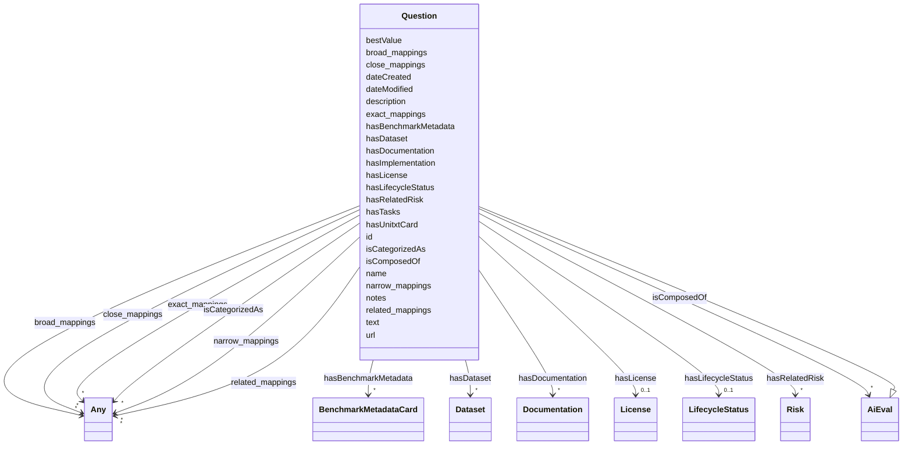

---
search:
  boost: 10.0
---

# Class: Question

_An evaluation where a question has to be answered_

<div data-search-exclude markdown="1">

URI: [nexus:Question](https://w3id.org/ai-atlas-nexus/Question)



## Inheritance

- [Entity](Entity.md)
  - [AiEval](AiEval.md)
    - **Question**

## Slots

| Name                                            | Cardinality and Range                                      | Description                                                                      | Inheritance         |
| ----------------------------------------------- | ---------------------------------------------------------- | -------------------------------------------------------------------------------- | ------------------- |
| [text](text.md)                                 | 1 <br/> [String](String.md)                                | The question itself                                                              | direct              |
| [hasDocumentation](hasDocumentation.md)         | \* <br/> [Documentation](Documentation.md)                 | Indicates documentation associated with an entity                                | [AiEval](AiEval.md) |
| [hasDataset](hasDataset.md)                     | \* <br/> [Dataset](Dataset.md)                             | A relationship to datasets that are used                                         | [AiEval](AiEval.md) |
| [hasTasks](hasTasks.md)                         | \* <br/> [String](String.md)                               | The tasks or evaluations the benchmark is intended to assess                     | [AiEval](AiEval.md) |
| [hasImplementation](hasImplementation.md)       | \* <br/> [Uri](Uri.md)                                     | A relationship to a implementation defining the risk evaluation                  | [AiEval](AiEval.md) |
| [hasUnitxtCard](hasUnitxtCard.md)               | \* <br/> [Uri](Uri.md)                                     | A relationship to a Unitxt card defining the risk evaluation                     | [AiEval](AiEval.md) |
| [hasLicense](hasLicense.md)                     | 0..1 <br/> [License](License.md)                           | Indicates licenses associated with a resource                                    | [AiEval](AiEval.md) |
| [hasRelatedRisk](hasRelatedRisk.md)             | \* <br/> [Risk](Risk.md)                                   | A relationship where an entity relates to a risk                                 | [AiEval](AiEval.md) |
| [bestValue](bestValue.md)                       | 0..1 <br/> [String](String.md)                             | Annotation of the best possible result of the evaluation                         | [AiEval](AiEval.md) |
| [hasBenchmarkMetadata](hasBenchmarkMetadata.md) | \* <br/> [BenchmarkMetadataCard](BenchmarkMetadataCard.md) | A relationship to a Benchmark Metadata Card which contains metadata about the... | [AiEval](AiEval.md) |
| [isComposedOf](isComposedOf.md)                 | \* <br/> [AiEval](AiEval.md)                               | A relationship indicating that an AI evaluation maybe composed of other AI ev... | [AiEval](AiEval.md) |
| [id](id.md)                                     | 1 <br/> [String](String.md)                                | A unique identifier to this instance of the model element                        | [Entity](Entity.md) |
| [name](name.md)                                 | 0..1 <br/> [String](String.md)                             | A text name of this instance                                                     | [Entity](Entity.md) |
| [description](description.md)                   | 0..1 <br/> [String](String.md)                             | The description of an entity                                                     | [Entity](Entity.md) |
| [url](url.md)                                   | 0..1 <br/> [Uri](Uri.md)                                   | An optional URL associated with this instance                                    | [Entity](Entity.md) |
| [dateCreated](dateCreated.md)                   | 0..1 <br/> [Date](Date.md)                                 | The date on which the entity was created                                         | [Entity](Entity.md) |
| [dateModified](dateModified.md)                 | 0..1 <br/> [Date](Date.md)                                 | The date on which the entity was most recently modified                          | [Entity](Entity.md) |
| [exact_mappings](exact_mappings.md)             | \* <br/> [Any](Any.md)                                     | The property is used to link two concepts, indicating a high degree of confid... | [Entity](Entity.md) |
| [close_mappings](close_mappings.md)             | \* <br/> [Any](Any.md)                                     | The property is used to link two concepts that are sufficiently similar that ... | [Entity](Entity.md) |
| [related_mappings](related_mappings.md)         | \* <br/> [Any](Any.md)                                     | The property skos:relatedMatch is used to state an associative mapping link b... | [Entity](Entity.md) |
| [narrow_mappings](narrow_mappings.md)           | \* <br/> [Any](Any.md)                                     | The property is used to state a hierarchical mapping link between two concept... | [Entity](Entity.md) |
| [broad_mappings](broad_mappings.md)             | \* <br/> [Any](Any.md)                                     | The property is used to state a hierarchical mapping link between two concept... | [Entity](Entity.md) |
| [isCategorizedAs](isCategorizedAs.md)           | \* <br/> [Any](Any.md)                                     | A relationship where an entity has been deemed to be categorized                 | [Entity](Entity.md) |
| [hasLifecycleStatus](hasLifecycleStatus.md)     | 0..1 <br/> [LifecycleStatus](LifecycleStatus.md)           | The editorial / publication lifecycle state of this entity                       | [Entity](Entity.md) |
| [notes](notes.md)                               | \* <br/> [String](String.md)                               | Free-text editorial notes, source breadcrumbs, or build-time provenance that ... | [Entity](Entity.md) |

## Usages

| used by                           | used in                         | type  | used                    |
| --------------------------------- | ------------------------------- | ----- | ----------------------- |
| [Questionnaire](Questionnaire.md) | [isComposedOf](isComposedOf.md) | range | [Question](Question.md) |

## Identifier and Mapping Information

### Schema Source

- from schema: https://w3id.org/ai-atlas-nexus/ai-risk-ontology

## Mappings

| Mapping Type | Mapped Value   |
| ------------ | -------------- |
| self         | nexus:Question |
| native       | nexus:Question |

## LinkML Source

<!-- TODO: investigate https://stackoverflow.com/questions/37606292/how-to-create-tabbed-code-blocks-in-mkdocs-or-sphinx -->

### Direct

<details>
```yaml
name: Question
description: An evaluation where a question has to be answered
from_schema: https://w3id.org/ai-atlas-nexus/ai-risk-ontology
is_a: AiEval
attributes:
  text:
    name: text
    description: The question itself
    from_schema: https://w3id.org/ai-atlas-nexus/ai_eval
    rank: 1000
    domain_of:
    - Question
    required: true

````
</details>

### Induced

<details>
```yaml
name: Question
description: An evaluation where a question has to be answered
from_schema: https://w3id.org/ai-atlas-nexus/ai-risk-ontology
is_a: AiEval
attributes:
  text:
    name: text
    description: The question itself
    from_schema: https://w3id.org/ai-atlas-nexus/ai_eval
    rank: 1000
    alias: text
    owner: Question
    domain_of:
    - Question
    range: string
    required: true
  hasDocumentation:
    name: hasDocumentation
    description: Indicates documentation associated with an entity.
    from_schema: https://w3id.org/ai-atlas-nexus/ai-risk-ontology
    rank: 1000
    slot_uri: airo:hasDocumentation
    alias: hasDocumentation
    owner: Question
    domain_of:
    - Dataset
    - Vocabulary
    - Taxonomy
    - Concept
    - Group
    - Entry
    - Term
    - Principle
    - RiskTaxonomy
    - RiskControlGroupTaxonomy
    - Action
    - BaseAi
    - LargeLanguageModelFamily
    - AiTaskTaxonomy
    - AiEval
    - EveryEvalAIResult
    - BenchmarkMetadataCard
    - Adapter
    - LLMIntrinsic
    range: Documentation
    multivalued: true
    inlined: false
  hasDataset:
    name: hasDataset
    description: A relationship to datasets that are used.
    from_schema: https://w3id.org/ai-atlas-nexus/ai-risk-ontology
    rank: 1000
    alias: hasDataset
    owner: Question
    domain_of:
    - AiEval
    range: Dataset
    multivalued: true
    inlined: false
  hasTasks:
    name: hasTasks
    description: The tasks or evaluations the benchmark is intended to assess.
    from_schema: https://w3id.org/ai-atlas-nexus/ai-risk-ontology
    rank: 1000
    alias: hasTasks
    owner: Question
    domain_of:
    - AiEval
    - EveryEvalAIResult
    - BenchmarkMetadataCard
    range: string
    multivalued: true
    inlined: false
  hasImplementation:
    name: hasImplementation
    description: A relationship to a implementation defining the risk evaluation
    from_schema: https://w3id.org/ai-atlas-nexus/ai-risk-ontology
    rank: 1000
    slot_uri: schema:url
    alias: hasImplementation
    owner: Question
    domain_of:
    - AiEval
    range: uri
    multivalued: true
    inlined: false
  hasUnitxtCard:
    name: hasUnitxtCard
    description: A relationship to a Unitxt card defining the risk evaluation
    from_schema: https://w3id.org/ai-atlas-nexus/ai-risk-ontology
    rank: 1000
    slot_uri: schema:url
    alias: hasUnitxtCard
    owner: Question
    domain_of:
    - AiEval
    range: uri
    multivalued: true
    inlined: false
  hasLicense:
    name: hasLicense
    description: Indicates licenses associated with a resource
    from_schema: https://w3id.org/ai-atlas-nexus/ai-risk-ontology
    rank: 1000
    slot_uri: airo:hasLicense
    alias: hasLicense
    owner: Question
    domain_of:
    - Dataset
    - Documentation
    - Vocabulary
    - Taxonomy
    - RiskTaxonomy
    - RiskControlGroupTaxonomy
    - BaseAi
    - AiTaskTaxonomy
    - AiEval
    - BenchmarkMetadataCard
    - Adapter
    range: License
  hasRelatedRisk:
    name: hasRelatedRisk
    description: A relationship where an entity relates to a risk
    from_schema: https://w3id.org/ai-atlas-nexus/ai-risk-ontology
    rank: 1000
    domain: AiEval
    alias: hasRelatedRisk
    owner: Question
    domain_of:
    - Term
    - LLMQuestionPolicy
    - Action
    - AiSystem
    - AiEval
    - EveryEvalAIResult
    - BenchmarkMetadataCard
    - Adapter
    - LLMIntrinsic
    range: Risk
    multivalued: true
    inlined: false
  bestValue:
    name: bestValue
    description: Annotation of the best possible result of the evaluation
    from_schema: https://w3id.org/ai-atlas-nexus/ai-risk-ontology
    rank: 1000
    alias: bestValue
    owner: Question
    domain_of:
    - AiEval
    range: string
  hasBenchmarkMetadata:
    name: hasBenchmarkMetadata
    description: A relationship to a Benchmark Metadata Card which contains metadata
      about the benchmark.
    from_schema: https://w3id.org/ai-atlas-nexus/ai-risk-ontology
    rank: 1000
    domain: AiEval
    alias: hasBenchmarkMetadata
    owner: Question
    domain_of:
    - AiEval
    inverse: describesAiEval
    range: BenchmarkMetadataCard
    multivalued: true
    inlined: false
  isComposedOf:
    name: isComposedOf
    description: A relationship indicating that an AI evaluation maybe composed of
      other AI evaluations (e.g. it's an overall average of other scores).
    from_schema: https://w3id.org/ai-atlas-nexus/ai-risk-ontology
    rank: 1000
    alias: isComposedOf
    owner: Question
    domain_of:
    - AiSystem
    - AiEval
    range: AiEval
    multivalued: true
    inlined: false
  id:
    name: id
    description: A unique identifier to this instance of the model element. Example
      identifiers include UUID, URI, URN, etc.
    from_schema: https://w3id.org/ai-atlas-nexus/ai-risk-ontology
    rank: 1000
    slot_uri: schema:identifier
    identifier: true
    alias: id
    owner: Question
    domain_of:
    - Entity
    range: string
    required: true
  name:
    name: name
    description: A text name of this instance.
    from_schema: https://w3id.org/ai-atlas-nexus/ai-risk-ontology
    rank: 1000
    slot_uri: schema:name
    alias: name
    owner: Question
    domain_of:
    - Entity
    - BenchmarkMetadataCard
    range: string
  description:
    name: description
    description: The description of an entity
    from_schema: https://w3id.org/ai-atlas-nexus/ai-risk-ontology
    rank: 1000
    slot_uri: schema:description
    alias: description
    owner: Question
    domain_of:
    - Entity
    range: string
  url:
    name: url
    description: An optional URL associated with this instance.
    from_schema: https://w3id.org/ai-atlas-nexus/ai-risk-ontology
    rank: 1000
    slot_uri: schema:url
    alias: url
    owner: Question
    domain_of:
    - Entity
    range: uri
  dateCreated:
    name: dateCreated
    description: The date on which the entity was created.
    from_schema: https://w3id.org/ai-atlas-nexus/ai-risk-ontology
    rank: 1000
    slot_uri: schema:dateCreated
    alias: dateCreated
    owner: Question
    domain_of:
    - Entity
    range: date
    required: false
  dateModified:
    name: dateModified
    description: The date on which the entity was most recently modified.
    from_schema: https://w3id.org/ai-atlas-nexus/ai-risk-ontology
    rank: 1000
    slot_uri: schema:dateModified
    alias: dateModified
    owner: Question
    domain_of:
    - Entity
    range: date
    required: false
  exact_mappings:
    name: exact_mappings
    description: The property is used to link two concepts, indicating a high degree
      of confidence that the concepts can be used interchangeably across a wide range
      of information retrieval applications
    from_schema: https://w3id.org/ai-atlas-nexus/ai-risk-ontology
    rank: 1000
    slot_uri: skos:exactMatch
    alias: exact_mappings
    owner: Question
    domain_of:
    - Entity
    range: Any
    multivalued: true
    inlined: false
  close_mappings:
    name: close_mappings
    description: The property is used to link two concepts that are sufficiently similar
      that they can be used interchangeably in some information retrieval applications.
    from_schema: https://w3id.org/ai-atlas-nexus/ai-risk-ontology
    rank: 1000
    slot_uri: skos:closeMatch
    alias: close_mappings
    owner: Question
    domain_of:
    - Entity
    range: Any
    multivalued: true
    inlined: false
  related_mappings:
    name: related_mappings
    description: The property skos:relatedMatch is used to state an associative mapping
      link between two concepts.
    from_schema: https://w3id.org/ai-atlas-nexus/ai-risk-ontology
    rank: 1000
    slot_uri: skos:relatedMatch
    alias: related_mappings
    owner: Question
    domain_of:
    - Entity
    range: Any
    multivalued: true
    inlined: false
  narrow_mappings:
    name: narrow_mappings
    description: The property is used to state a hierarchical mapping link between
      two concepts, indicating that the concept linked to, is a narrower concept than
      the originating concept.
    from_schema: https://w3id.org/ai-atlas-nexus/ai-risk-ontology
    rank: 1000
    slot_uri: skos:narrowMatch
    alias: narrow_mappings
    owner: Question
    domain_of:
    - Entity
    range: Any
    multivalued: true
    inlined: false
  broad_mappings:
    name: broad_mappings
    description: The property is used to state a hierarchical mapping link between
      two concepts, indicating that the concept linked to, is a broader concept than
      the originating concept.
    from_schema: https://w3id.org/ai-atlas-nexus/ai-risk-ontology
    rank: 1000
    slot_uri: skos:broadMatch
    alias: broad_mappings
    owner: Question
    domain_of:
    - Entity
    range: Any
    multivalued: true
    inlined: false
  isCategorizedAs:
    name: isCategorizedAs
    description: A relationship where an entity has been deemed to be categorized
    from_schema: https://w3id.org/ai-atlas-nexus/ai-risk-ontology
    rank: 1000
    slot_uri: nexus:isCategorizedAs
    alias: isCategorizedAs
    owner: Question
    domain_of:
    - Entity
    range: Any
    multivalued: true
    inlined: false
  hasLifecycleStatus:
    name: hasLifecycleStatus
    description: The editorial / publication lifecycle state of this entity. Distinct
      from AiLifecyclePhase, which describes an AI system's runtime evolution rather
      than the editorial workflow of a catalogued entry.
    from_schema: https://w3id.org/ai-atlas-nexus/ai-risk-ontology
    aliases:
    - lifecycle_status
    - doc_status
    rank: 1000
    slot_uri: adms:status
    alias: hasLifecycleStatus
    owner: Question
    domain_of:
    - Entity
    range: LifecycleStatus
  notes:
    name: notes
    description: Free-text editorial notes, source breadcrumbs, or build-time provenance
      that do not belong in the user-facing description. Opaque to consumers.
    from_schema: https://w3id.org/ai-atlas-nexus/ai-risk-ontology
    rank: 1000
    slot_uri: skos:note
    alias: notes
    owner: Question
    domain_of:
    - Entity
    range: string
    recommended: false
    multivalued: true

````

</details></div>
