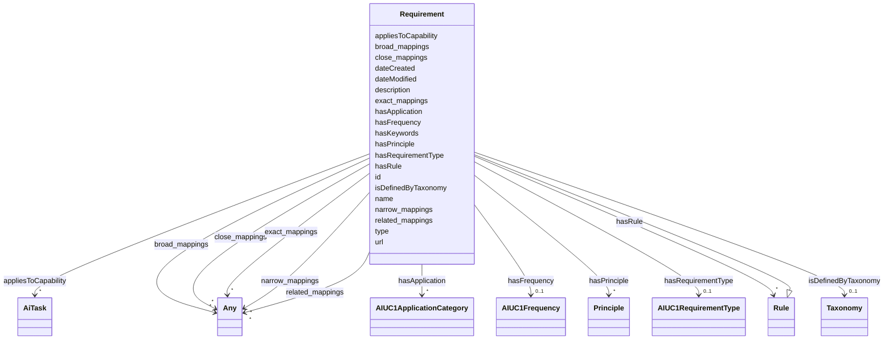

# Class: Requirement

_A requirement representing a combination of obligation, permission, or prohibition for AI system assurance._

URI: [nexus:Requirement](https://ibm.github.io/ai-atlas-nexus/ontology/Requirement)



## Inheritance

- [Entity](Entity.md)
  - [Rule](Rule.md)
    - **Requirement**

## Slots

| Name                                          | Cardinality and Range                                            | Description                                                                      | Inheritance         |
| --------------------------------------------- | ---------------------------------------------------------------- | -------------------------------------------------------------------------------- | ------------------- |
| [hasApplication](hasApplication.md)           | \* <br/> [AIUC1ApplicationCategory](AIUC1ApplicationCategory.md) | The application category, Optional or Mandatory                                  | direct              |
| [hasFrequency](hasFrequency.md)               | 0..1 <br/> [AIUC1Frequency](AIUC1Frequency.md)                   | The frequency                                                                    | direct              |
| [hasKeywords](hasKeywords.md)                 | \* <br/> [String](String.md)                                     | A collection of keywords                                                         | direct              |
| [hasPrinciple](hasPrinciple.md)               | \* <br/> [Principle](Principle.md)                               | Which of the AIUC-1 principles this requirement belongs to                       | direct              |
| [appliesToCapability](appliesToCapability.md) | \* <br/> [AiTask](AiTask.md)                                     | This evidence only applies to AI systems with this capability                    | direct              |
| [hasRequirementType](hasRequirementType.md)   | 0..1 <br/> [AIUC1RequirementType](AIUC1RequirementType.md)       | The requirement type of whether this is preventive, detective, etc               | direct              |
| [isDefinedByTaxonomy](isDefinedByTaxonomy.md) | 0..1 <br/> [Taxonomy](Taxonomy.md)                               | A relationship where a concept or a concept group is defined by a taxonomy       | direct              |
| [hasRule](hasRule.md)                         | \* <br/> [Rule](Rule.md)                                         | Relationship indicating the control activities (rules) of which the requireme... | direct              |
| [type](type.md)                               | 0..1 <br/> [String](String.md)                                   |                                                                                  | direct              |
| [id](id.md)                                   | 1 <br/> [String](String.md)                                      | A unique identifier to this instance of the model element                        | [Entity](Entity.md) |
| [name](name.md)                               | 0..1 <br/> [String](String.md)                                   | A text name of this instance                                                     | [Entity](Entity.md) |
| [description](description.md)                 | 0..1 <br/> [String](String.md)                                   | The description of an entity                                                     | [Entity](Entity.md) |
| [url](url.md)                                 | 0..1 <br/> [Uri](Uri.md)                                         | An optional URL associated with this instance                                    | [Entity](Entity.md) |
| [dateCreated](dateCreated.md)                 | 0..1 <br/> [Date](Date.md)                                       | The date on which the entity was created                                         | [Entity](Entity.md) |
| [dateModified](dateModified.md)               | 0..1 <br/> [Date](Date.md)                                       | The date on which the entity was most recently modified                          | [Entity](Entity.md) |
| [exact_mappings](exact_mappings.md)           | \* <br/> [Any](Any.md)                                           | The property is used to link two concepts, indicating a high degree of confid... | [Entity](Entity.md) |
| [close_mappings](close_mappings.md)           | \* <br/> [Any](Any.md)                                           | The property is used to link two concepts that are sufficiently similar that ... | [Entity](Entity.md) |
| [related_mappings](related_mappings.md)       | \* <br/> [Any](Any.md)                                           | The property skos:relatedMatch is used to state an associative mapping link b... | [Entity](Entity.md) |
| [narrow_mappings](narrow_mappings.md)         | \* <br/> [Any](Any.md)                                           | The property is used to state a hierarchical mapping link between two concept... | [Entity](Entity.md) |
| [broad_mappings](broad_mappings.md)           | \* <br/> [Any](Any.md)                                           | The property is used to state a hierarchical mapping link between two concept... | [Entity](Entity.md) |

## Usages

| used by                                                           | used in                             | type  | used                          |
| ----------------------------------------------------------------- | ----------------------------------- | ----- | ----------------------------- |
| [ControlActivity](ControlActivity.md)                             | [hasRequirement](hasRequirement.md) | range | [Requirement](Requirement.md) |
| [ControlActivityPermission](ControlActivityPermission.md)         | [hasRequirement](hasRequirement.md) | range | [Requirement](Requirement.md) |
| [ControlActivityProhibition](ControlActivityProhibition.md)       | [hasRequirement](hasRequirement.md) | range | [Requirement](Requirement.md) |
| [ControlActivityObligation](ControlActivityObligation.md)         | [hasRequirement](hasRequirement.md) | range | [Requirement](Requirement.md) |
| [ControlActivityRecommendation](ControlActivityRecommendation.md) | [hasRequirement](hasRequirement.md) | range | [Requirement](Requirement.md) |

## Identifier and Mapping Information

### Schema Source

- from schema: https://ibm.github.io/ai-atlas-nexus/ontology/ai-risk-ontology

## Mappings

| Mapping Type | Mapped Value      |
| ------------ | ----------------- |
| self         | nexus:Requirement |
| native       | nexus:Requirement |

## LinkML Source

<!-- TODO: investigate https://stackoverflow.com/questions/37606292/how-to-create-tabbed-code-blocks-in-mkdocs-or-sphinx -->

### Direct

<details>
```yaml
name: Requirement
description: A requirement representing a combination of obligation, permission, or
  prohibition for AI system assurance.
from_schema: https://ibm.github.io/ai-atlas-nexus/ontology/ai-risk-ontology
is_a: Rule
slots:
- hasApplication
- hasFrequency
- hasKeywords
- hasPrinciple
- appliesToCapability
- hasRequirementType
- isDefinedByTaxonomy
- hasRule
slot_usage:
  hasRule:
    name: hasRule
    description: Relationship indicating the control activities (rules) of which the
      requirement is composed.
    inlined: false
attributes:
  type:
    name: type
    from_schema: https://ibm.github.io/ai-atlas-nexus/ontology/ai_aiuc
    designates_type: true
    domain_of:
    - Vocabulary
    - Taxonomy
    - Concept
    - Control
    - Group
    - Entry
    - Policy
    - Rule
    - Permission
    - Prohibition
    - Obligation
    - Recommendation
    - Certification
    - ControlActivity
    - ControlActivityPermission
    - ControlActivityProhibition
    - ControlActivityObligation
    - ControlActivityRecommendation
    - Requirement
    range: string

````
</details>

### Induced

<details>
```yaml
name: Requirement
description: A requirement representing a combination of obligation, permission, or
  prohibition for AI system assurance.
from_schema: https://ibm.github.io/ai-atlas-nexus/ontology/ai-risk-ontology
is_a: Rule
slot_usage:
  hasRule:
    name: hasRule
    description: Relationship indicating the control activities (rules) of which the
      requirement is composed.
    inlined: false
attributes:
  type:
    name: type
    from_schema: https://ibm.github.io/ai-atlas-nexus/ontology/ai_aiuc
    designates_type: true
    alias: type
    owner: Requirement
    domain_of:
    - Vocabulary
    - Taxonomy
    - Concept
    - Control
    - Group
    - Entry
    - Policy
    - Rule
    - Permission
    - Prohibition
    - Obligation
    - Recommendation
    - Certification
    - ControlActivity
    - ControlActivityPermission
    - ControlActivityProhibition
    - ControlActivityObligation
    - ControlActivityRecommendation
    - Requirement
    range: string
  hasApplication:
    name: hasApplication
    description: The application category, Optional or Mandatory.
    from_schema: https://ibm.github.io/ai-atlas-nexus/ontology/ai-risk-ontology
    rank: 1000
    slot_uri: nexus:hasApplication
    alias: hasApplication
    owner: Requirement
    domain_of:
    - Requirement
    range: AIUC1ApplicationCategory
    multivalued: true
    inlined: false
  hasFrequency:
    name: hasFrequency
    description: The frequency
    from_schema: https://ibm.github.io/ai-atlas-nexus/ontology/ai-risk-ontology
    rank: 1000
    slot_uri: nexus:hasFrequency
    alias: hasFrequency
    owner: Requirement
    domain_of:
    - Requirement
    range: AIUC1Frequency
  hasKeywords:
    name: hasKeywords
    description: A collection of keywords
    from_schema: https://ibm.github.io/ai-atlas-nexus/ontology/ai-risk-ontology
    rank: 1000
    slot_uri: nexus:hasKeywords
    alias: hasKeywords
    owner: Requirement
    domain_of:
    - Requirement
    range: string
    multivalued: true
    inlined: false
  hasPrinciple:
    name: hasPrinciple
    description: Which of the AIUC-1 principles this requirement belongs to
    from_schema: https://ibm.github.io/ai-atlas-nexus/ontology/ai-risk-ontology
    rank: 1000
    slot_uri: dpv:isPartOf
    alias: hasPrinciple
    owner: Requirement
    domain_of:
    - Requirement
    range: Principle
    multivalued: true
    inlined: false
  appliesToCapability:
    name: appliesToCapability
    description: This evidence only applies to AI systems with this capability
    from_schema: https://ibm.github.io/ai-atlas-nexus/ontology/ai-risk-ontology
    rank: 1000
    slot_uri: nexus:appliesToCapability
    alias: appliesToCapability
    owner: Requirement
    domain_of:
    - ControlActivity
    - Requirement
    range: AiTask
    multivalued: true
    inlined: false
  hasRequirementType:
    name: hasRequirementType
    description: The requirement type of whether this is preventive, detective, etc.
    from_schema: https://ibm.github.io/ai-atlas-nexus/ontology/ai-risk-ontology
    rank: 1000
    slot_uri: nexus:hasRequirementType
    alias: hasRequirementType
    owner: Requirement
    domain_of:
    - ControlActivity
    - Requirement
    range: AIUC1RequirementType
  isDefinedByTaxonomy:
    name: isDefinedByTaxonomy
    description: A relationship where a concept or a concept group is defined by a
      taxonomy
    from_schema: https://ibm.github.io/ai-atlas-nexus/ontology/ai-risk-ontology
    rank: 1000
    slot_uri: schema:isPartOf
    alias: isDefinedByTaxonomy
    owner: Requirement
    domain_of:
    - Concept
    - Control
    - Group
    - Entry
    - Policy
    - Rule
    - RiskGroup
    - Risk
    - RiskControl
    - Action
    - RiskIncident
    - CapabilityGroup
    - StakeholderGroup
    - Stakeholder
    - Requirement
    range: Taxonomy
  hasRule:
    name: hasRule
    description: Relationship indicating the control activities (rules) of which the
      requirement is composed.
    from_schema: https://ibm.github.io/ai-atlas-nexus/ontology/ai-risk-ontology
    rank: 1000
    slot_uri: dpv:hasRule
    alias: hasRule
    owner: Requirement
    domain_of:
    - LLMQuestionPolicy
    - Rule
    - Requirement
    range: Rule
    multivalued: true
    inlined: false
  id:
    name: id
    description: A unique identifier to this instance of the model element. Example
      identifiers include UUID, URI, URN, etc.
    from_schema: https://ibm.github.io/ai-atlas-nexus/ontology/ai-risk-ontology
    rank: 1000
    slot_uri: schema:identifier
    identifier: true
    alias: id
    owner: Requirement
    domain_of:
    - Entity
    range: string
    required: true
  name:
    name: name
    description: A text name of this instance.
    from_schema: https://ibm.github.io/ai-atlas-nexus/ontology/ai-risk-ontology
    rank: 1000
    slot_uri: schema:name
    alias: name
    owner: Requirement
    domain_of:
    - Entity
    - BenchmarkMetadataCard
    range: string
  description:
    name: description
    description: The description of an entity
    from_schema: https://ibm.github.io/ai-atlas-nexus/ontology/ai-risk-ontology
    rank: 1000
    slot_uri: schema:description
    alias: description
    owner: Requirement
    domain_of:
    - Entity
    range: string
  url:
    name: url
    description: An optional URL associated with this instance.
    from_schema: https://ibm.github.io/ai-atlas-nexus/ontology/ai-risk-ontology
    rank: 1000
    slot_uri: schema:url
    alias: url
    owner: Requirement
    domain_of:
    - Entity
    range: uri
  dateCreated:
    name: dateCreated
    description: The date on which the entity was created.
    from_schema: https://ibm.github.io/ai-atlas-nexus/ontology/ai-risk-ontology
    rank: 1000
    slot_uri: schema:dateCreated
    alias: dateCreated
    owner: Requirement
    domain_of:
    - Entity
    range: date
    required: false
  dateModified:
    name: dateModified
    description: The date on which the entity was most recently modified.
    from_schema: https://ibm.github.io/ai-atlas-nexus/ontology/ai-risk-ontology
    rank: 1000
    slot_uri: schema:dateModified
    alias: dateModified
    owner: Requirement
    domain_of:
    - Entity
    range: date
    required: false
  exact_mappings:
    name: exact_mappings
    description: The property is used to link two concepts, indicating a high degree
      of confidence that the concepts can be used interchangeably across a wide range
      of information retrieval applications
    from_schema: https://ibm.github.io/ai-atlas-nexus/ontology/ai-risk-ontology
    rank: 1000
    slot_uri: skos:exactMatch
    alias: exact_mappings
    owner: Requirement
    domain_of:
    - Entity
    range: Any
    multivalued: true
    inlined: false
  close_mappings:
    name: close_mappings
    description: The property is used to link two concepts that are sufficiently similar
      that they can be used interchangeably in some information retrieval applications.
    from_schema: https://ibm.github.io/ai-atlas-nexus/ontology/ai-risk-ontology
    rank: 1000
    slot_uri: skos:closeMatch
    alias: close_mappings
    owner: Requirement
    domain_of:
    - Entity
    range: Any
    multivalued: true
    inlined: false
  related_mappings:
    name: related_mappings
    description: The property skos:relatedMatch is used to state an associative mapping
      link between two concepts.
    from_schema: https://ibm.github.io/ai-atlas-nexus/ontology/ai-risk-ontology
    rank: 1000
    slot_uri: skos:relatedMatch
    alias: related_mappings
    owner: Requirement
    domain_of:
    - Entity
    range: Any
    multivalued: true
    inlined: false
  narrow_mappings:
    name: narrow_mappings
    description: The property is used to state a hierarchical mapping link between
      two concepts, indicating that the concept linked to, is a narrower concept than
      the originating concept.
    from_schema: https://ibm.github.io/ai-atlas-nexus/ontology/ai-risk-ontology
    rank: 1000
    slot_uri: skos:narrowMatch
    alias: narrow_mappings
    owner: Requirement
    domain_of:
    - Entity
    range: Any
    multivalued: true
    inlined: false
  broad_mappings:
    name: broad_mappings
    description: The property is used to state a hierarchical mapping link between
      two concepts, indicating that the concept linked to, is a broader concept than
      the originating concept.
    from_schema: https://ibm.github.io/ai-atlas-nexus/ontology/ai-risk-ontology
    rank: 1000
    slot_uri: skos:broadMatch
    alias: broad_mappings
    owner: Requirement
    domain_of:
    - Entity
    range: Any
    multivalued: true
    inlined: false

````

</details>
