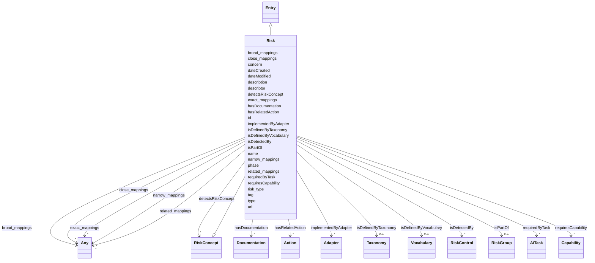

# Class: Risk

_The state of uncertainty associated with an AI system, that has the potential to cause harms_

URI: [airo:Risk](https://w3id.org/airo#Risk)



## Inheritance

- [Entity](Entity.md)
  - [Entry](Entry.md)
    - **Risk** [ [RiskConcept](RiskConcept.md)]

## Slots

| Name                                              | Cardinality and Range                      | Description                                                                      | Inheritance                              |
| ------------------------------------------------- | ------------------------------------------ | -------------------------------------------------------------------------------- | ---------------------------------------- |
| [hasRelatedAction](hasRelatedAction.md)           | \* <br/> [Action](Action.md)               | A relationship where an entity relates to an action                              | direct                                   |
| [isDefinedByTaxonomy](isDefinedByTaxonomy.md)     | 0..1 <br/> [Taxonomy](Taxonomy.md)         | A relationship where a concept or a concept group is defined by a taxonomy       | direct                                   |
| [isPartOf](isPartOf.md)                           | 0..1 <br/> [RiskGroup](RiskGroup.md)       | A relationship where a risk is part of a risk group                              | direct                                   |
| [detectsRiskConcept](detectsRiskConcept.md)       | \* <br/> [RiskConcept](RiskConcept.md)     | The property airo:detectsRiskConcept indicates the control used for detecting... | direct                                   |
| [tag](tag.md)                                     | 0..1 <br/> [String](String.md)             | A shost version of the name                                                      | direct                                   |
| [risk_type](risk_type.md)                         | 0..1 <br/> [String](String.md)             | Annotation whether an AI risk occurs at input or output or is non-technical      | direct                                   |
| [phase](phase.md)                                 | 0..1 <br/> [String](String.md)             | Annotation whether an AI risk shows specifically during the training-tuning o... | direct                                   |
| [descriptor](descriptor.md)                       | \* <br/> [String](String.md)               | Annotates whether an AI risk is a traditional risk, specific to or amplified ... | direct                                   |
| [concern](concern.md)                             | 0..1 <br/> [String](String.md)             | Some explanation about the concern related to an AI risk                         | direct                                   |
| [isDetectedBy](isDetectedBy.md)                   | \* <br/> [RiskControl](RiskControl.md)     | A relationship where a risk, risk source, consequence, or impact is detected ... | [RiskConcept](RiskConcept.md)            |
| [isDefinedByVocabulary](isDefinedByVocabulary.md) | 0..1 <br/> [Vocabulary](Vocabulary.md)     | A relationship where a term or a term group is defined by a vocabulary           | [Entry](Entry.md)                        |
| [hasDocumentation](hasDocumentation.md)           | \* <br/> [Documentation](Documentation.md) | Indicates documentation associated with an entity                                | [Entry](Entry.md), [Concept](Concept.md) |
| [requiredByTask](requiredByTask.md)               | \* <br/> [AiTask](AiTask.md)               | Indicates that this entry is required to perform a specific AI task              | [Entry](Entry.md)                        |
| [requiresCapability](requiresCapability.md)       | \* <br/> [Capability](Capability.md)       | Indicates that this entry requires a specific capability                         | [Entry](Entry.md)                        |
| [implementedByAdapter](implementedByAdapter.md)   | \* <br/> [Adapter](Adapter.md)             | Indicates that this capability is implemented by a specific adapter              | [Entry](Entry.md)                        |
| [type](type.md)                                   | 0..1 <br/> [String](String.md)             |                                                                                  | [Entry](Entry.md), [Concept](Concept.md) |
| [id](id.md)                                       | 1 <br/> [String](String.md)                | A unique identifier to this instance of the model element                        | [Entity](Entity.md)                      |
| [name](name.md)                                   | 0..1 <br/> [String](String.md)             | A text name of this instance                                                     | [Entity](Entity.md)                      |
| [description](description.md)                     | 0..1 <br/> [String](String.md)             | The description of an entity                                                     | [Entity](Entity.md)                      |
| [url](url.md)                                     | 0..1 <br/> [Uri](Uri.md)                   | An optional URL associated with this instance                                    | [Entity](Entity.md)                      |
| [dateCreated](dateCreated.md)                     | 0..1 <br/> [Date](Date.md)                 | The date on which the entity was created                                         | [Entity](Entity.md)                      |
| [dateModified](dateModified.md)                   | 0..1 <br/> [Date](Date.md)                 | The date on which the entity was most recently modified                          | [Entity](Entity.md)                      |
| [exact_mappings](exact_mappings.md)               | \* <br/> [Any](Any.md)                     | The property is used to link two concepts, indicating a high degree of confid... | [Entity](Entity.md)                      |
| [close_mappings](close_mappings.md)               | \* <br/> [Any](Any.md)                     | The property is used to link two concepts that are sufficiently similar that ... | [Entity](Entity.md)                      |
| [related_mappings](related_mappings.md)           | \* <br/> [Any](Any.md)                     | The property skos:relatedMatch is used to state an associative mapping link b... | [Entity](Entity.md)                      |
| [narrow_mappings](narrow_mappings.md)             | \* <br/> [Any](Any.md)                     | The property is used to state a hierarchical mapping link between two concept... | [Entity](Entity.md)                      |
| [broad_mappings](broad_mappings.md)               | \* <br/> [Any](Any.md)                     | The property is used to state a hierarchical mapping link between two concept... | [Entity](Entity.md)                      |

## Usages

| used by                                           | used in                             | type  | used            |
| ------------------------------------------------- | ----------------------------------- | ----- | --------------- |
| [Term](Term.md)                                   | [hasRelatedRisk](hasRelatedRisk.md) | range | [Risk](Risk.md) |
| [LLMQuestionPolicy](LLMQuestionPolicy.md)         | [hasRelatedRisk](hasRelatedRisk.md) | range | [Risk](Risk.md) |
| [RiskGroup](RiskGroup.md)                         | [hasPart](hasPart.md)               | range | [Risk](Risk.md) |
| [Action](Action.md)                               | [hasRelatedRisk](hasRelatedRisk.md) | range | [Risk](Risk.md) |
| [RiskIncident](RiskIncident.md)                   | [refersToRisk](refersToRisk.md)     | range | [Risk](Risk.md) |
| [AiEval](AiEval.md)                               | [hasRelatedRisk](hasRelatedRisk.md) | range | [Risk](Risk.md) |
| [BenchmarkMetadataCard](BenchmarkMetadataCard.md) | [hasRelatedRisk](hasRelatedRisk.md) | range | [Risk](Risk.md) |
| [Question](Question.md)                           | [hasRelatedRisk](hasRelatedRisk.md) | range | [Risk](Risk.md) |
| [Questionnaire](Questionnaire.md)                 | [hasRelatedRisk](hasRelatedRisk.md) | range | [Risk](Risk.md) |
| [Adapter](Adapter.md)                             | [hasRelatedRisk](hasRelatedRisk.md) | range | [Risk](Risk.md) |
| [LLMIntrinsic](LLMIntrinsic.md)                   | [hasRelatedRisk](hasRelatedRisk.md) | range | [Risk](Risk.md) |

## Identifier and Mapping Information

### Schema Source

- from schema: https://ibm.github.io/ai-atlas-nexus/ontology/ai-risk-ontology

## Mappings

| Mapping Type | Mapped Value |
| ------------ | ------------ |
| self         | airo:Risk    |
| native       | nexus:Risk   |

## LinkML Source

<!-- TODO: investigate https://stackoverflow.com/questions/37606292/how-to-create-tabbed-code-blocks-in-mkdocs-or-sphinx -->

### Direct

<details>
```yaml
name: Risk
description: The state of uncertainty associated with an AI system, that has the potential
  to cause harms
from_schema: https://ibm.github.io/ai-atlas-nexus/ontology/ai-risk-ontology
is_a: Entry
mixins:
- RiskConcept
slots:
- hasRelatedAction
- isDefinedByTaxonomy
- isPartOf
- detectsRiskConcept
slot_usage:
  isPartOf:
    name: isPartOf
    description: A relationship where a risk is part of a risk group
    range: RiskGroup
attributes:
  tag:
    name: tag
    description: A shost version of the name
    from_schema: https://ibm.github.io/ai-atlas-nexus/ontology/ai_risk
    rank: 1000
    domain_of:
    - Risk
  risk_type:
    name: risk_type
    description: Annotation whether an AI risk occurs at input or output or is non-technical.
    from_schema: https://ibm.github.io/ai-atlas-nexus/ontology/ai_risk
    rank: 1000
    domain_of:
    - Risk
  phase:
    name: phase
    description: Annotation whether an AI risk shows specifically during the training-tuning
      or inference phase.
    from_schema: https://ibm.github.io/ai-atlas-nexus/ontology/ai_risk
    rank: 1000
    domain_of:
    - Risk
  descriptor:
    name: descriptor
    description: Annotates whether an AI risk is a traditional risk, specific to or
      amplified by AI.
    from_schema: https://ibm.github.io/ai-atlas-nexus/ontology/ai_risk
    rank: 1000
    domain_of:
    - Risk
    multivalued: true
  concern:
    name: concern
    description: Some explanation about the concern related to an AI risk
    from_schema: https://ibm.github.io/ai-atlas-nexus/ontology/ai_risk
    rank: 1000
    domain_of:
    - Risk
class_uri: airo:Risk

````
</details>

### Induced

<details>
```yaml
name: Risk
description: The state of uncertainty associated with an AI system, that has the potential
  to cause harms
from_schema: https://ibm.github.io/ai-atlas-nexus/ontology/ai-risk-ontology
is_a: Entry
mixins:
- RiskConcept
slot_usage:
  isPartOf:
    name: isPartOf
    description: A relationship where a risk is part of a risk group
    range: RiskGroup
attributes:
  tag:
    name: tag
    description: A shost version of the name
    from_schema: https://ibm.github.io/ai-atlas-nexus/ontology/ai_risk
    rank: 1000
    alias: tag
    owner: Risk
    domain_of:
    - Risk
    range: string
  risk_type:
    name: risk_type
    description: Annotation whether an AI risk occurs at input or output or is non-technical.
    from_schema: https://ibm.github.io/ai-atlas-nexus/ontology/ai_risk
    rank: 1000
    alias: risk_type
    owner: Risk
    domain_of:
    - Risk
    range: string
  phase:
    name: phase
    description: Annotation whether an AI risk shows specifically during the training-tuning
      or inference phase.
    from_schema: https://ibm.github.io/ai-atlas-nexus/ontology/ai_risk
    rank: 1000
    alias: phase
    owner: Risk
    domain_of:
    - Risk
    range: string
  descriptor:
    name: descriptor
    description: Annotates whether an AI risk is a traditional risk, specific to or
      amplified by AI.
    from_schema: https://ibm.github.io/ai-atlas-nexus/ontology/ai_risk
    rank: 1000
    alias: descriptor
    owner: Risk
    domain_of:
    - Risk
    range: string
    multivalued: true
  concern:
    name: concern
    description: Some explanation about the concern related to an AI risk
    from_schema: https://ibm.github.io/ai-atlas-nexus/ontology/ai_risk
    rank: 1000
    alias: concern
    owner: Risk
    domain_of:
    - Risk
    range: string
  hasRelatedAction:
    name: hasRelatedAction
    description: A relationship where an entity relates to an action
    from_schema: https://ibm.github.io/ai-atlas-nexus/ontology/ai-risk-ontology
    rank: 1000
    alias: hasRelatedAction
    owner: Risk
    domain_of:
    - Risk
    range: Action
    multivalued: true
    inlined: false
  isDefinedByTaxonomy:
    name: isDefinedByTaxonomy
    description: A relationship where a concept or a concept group is defined by a
      taxonomy
    from_schema: https://ibm.github.io/ai-atlas-nexus/ontology/ai-risk-ontology
    rank: 1000
    slot_uri: schema:isPartOf
    alias: isDefinedByTaxonomy
    owner: Risk
    domain_of:
    - Concept
    - Control
    - Group
    - Entry
    - Policy
    - Rule
    - RiskGroup
    - Risk
    - RiskControl
    - Action
    - RiskIncident
    - CapabilityGroup
    - StakeholderGroup
    - Stakeholder
    - Requirement
    range: Taxonomy
  isPartOf:
    name: isPartOf
    description: A relationship where a risk is part of a risk group
    from_schema: https://ibm.github.io/ai-atlas-nexus/ontology/ai-risk-ontology
    rank: 1000
    slot_uri: schema:isPartOf
    alias: isPartOf
    owner: Risk
    domain_of:
    - Entry
    - Risk
    - LargeLanguageModel
    - CapabilityGroup
    - Stakeholder
    range: RiskGroup
  detectsRiskConcept:
    name: detectsRiskConcept
    description: The property airo:detectsRiskConcept indicates the control used for
      detecting risks, risk sources, consequences, and impacts.
    from_schema: https://ibm.github.io/ai-atlas-nexus/ontology/ai-risk-ontology
    exact_mappings:
    - airo:detectsRiskConcept
    rank: 1000
    domain: RiskControl
    alias: detectsRiskConcept
    owner: Risk
    domain_of:
    - Risk
    - RiskControl
    inverse: isDetectedBy
    range: RiskConcept
    multivalued: true
    inlined: false
  isDetectedBy:
    name: isDetectedBy
    description: A relationship where a risk, risk source, consequence, or impact
      is detected by a risk control.
    from_schema: https://ibm.github.io/ai-atlas-nexus/ontology/ai-risk-ontology
    rank: 1000
    domain: RiskConcept
    alias: isDetectedBy
    owner: Risk
    domain_of:
    - RiskConcept
    inverse: detectsRiskConcept
    range: RiskControl
    multivalued: true
    inlined: false
  isDefinedByVocabulary:
    name: isDefinedByVocabulary
    description: A relationship where a term or a term group is defined by a vocabulary
    from_schema: https://ibm.github.io/ai-atlas-nexus/ontology/ai-risk-ontology
    rank: 1000
    slot_uri: schema:isPartOf
    alias: isDefinedByVocabulary
    owner: Risk
    domain_of:
    - Entry
    - Term
    - Adapter
    - LLMIntrinsic
    range: Vocabulary
  hasDocumentation:
    name: hasDocumentation
    description: Indicates documentation associated with an entity.
    from_schema: https://ibm.github.io/ai-atlas-nexus/ontology/ai-risk-ontology
    rank: 1000
    slot_uri: airo:hasDocumentation
    alias: hasDocumentation
    owner: Risk
    domain_of:
    - Dataset
    - Vocabulary
    - Taxonomy
    - Concept
    - Group
    - Entry
    - Term
    - Principle
    - RiskTaxonomy
    - Action
    - BaseAi
    - LargeLanguageModelFamily
    - AiEval
    - BenchmarkMetadataCard
    - Adapter
    - LLMIntrinsic
    range: Documentation
    multivalued: true
    inlined: false
  requiredByTask:
    name: requiredByTask
    description: Indicates that this entry is required to perform a specific AI task.
    from_schema: https://ibm.github.io/ai-atlas-nexus/ontology/ai-risk-ontology
    rank: 1000
    alias: requiredByTask
    owner: Risk
    domain_of:
    - Entry
    - Capability
    inverse: requiresCapability
    range: AiTask
    multivalued: true
    inlined: false
  requiresCapability:
    name: requiresCapability
    description: Indicates that this entry requires a specific capability
    from_schema: https://ibm.github.io/ai-atlas-nexus/ontology/ai-risk-ontology
    rank: 1000
    domain: Any
    alias: requiresCapability
    owner: Risk
    domain_of:
    - Entry
    - LargeLanguageModel
    - AiTask
    - Adapter
    inverse: requiredByTask
    range: Capability
    multivalued: true
    inlined: false
  implementedByAdapter:
    name: implementedByAdapter
    description: 'Indicates that this capability is implemented by a specific adapter.
      This relationship distinguishes the abstract capability (what can be done) from
      the technical implementation mechanism (how it is added/extended via adapters).

      '
    from_schema: https://ibm.github.io/ai-atlas-nexus/ontology/ai-risk-ontology
    rank: 1000
    domain: Any
    alias: implementedByAdapter
    owner: Risk
    domain_of:
    - Entry
    - Capability
    inverse: implementsCapability
    range: Adapter
    multivalued: true
    inlined: false
  type:
    name: type
    from_schema: https://ibm.github.io/ai-atlas-nexus/ontology/common
    designates_type: true
    alias: type
    owner: Risk
    domain_of:
    - Vocabulary
    - Taxonomy
    - Concept
    - Control
    - Group
    - Entry
    - Policy
    - Rule
    - Permission
    - Prohibition
    - Obligation
    - Recommendation
    - Certification
    - ControlActivity
    - ControlActivityPermission
    - ControlActivityProhibition
    - ControlActivityObligation
    - ControlActivityRecommendation
    - Requirement
    range: string
  id:
    name: id
    description: A unique identifier to this instance of the model element. Example
      identifiers include UUID, URI, URN, etc.
    from_schema: https://ibm.github.io/ai-atlas-nexus/ontology/ai-risk-ontology
    rank: 1000
    slot_uri: schema:identifier
    identifier: true
    alias: id
    owner: Risk
    domain_of:
    - Entity
    range: string
    required: true
  name:
    name: name
    description: A text name of this instance.
    from_schema: https://ibm.github.io/ai-atlas-nexus/ontology/ai-risk-ontology
    rank: 1000
    slot_uri: schema:name
    alias: name
    owner: Risk
    domain_of:
    - Entity
    - BenchmarkMetadataCard
    range: string
  description:
    name: description
    description: The description of an entity
    from_schema: https://ibm.github.io/ai-atlas-nexus/ontology/ai-risk-ontology
    rank: 1000
    slot_uri: schema:description
    alias: description
    owner: Risk
    domain_of:
    - Entity
    range: string
  url:
    name: url
    description: An optional URL associated with this instance.
    from_schema: https://ibm.github.io/ai-atlas-nexus/ontology/ai-risk-ontology
    rank: 1000
    slot_uri: schema:url
    alias: url
    owner: Risk
    domain_of:
    - Entity
    range: uri
  dateCreated:
    name: dateCreated
    description: The date on which the entity was created.
    from_schema: https://ibm.github.io/ai-atlas-nexus/ontology/ai-risk-ontology
    rank: 1000
    slot_uri: schema:dateCreated
    alias: dateCreated
    owner: Risk
    domain_of:
    - Entity
    range: date
    required: false
  dateModified:
    name: dateModified
    description: The date on which the entity was most recently modified.
    from_schema: https://ibm.github.io/ai-atlas-nexus/ontology/ai-risk-ontology
    rank: 1000
    slot_uri: schema:dateModified
    alias: dateModified
    owner: Risk
    domain_of:
    - Entity
    range: date
    required: false
  exact_mappings:
    name: exact_mappings
    description: The property is used to link two concepts, indicating a high degree
      of confidence that the concepts can be used interchangeably across a wide range
      of information retrieval applications
    from_schema: https://ibm.github.io/ai-atlas-nexus/ontology/ai-risk-ontology
    rank: 1000
    slot_uri: skos:exactMatch
    alias: exact_mappings
    owner: Risk
    domain_of:
    - Entity
    range: Any
    multivalued: true
    inlined: false
  close_mappings:
    name: close_mappings
    description: The property is used to link two concepts that are sufficiently similar
      that they can be used interchangeably in some information retrieval applications.
    from_schema: https://ibm.github.io/ai-atlas-nexus/ontology/ai-risk-ontology
    rank: 1000
    slot_uri: skos:closeMatch
    alias: close_mappings
    owner: Risk
    domain_of:
    - Entity
    range: Any
    multivalued: true
    inlined: false
  related_mappings:
    name: related_mappings
    description: The property skos:relatedMatch is used to state an associative mapping
      link between two concepts.
    from_schema: https://ibm.github.io/ai-atlas-nexus/ontology/ai-risk-ontology
    rank: 1000
    slot_uri: skos:relatedMatch
    alias: related_mappings
    owner: Risk
    domain_of:
    - Entity
    range: Any
    multivalued: true
    inlined: false
  narrow_mappings:
    name: narrow_mappings
    description: The property is used to state a hierarchical mapping link between
      two concepts, indicating that the concept linked to, is a narrower concept than
      the originating concept.
    from_schema: https://ibm.github.io/ai-atlas-nexus/ontology/ai-risk-ontology
    rank: 1000
    slot_uri: skos:narrowMatch
    alias: narrow_mappings
    owner: Risk
    domain_of:
    - Entity
    range: Any
    multivalued: true
    inlined: false
  broad_mappings:
    name: broad_mappings
    description: The property is used to state a hierarchical mapping link between
      two concepts, indicating that the concept linked to, is a broader concept than
      the originating concept.
    from_schema: https://ibm.github.io/ai-atlas-nexus/ontology/ai-risk-ontology
    rank: 1000
    slot_uri: skos:broadMatch
    alias: broad_mappings
    owner: Risk
    domain_of:
    - Entity
    range: Any
    multivalued: true
    inlined: false
class_uri: airo:Risk

````

</details>
