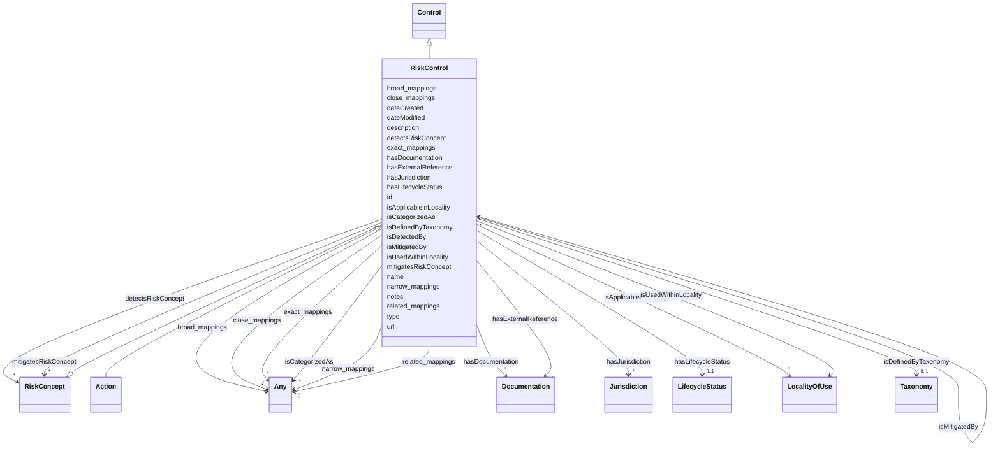

---
search:
  boost: 10.0
---

# Class: RiskControl

_A measure that maintains and/or modifies risk (and risk concepts)_

<div data-search-exclude markdown="1">

URI: [airo:RiskControl](https://w3id.org/airo#RiskControl)


```mermaid
 classDiagram
    class RiskControl
    click RiskControl href "../RiskControl/"
      RiskConcept <|-- RiskControl
        click RiskConcept href "../RiskConcept/"
      Control <|-- RiskControl
        click Control href "../Control/"


      RiskControl <|-- Action
        click Action href "../Action/"


      RiskControl : broad_mappings


        RiskControl --> "*" Any : broad_mappings
        click Any href "../Any/"


      RiskControl : close_mappings


        RiskControl --> "*" Any : close_mappings
        click Any href "../Any/"


      RiskControl : dateCreated

      RiskControl : dateModified

      RiskControl : description

      RiskControl : detectsRiskConcept


        RiskControl --> "*" RiskConcept : detectsRiskConcept
        click RiskConcept href "../RiskConcept/"


      RiskControl : exact_mappings


        RiskControl --> "*" Any : exact_mappings
        click Any href "../Any/"


      RiskControl : hasDocumentation


        RiskControl --> "*" Documentation : hasDocumentation
        click Documentation href "../Documentation/"


      RiskControl : hasExternalReference


        RiskControl --> "*" Documentation : hasExternalReference
        click Documentation href "../Documentation/"


      RiskControl : hasJurisdiction


        RiskControl --> "*" Jurisdiction : hasJurisdiction
        click Jurisdiction href "../Jurisdiction/"


      RiskControl : hasLifecycleStatus


        RiskControl --> "0..1" LifecycleStatus : hasLifecycleStatus
        click LifecycleStatus href "../LifecycleStatus/"


      RiskControl : id

      RiskControl : isApplicableinLocality


        RiskControl --> "*" LocalityOfUse : isApplicableinLocality
        click LocalityOfUse href "../LocalityOfUse/"


      RiskControl : isCategorizedAs


        RiskControl --> "*" Any : isCategorizedAs
        click Any href "../Any/"


      RiskControl : isDefinedByTaxonomy


        RiskControl --> "0..1" Taxonomy : isDefinedByTaxonomy
        click Taxonomy href "../Taxonomy/"


      RiskControl : isDetectedBy


        RiskControl --> "*" RiskControl : isDetectedBy
        click RiskControl href "../RiskControl/"


      RiskControl : isMitigatedBy


        RiskControl --> "*" RiskControl : isMitigatedBy
        click RiskControl href "../RiskControl/"


      RiskControl : isUsedWithinLocality


        RiskControl --> "*" LocalityOfUse : isUsedWithinLocality
        click LocalityOfUse href "../LocalityOfUse/"


      RiskControl : mitigatesRiskConcept


        RiskControl --> "*" RiskConcept : mitigatesRiskConcept
        click RiskConcept href "../RiskConcept/"


      RiskControl : name

      RiskControl : narrow_mappings


        RiskControl --> "*" Any : narrow_mappings
        click Any href "../Any/"


      RiskControl : notes

      RiskControl : related_mappings


        RiskControl --> "*" Any : related_mappings
        click Any href "../Any/"


      RiskControl : type

      RiskControl : url


```

## Inheritance

- [Entity](Entity.md)
  - [Control](Control.md)
    - **RiskControl** [ [RiskConcept](RiskConcept.md)]
      - [Action](Action.md)

## Class Properties

| Property  | Value                                                 |
| --------- | ----------------------------------------------------- |
| Class URI | [airo:RiskControl](https://w3id.org/airo#RiskControl) |
| Mixin     | Yes                                                   |

## Slots

| Name                                                | Cardinality and Range                            | Description                                                                      | Inheritance                                  |
| --------------------------------------------------- | ------------------------------------------------ | -------------------------------------------------------------------------------- | -------------------------------------------- |
| [detectsRiskConcept](detectsRiskConcept.md)         | \* <br/> [RiskConcept](RiskConcept.md)           | The property airo:detectsRiskConcept indicates the control used for detecting... | direct                                       |
| [mitigatesRiskConcept](mitigatesRiskConcept.md)     | \* <br/> [RiskConcept](RiskConcept.md)           | Indicates the control used for mitigating risks, risk sources, consequences, ... | direct                                       |
| [isDefinedByTaxonomy](isDefinedByTaxonomy.md)       | 0..1 <br/> [Taxonomy](Taxonomy.md)               | A relationship where a concept or a concept group is defined by a taxonomy       | direct                                       |
| [isDetectedBy](isDetectedBy.md)                     | \* <br/> [RiskControl](RiskControl.md)           | A relationship where a risk, risk source, consequence, or impact is detected ... | [RiskConcept](RiskConcept.md)                |
| [isMitigatedBy](isMitigatedBy.md)                   | \* <br/> [RiskControl](RiskControl.md)           | A relationship where a risk, risk source, consequence, or impact is mitigated... | [RiskConcept](RiskConcept.md)                |
| [isUsedWithinLocality](isUsedWithinLocality.md)     | \* <br/> [LocalityOfUse](LocalityOfUse.md)       | Specifies the domain an AI system is used within                                 | [RiskConcept](RiskConcept.md)                |
| [isApplicableinLocality](isApplicableinLocality.md) | \* <br/> [LocalityOfUse](LocalityOfUse.md)       | A relationship where an entity has is applicable in these localities             | [Control](Control.md)                        |
| [hasExternalReference](hasExternalReference.md)     | \* <br/> [Documentation](Documentation.md)       | External references / additional resources related to this entity, such as ar... | [Control](Control.md)                        |
| [type](type.md)                                     | 0..1 <br/> [String](String.md)                   | The type or class designation of this entity instance                            | [Concept](Concept.md), [Control](Control.md) |
| [id](id.md)                                         | 1 <br/> [String](String.md)                      | A unique identifier to this instance of the model element                        | [Entity](Entity.md)                          |
| [name](name.md)                                     | 0..1 <br/> [String](String.md)                   | A text name of this instance                                                     | [Entity](Entity.md)                          |
| [description](description.md)                       | 0..1 <br/> [String](String.md)                   | The description of an entity                                                     | [Entity](Entity.md)                          |
| [url](url.md)                                       | 0..1 <br/> [Uri](Uri.md)                         | An optional URL associated with this instance                                    | [Entity](Entity.md)                          |
| [dateCreated](dateCreated.md)                       | 0..1 <br/> [Date](Date.md)                       | The date on which the entity was created                                         | [Entity](Entity.md)                          |
| [dateModified](dateModified.md)                     | 0..1 <br/> [Date](Date.md)                       | The date on which the entity was most recently modified                          | [Entity](Entity.md)                          |
| [exact_mappings](exact_mappings.md)                 | \* <br/> [Any](Any.md)                           | The property is used to link two concepts, indicating a high degree of confid... | [Entity](Entity.md)                          |
| [close_mappings](close_mappings.md)                 | \* <br/> [Any](Any.md)                           | The property is used to link two concepts that are sufficiently similar that ... | [Entity](Entity.md)                          |
| [related_mappings](related_mappings.md)             | \* <br/> [Any](Any.md)                           | The property skos:relatedMatch is used to state an associative mapping link b... | [Entity](Entity.md)                          |
| [narrow_mappings](narrow_mappings.md)               | \* <br/> [Any](Any.md)                           | The property is used to state a hierarchical mapping link between two concept... | [Entity](Entity.md)                          |
| [broad_mappings](broad_mappings.md)                 | \* <br/> [Any](Any.md)                           | The property is used to state a hierarchical mapping link between two concept... | [Entity](Entity.md)                          |
| [isCategorizedAs](isCategorizedAs.md)               | \* <br/> [Any](Any.md)                           | A relationship where an entity has been deemed to be categorized                 | [Entity](Entity.md)                          |
| [hasLifecycleStatus](hasLifecycleStatus.md)         | 0..1 <br/> [LifecycleStatus](LifecycleStatus.md) | The editorial / publication lifecycle state of this entity                       | [Entity](Entity.md)                          |
| [notes](notes.md)                                   | \* <br/> [String](String.md)                     | Free-text editorial notes, source breadcrumbs, or build-time provenance that ... | [Entity](Entity.md)                          |
| [hasDocumentation](hasDocumentation.md)             | \* <br/> [Documentation](Documentation.md)       | Indicates documentation associated with an entity                                | [Concept](Concept.md)                        |
| [hasJurisdiction](hasJurisdiction.md)               | \* <br/> [Jurisdiction](Jurisdiction.md)         | The legal or political jurisdiction(s) in which this concept applies, express... | [Concept](Concept.md)                        |

## Mixin Usage

| mixed into | description |
| ---------- | ----------- |

## Usages

| used by                                     | used in                                         | type   | used                          |
| ------------------------------------------- | ----------------------------------------------- | ------ | ----------------------------- |
| [RiskControlGroup](RiskControlGroup.md)     | [hasPart](hasPart.md)                           | range  | [RiskControl](RiskControl.md) |
| [RiskControlGroup](RiskControlGroup.md)     | [isDetectedBy](isDetectedBy.md)                 | range  | [RiskControl](RiskControl.md) |
| [RiskControlGroup](RiskControlGroup.md)     | [isMitigatedBy](isMitigatedBy.md)               | range  | [RiskControl](RiskControl.md) |
| [RiskGroup](RiskGroup.md)                   | [isDetectedBy](isDetectedBy.md)                 | range  | [RiskControl](RiskControl.md) |
| [RiskGroup](RiskGroup.md)                   | [isMitigatedBy](isMitigatedBy.md)               | range  | [RiskControl](RiskControl.md) |
| [Risk](Risk.md)                             | [detectsRiskConcept](detectsRiskConcept.md)     | domain | [RiskControl](RiskControl.md) |
| [Risk](Risk.md)                             | [isDetectedBy](isDetectedBy.md)                 | range  | [RiskControl](RiskControl.md) |
| [Risk](Risk.md)                             | [isMitigatedBy](isMitigatedBy.md)               | range  | [RiskControl](RiskControl.md) |
| [RiskConcept](RiskConcept.md)               | [isDetectedBy](isDetectedBy.md)                 | range  | [RiskControl](RiskControl.md) |
| [RiskConcept](RiskConcept.md)               | [isMitigatedBy](isMitigatedBy.md)               | range  | [RiskControl](RiskControl.md) |
| [RiskControl](RiskControl.md)               | [detectsRiskConcept](detectsRiskConcept.md)     | domain | [RiskControl](RiskControl.md) |
| [RiskControl](RiskControl.md)               | [mitigatesRiskConcept](mitigatesRiskConcept.md) | domain | [RiskControl](RiskControl.md) |
| [RiskControl](RiskControl.md)               | [isDetectedBy](isDetectedBy.md)                 | range  | [RiskControl](RiskControl.md) |
| [RiskControl](RiskControl.md)               | [isMitigatedBy](isMitigatedBy.md)               | range  | [RiskControl](RiskControl.md) |
| [Action](Action.md)                         | [detectsRiskConcept](detectsRiskConcept.md)     | domain | [RiskControl](RiskControl.md) |
| [Action](Action.md)                         | [mitigatesRiskConcept](mitigatesRiskConcept.md) | domain | [RiskControl](RiskControl.md) |
| [Action](Action.md)                         | [isDetectedBy](isDetectedBy.md)                 | range  | [RiskControl](RiskControl.md) |
| [Action](Action.md)                         | [isMitigatedBy](isMitigatedBy.md)               | range  | [RiskControl](RiskControl.md) |
| [RiskIncident](RiskIncident.md)             | [isDetectedBy](isDetectedBy.md)                 | range  | [RiskControl](RiskControl.md) |
| [RiskIncident](RiskIncident.md)             | [isMitigatedBy](isMitigatedBy.md)               | range  | [RiskControl](RiskControl.md) |
| [Impact](Impact.md)                         | [isDetectedBy](isDetectedBy.md)                 | range  | [RiskControl](RiskControl.md) |
| [Impact](Impact.md)                         | [isMitigatedBy](isMitigatedBy.md)               | range  | [RiskControl](RiskControl.md) |
| [AiModel](AiModel.md)                       | [hasRiskControl](hasRiskControl.md)             | range  | [RiskControl](RiskControl.md) |
| [LargeLanguageModel](LargeLanguageModel.md) | [hasRiskControl](hasRiskControl.md)             | range  | [RiskControl](RiskControl.md) |
| [Adapter](Adapter.md)                       | [hasRiskControl](hasRiskControl.md)             | range  | [RiskControl](RiskControl.md) |

## Identifier and Mapping Information

### Schema Source

- from schema: https://w3id.org/ai-atlas-nexus/ai-risk-ontology

## Mappings

| Mapping Type | Mapped Value      |
| ------------ | ----------------- |
| self         | airo:RiskControl  |
| native       | nexus:RiskControl |

## LinkML Source

<!-- TODO: investigate https://stackoverflow.com/questions/37606292/how-to-create-tabbed-code-blocks-in-mkdocs-or-sphinx -->

### Direct

<details>
```yaml
name: RiskControl
description: A measure that maintains and/or modifies risk (and risk concepts)
from_schema: https://w3id.org/ai-atlas-nexus/ai-risk-ontology
is_a: Control
mixin: true
mixins:
- RiskConcept
slots:
- detectsRiskConcept
- mitigatesRiskConcept
- isDefinedByTaxonomy
class_uri: airo:RiskControl

````
</details>

### Induced

<details>
```yaml
name: RiskControl
description: A measure that maintains and/or modifies risk (and risk concepts)
from_schema: https://w3id.org/ai-atlas-nexus/ai-risk-ontology
is_a: Control
mixin: true
mixins:
- RiskConcept
attributes:
  detectsRiskConcept:
    name: detectsRiskConcept
    description: The property airo:detectsRiskConcept indicates the control used for
      detecting risks, risk sources, consequences, and impacts.
    from_schema: https://w3id.org/ai-atlas-nexus/ai-risk-ontology
    exact_mappings:
    - airo:detectsRiskConcept
    rank: 1000
    domain: RiskControl
    owner: RiskControl
    domain_of:
    - Risk
    - RiskControl
    inverse: isDetectedBy
    range: RiskConcept
    multivalued: true
    inlined: false
  mitigatesRiskConcept:
    name: mitigatesRiskConcept
    description: Indicates the control used for mitigating risks, risk sources, consequences,
      and impacts.
    from_schema: https://w3id.org/ai-atlas-nexus/ai-risk-ontology
    exact_mappings:
    - airo:mitigatesRiskConcept
    rank: 1000
    domain: RiskControl
    owner: RiskControl
    domain_of:
    - RiskControl
    inverse: isMitigatedBy
    range: RiskConcept
    multivalued: true
    inlined: false
  isDefinedByTaxonomy:
    name: isDefinedByTaxonomy
    description: A relationship where a concept or a concept group is defined by a
      taxonomy
    from_schema: https://w3id.org/ai-atlas-nexus/ai-risk-ontology
    rank: 1000
    slot_uri: schema:isPartOf
    owner: RiskControl
    domain_of:
    - Concept
    - Control
    - Group
    - Entry
    - Policy
    - Rule
    - RiskControlGroup
    - RiskGroup
    - Risk
    - RiskControl
    - Action
    - RiskIncident
    - CapabilityGroup
    - AiTaskDomain
    - AiTaskGroup
    - Stakeholder
    - StakeholderGroup
    - Requirement
    range: Taxonomy
  isDetectedBy:
    name: isDetectedBy
    description: A relationship where a risk, risk source, consequence, or impact
      is detected by a risk control.
    from_schema: https://w3id.org/ai-atlas-nexus/ai-risk-ontology
    rank: 1000
    domain: RiskConcept
    owner: RiskControl
    domain_of:
    - RiskConcept
    inverse: detectsRiskConcept
    range: RiskControl
    multivalued: true
    inlined: false
  isMitigatedBy:
    name: isMitigatedBy
    description: A relationship where a risk, risk source, consequence, or impact
      is mitigated by a risk control.
    from_schema: https://w3id.org/ai-atlas-nexus/ai-risk-ontology
    rank: 1000
    domain: RiskConcept
    owner: RiskControl
    domain_of:
    - RiskConcept
    inverse: mitigatesRiskConcept
    range: RiskControl
    multivalued: true
    inlined: false
  isUsedWithinLocality:
    name: isUsedWithinLocality
    description: Specifies the domain an AI system is used within.
    from_schema: https://w3id.org/ai-atlas-nexus/ai-risk-ontology
    rank: 1000
    slot_uri: airo:isUsedWithinLocality
    owner: RiskControl
    domain_of:
    - RiskConcept
    - AiSystem
    range: LocalityOfUse
    multivalued: true
    inlined: false
  isApplicableinLocality:
    name: isApplicableinLocality
    description: A relationship where an entity has is applicable in these localities.
    from_schema: https://w3id.org/ai-atlas-nexus/ai-risk-ontology
    rank: 1000
    slot_uri: nexus:isApplicableinLocality
    owner: RiskControl
    domain_of:
    - Control
    - Policy
    range: LocalityOfUse
    multivalued: true
    inlined: false
  hasExternalReference:
    name: hasExternalReference
    description: External references / additional resources related to this entity,
      such as articles, tools, or datasets. Distinct from hasDocumentation, which
      documents the entity itself. External references are not necessarily curated
      or vetted, and quality will vary.
    from_schema: https://w3id.org/ai-atlas-nexus/ai-risk-ontology
    aliases:
    - additional resources
    - external_links
    close_mappings:
    - rdfs:seeAlso
    rank: 1000
    slot_uri: nexus:hasExternalReference
    owner: RiskControl
    domain_of:
    - Control
    - Entry
    range: Documentation
    multivalued: true
    inlined: false
  type:
    name: type
    description: The type or class designation of this entity instance.
    from_schema: https://w3id.org/ai-atlas-nexus/common
    designates_type: true
    owner: RiskControl
    domain_of:
    - Vocabulary
    - Taxonomy
    - Concept
    - Control
    - Group
    - Entry
    - Policy
    - Rule
    - Permission
    - Prohibition
    - Obligation
    - Recommendation
    - Certification
    - BenchmarkMetadataCard
    - ControlActivity
    - ControlActivityPermission
    - ControlActivityProhibition
    - ControlActivityObligation
    - ControlActivityRecommendation
    - Requirement
    range: string
  id:
    name: id
    description: A unique identifier to this instance of the model element. Example
      identifiers include UUID, URI, URN, etc.
    from_schema: https://w3id.org/ai-atlas-nexus/ai-risk-ontology
    rank: 1000
    slot_uri: schema:identifier
    identifier: true
    owner: RiskControl
    domain_of:
    - Entity
    range: string
    required: true
  name:
    name: name
    description: A text name of this instance.
    from_schema: https://w3id.org/ai-atlas-nexus/ai-risk-ontology
    rank: 1000
    slot_uri: schema:name
    owner: RiskControl
    domain_of:
    - Entity
    - BenchmarkMetadataCard
    range: string
  description:
    name: description
    description: The description of an entity
    from_schema: https://w3id.org/ai-atlas-nexus/ai-risk-ontology
    rank: 1000
    slot_uri: schema:description
    owner: RiskControl
    domain_of:
    - Entity
    range: string
  url:
    name: url
    description: An optional URL associated with this instance.
    from_schema: https://w3id.org/ai-atlas-nexus/ai-risk-ontology
    rank: 1000
    slot_uri: schema:url
    owner: RiskControl
    domain_of:
    - Entity
    range: uri
  dateCreated:
    name: dateCreated
    description: The date on which the entity was created.
    from_schema: https://w3id.org/ai-atlas-nexus/ai-risk-ontology
    rank: 1000
    slot_uri: schema:dateCreated
    owner: RiskControl
    domain_of:
    - Entity
    range: date
    required: false
  dateModified:
    name: dateModified
    description: The date on which the entity was most recently modified.
    from_schema: https://w3id.org/ai-atlas-nexus/ai-risk-ontology
    rank: 1000
    slot_uri: schema:dateModified
    owner: RiskControl
    domain_of:
    - Entity
    range: date
    required: false
  exact_mappings:
    name: exact_mappings
    description: The property is used to link two concepts, indicating a high degree
      of confidence that the concepts can be used interchangeably across a wide range
      of information retrieval applications
    from_schema: https://w3id.org/ai-atlas-nexus/ai-risk-ontology
    rank: 1000
    slot_uri: skos:exactMatch
    owner: RiskControl
    domain_of:
    - Entity
    range: Any
    multivalued: true
    inlined: false
  close_mappings:
    name: close_mappings
    description: The property is used to link two concepts that are sufficiently similar
      that they can be used interchangeably in some information retrieval applications.
    from_schema: https://w3id.org/ai-atlas-nexus/ai-risk-ontology
    rank: 1000
    slot_uri: skos:closeMatch
    owner: RiskControl
    domain_of:
    - Entity
    range: Any
    multivalued: true
    inlined: false
  related_mappings:
    name: related_mappings
    description: The property skos:relatedMatch is used to state an associative mapping
      link between two concepts.
    from_schema: https://w3id.org/ai-atlas-nexus/ai-risk-ontology
    rank: 1000
    slot_uri: skos:relatedMatch
    owner: RiskControl
    domain_of:
    - Entity
    range: Any
    multivalued: true
    inlined: false
  narrow_mappings:
    name: narrow_mappings
    description: The property is used to state a hierarchical mapping link between
      two concepts, indicating that the concept linked to, is a narrower concept than
      the originating concept.
    from_schema: https://w3id.org/ai-atlas-nexus/ai-risk-ontology
    rank: 1000
    slot_uri: skos:narrowMatch
    owner: RiskControl
    domain_of:
    - Entity
    range: Any
    multivalued: true
    inlined: false
  broad_mappings:
    name: broad_mappings
    description: The property is used to state a hierarchical mapping link between
      two concepts, indicating that the concept linked to, is a broader concept than
      the originating concept.
    from_schema: https://w3id.org/ai-atlas-nexus/ai-risk-ontology
    rank: 1000
    slot_uri: skos:broadMatch
    owner: RiskControl
    domain_of:
    - Entity
    range: Any
    multivalued: true
    inlined: false
  isCategorizedAs:
    name: isCategorizedAs
    description: A relationship where an entity has been deemed to be categorized
    from_schema: https://w3id.org/ai-atlas-nexus/ai-risk-ontology
    rank: 1000
    slot_uri: nexus:isCategorizedAs
    owner: RiskControl
    domain_of:
    - Entity
    range: Any
    multivalued: true
    inlined: false
  hasLifecycleStatus:
    name: hasLifecycleStatus
    description: The editorial / publication lifecycle state of this entity. Distinct
      from AiLifecyclePhase, which describes an AI system's runtime evolution rather
      than the editorial workflow of a catalogued entry.
    from_schema: https://w3id.org/ai-atlas-nexus/ai-risk-ontology
    aliases:
    - lifecycle_status
    - doc_status
    rank: 1000
    slot_uri: adms:status
    owner: RiskControl
    domain_of:
    - Entity
    range: LifecycleStatus
  notes:
    name: notes
    description: Free-text editorial notes, source breadcrumbs, or build-time provenance
      that do not belong in the user-facing description. Opaque to consumers.
    from_schema: https://w3id.org/ai-atlas-nexus/ai-risk-ontology
    rank: 1000
    slot_uri: skos:note
    owner: RiskControl
    domain_of:
    - Entity
    range: string
    recommended: false
    multivalued: true
  hasDocumentation:
    name: hasDocumentation
    description: Indicates documentation associated with an entity.
    from_schema: https://w3id.org/ai-atlas-nexus/ai-risk-ontology
    rank: 1000
    slot_uri: airo:hasDocumentation
    owner: RiskControl
    domain_of:
    - Dataset
    - Vocabulary
    - Taxonomy
    - Concept
    - Group
    - Entry
    - Term
    - Principle
    - RiskTaxonomy
    - RiskControlGroupTaxonomy
    - Action
    - BaseAi
    - LargeLanguageModelFamily
    - AiTaskTaxonomy
    - AiEval
    - EveryEvalAIResult
    - BenchmarkMetadataCard
    - Adapter
    - LLMIntrinsic
    range: Documentation
    multivalued: true
    inlined: false
  hasJurisdiction:
    name: hasJurisdiction
    description: The legal or political jurisdiction(s) in which this concept applies,
      expressed as ISO 3166-1 country codes.
    from_schema: https://w3id.org/ai-atlas-nexus/ai-risk-ontology
    rank: 1000
    slot_uri: dpv:hasJurisdiction
    owner: RiskControl
    domain_of:
    - Concept
    range: Jurisdiction
    multivalued: true
    inlined: false
class_uri: airo:RiskControl

````

</details></div>
