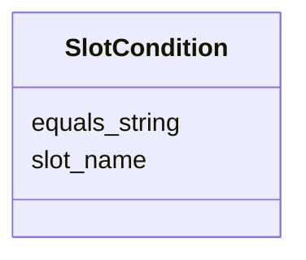

---
search:
  boost: 10.0
---

# Class: SlotCondition

<div data-search-exclude markdown="1">

URI: [nexus:SlotCondition](https://w3id.org/ai-atlas-nexus/SlotCondition)



<!-- no inheritance hierarchy -->

## Slots

| Name                              | Cardinality and Range          | Description                                                         | Inheritance |
| --------------------------------- | ------------------------------ | ------------------------------------------------------------------- | ----------- |
| [slot_name](slot_name.md)         | 0..1 <br/> [String](String.md) | The name of the slot being evaluated in this condition              | direct      |
| [equals_string](equals_string.md) | 0..1 <br/> [String](String.md) | The string value that the slot must equal to satisfy this condition | direct      |

## Usages

| used by                                                 | used in                               | type  | used                              |
| ------------------------------------------------------- | ------------------------------------- | ----- | --------------------------------- |
| [AnonymousClassExpression](AnonymousClassExpression.md) | [slot_conditions](slot_conditions.md) | range | [SlotCondition](SlotCondition.md) |

## Identifier and Mapping Information

### Schema Source

- from schema: https://w3id.org/ai-atlas-nexus/ai-risk-ontology

## Mappings

| Mapping Type | Mapped Value        |
| ------------ | ------------------- |
| self         | nexus:SlotCondition |
| native       | nexus:SlotCondition |

## LinkML Source

<!-- TODO: investigate https://stackoverflow.com/questions/37606292/how-to-create-tabbed-code-blocks-in-mkdocs-or-sphinx -->

### Direct

<details>
```yaml
name: SlotCondition
from_schema: https://w3id.org/ai-atlas-nexus/ai-risk-ontology
attributes:
  slot_name:
    name: slot_name
    description: The name of the slot being evaluated in this condition.
    from_schema: https://w3id.org/ai-atlas-nexus/common
    rank: 1000
    domain_of:
    - SlotCondition
    range: string
  equals_string:
    name: equals_string
    description: The string value that the slot must equal to satisfy this condition.
    from_schema: https://w3id.org/ai-atlas-nexus/common
    rank: 1000
    domain_of:
    - SlotCondition
    range: string

````
</details>

### Induced

<details>
```yaml
name: SlotCondition
from_schema: https://w3id.org/ai-atlas-nexus/ai-risk-ontology
attributes:
  slot_name:
    name: slot_name
    description: The name of the slot being evaluated in this condition.
    from_schema: https://w3id.org/ai-atlas-nexus/common
    rank: 1000
    alias: slot_name
    owner: SlotCondition
    domain_of:
    - SlotCondition
    range: string
  equals_string:
    name: equals_string
    description: The string value that the slot must equal to satisfy this condition.
    from_schema: https://w3id.org/ai-atlas-nexus/common
    rank: 1000
    alias: equals_string
    owner: SlotCondition
    domain_of:
    - SlotCondition
    range: string

````

</details></div>
