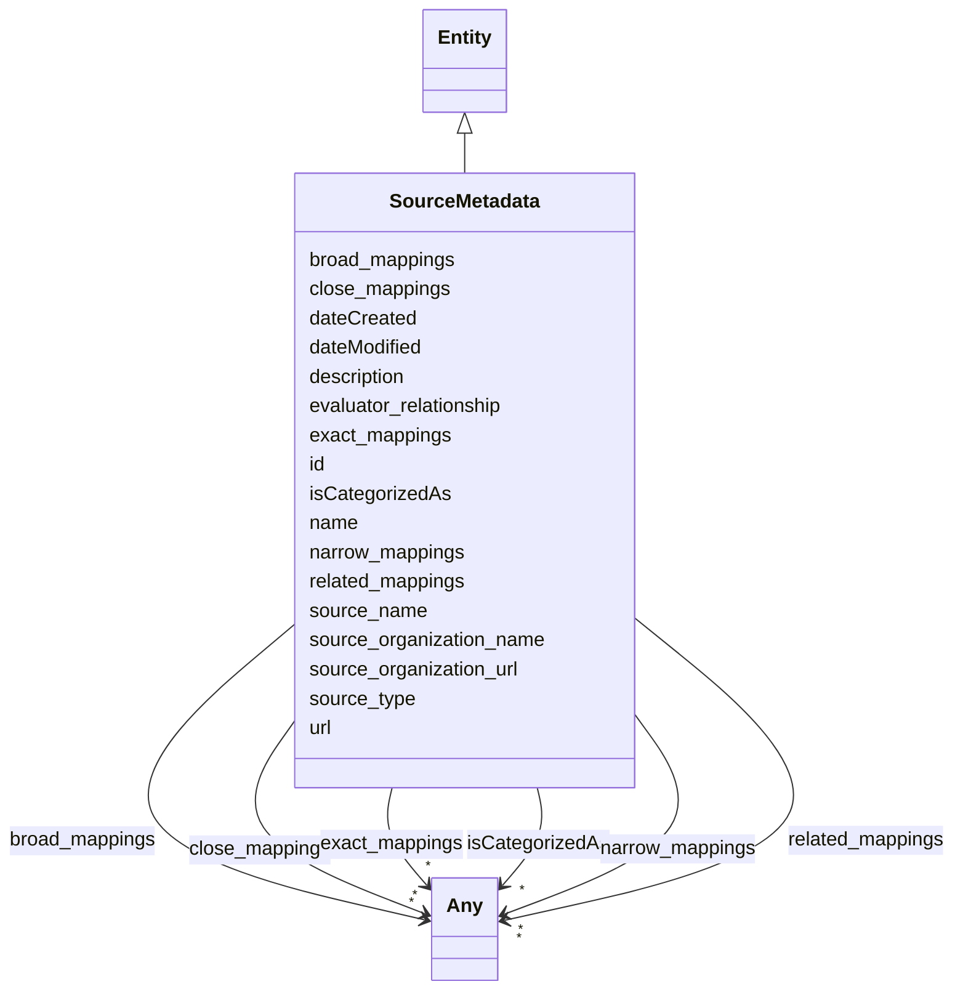

# Class: SourceMetadata

_Metadata about the source of an evaluation_

URI: [nexus:sourcemetadata](https://ibm.github.io/ai-atlas-nexus/ontology/sourcemetadata)



## Inheritance

- [Entity](Entity.md)
  - **SourceMetadata**

## Class Properties

| Property  | Value                                                                                |
| --------- | ------------------------------------------------------------------------------------ |
| Class URI | [nexus:sourcemetadata](https://ibm.github.io/ai-atlas-nexus/ontology/sourcemetadata) |

## Slots

| Name                                                    | Cardinality and Range          | Description                                                                      | Inheritance         |
| ------------------------------------------------------- | ------------------------------ | -------------------------------------------------------------------------------- | ------------------- |
| [source_name](source_name.md)                           | 0..1 <br/> [String](String.md) | Name of the evaluation source                                                    | direct              |
| [source_type](source_type.md)                           | 0..1 <br/> [String](String.md) | Type of source (e                                                                | direct              |
| [source_organization_name](source_organization_name.md) | 0..1 <br/> [String](String.md) | Organization that provided the evaluation                                        | direct              |
| [source_organization_url](source_organization_url.md)   | 0..1 <br/> [Uri](Uri.md)       | URL of the source organization                                                   | direct              |
| [evaluator_relationship](evaluator_relationship.md)     | 0..1 <br/> [String](String.md) | Relationship of evaluator (e                                                     | direct              |
| [id](id.md)                                             | 1 <br/> [String](String.md)    | A unique identifier to this instance of the model element                        | [Entity](Entity.md) |
| [name](name.md)                                         | 0..1 <br/> [String](String.md) | A text name of this instance                                                     | [Entity](Entity.md) |
| [description](description.md)                           | 0..1 <br/> [String](String.md) | The description of an entity                                                     | [Entity](Entity.md) |
| [url](url.md)                                           | 0..1 <br/> [Uri](Uri.md)       | An optional URL associated with this instance                                    | [Entity](Entity.md) |
| [dateCreated](dateCreated.md)                           | 0..1 <br/> [Date](Date.md)     | The date on which the entity was created                                         | [Entity](Entity.md) |
| [dateModified](dateModified.md)                         | 0..1 <br/> [Date](Date.md)     | The date on which the entity was most recently modified                          | [Entity](Entity.md) |
| [exact_mappings](exact_mappings.md)                     | \* <br/> [Any](Any.md)         | The property is used to link two concepts, indicating a high degree of confid... | [Entity](Entity.md) |
| [close_mappings](close_mappings.md)                     | \* <br/> [Any](Any.md)         | The property is used to link two concepts that are sufficiently similar that ... | [Entity](Entity.md) |
| [related_mappings](related_mappings.md)                 | \* <br/> [Any](Any.md)         | The property skos:relatedMatch is used to state an associative mapping link b... | [Entity](Entity.md) |
| [narrow_mappings](narrow_mappings.md)                   | \* <br/> [Any](Any.md)         | The property is used to state a hierarchical mapping link between two concept... | [Entity](Entity.md) |
| [broad_mappings](broad_mappings.md)                     | \* <br/> [Any](Any.md)         | The property is used to state a hierarchical mapping link between two concept... | [Entity](Entity.md) |
| [isCategorizedAs](isCategorizedAs.md)                   | \* <br/> [Any](Any.md)         | A relationship where an entity has been deemed to be categorized                 | [Entity](Entity.md) |

## Usages

| used by                                   | used in                                   | type  | used                                |
| ----------------------------------------- | ----------------------------------------- | ----- | ----------------------------------- |
| [EveryEvalAIResult](EveryEvalAIResult.md) | [hasSourceMetadata](hasSourceMetadata.md) | range | [SourceMetadata](SourceMetadata.md) |

## Identifier and Mapping Information

### Schema Source

- from schema: https://ibm.github.io/ai-atlas-nexus/ontology/ai-risk-ontology

## Mappings

| Mapping Type | Mapped Value         |
| ------------ | -------------------- |
| self         | nexus:sourcemetadata |
| native       | nexus:SourceMetadata |

## LinkML Source

<!-- TODO: investigate https://stackoverflow.com/questions/37606292/how-to-create-tabbed-code-blocks-in-mkdocs-or-sphinx -->

### Direct

<details>
```yaml
name: SourceMetadata
description: Metadata about the source of an evaluation
from_schema: https://ibm.github.io/ai-atlas-nexus/ontology/ai-risk-ontology
is_a: Entity
attributes:
  source_name:
    name: source_name
    description: Name of the evaluation source
    from_schema: https://ibm.github.io/ai-atlas-nexus/ontology/ai_eval
    rank: 1000
    domain_of:
    - SourceMetadata
    range: string
  source_type:
    name: source_type
    description: Type of source (e.g., evaluation_run)
    from_schema: https://ibm.github.io/ai-atlas-nexus/ontology/ai_eval
    rank: 1000
    domain_of:
    - SourceMetadata
    - SourceData
    range: string
  source_organization_name:
    name: source_organization_name
    description: Organization that provided the evaluation
    from_schema: https://ibm.github.io/ai-atlas-nexus/ontology/ai_eval
    rank: 1000
    domain_of:
    - SourceMetadata
    range: string
  source_organization_url:
    name: source_organization_url
    description: URL of the source organization
    from_schema: https://ibm.github.io/ai-atlas-nexus/ontology/ai_eval
    rank: 1000
    domain_of:
    - SourceMetadata
    range: uri
  evaluator_relationship:
    name: evaluator_relationship
    description: Relationship of evaluator (e.g., first_party, third_party)
    from_schema: https://ibm.github.io/ai-atlas-nexus/ontology/ai_eval
    rank: 1000
    domain_of:
    - SourceMetadata
    range: string
class_uri: nexus:sourcemetadata

````
</details>

### Induced

<details>
```yaml
name: SourceMetadata
description: Metadata about the source of an evaluation
from_schema: https://ibm.github.io/ai-atlas-nexus/ontology/ai-risk-ontology
is_a: Entity
attributes:
  source_name:
    name: source_name
    description: Name of the evaluation source
    from_schema: https://ibm.github.io/ai-atlas-nexus/ontology/ai_eval
    rank: 1000
    alias: source_name
    owner: SourceMetadata
    domain_of:
    - SourceMetadata
    range: string
  source_type:
    name: source_type
    description: Type of source (e.g., evaluation_run)
    from_schema: https://ibm.github.io/ai-atlas-nexus/ontology/ai_eval
    rank: 1000
    alias: source_type
    owner: SourceMetadata
    domain_of:
    - SourceMetadata
    - SourceData
    range: string
  source_organization_name:
    name: source_organization_name
    description: Organization that provided the evaluation
    from_schema: https://ibm.github.io/ai-atlas-nexus/ontology/ai_eval
    rank: 1000
    alias: source_organization_name
    owner: SourceMetadata
    domain_of:
    - SourceMetadata
    range: string
  source_organization_url:
    name: source_organization_url
    description: URL of the source organization
    from_schema: https://ibm.github.io/ai-atlas-nexus/ontology/ai_eval
    rank: 1000
    alias: source_organization_url
    owner: SourceMetadata
    domain_of:
    - SourceMetadata
    range: uri
  evaluator_relationship:
    name: evaluator_relationship
    description: Relationship of evaluator (e.g., first_party, third_party)
    from_schema: https://ibm.github.io/ai-atlas-nexus/ontology/ai_eval
    rank: 1000
    alias: evaluator_relationship
    owner: SourceMetadata
    domain_of:
    - SourceMetadata
    range: string
  id:
    name: id
    description: A unique identifier to this instance of the model element. Example
      identifiers include UUID, URI, URN, etc.
    from_schema: https://ibm.github.io/ai-atlas-nexus/ontology/ai-risk-ontology
    rank: 1000
    slot_uri: schema:identifier
    identifier: true
    alias: id
    owner: SourceMetadata
    domain_of:
    - Entity
    range: string
    required: true
  name:
    name: name
    description: A text name of this instance.
    from_schema: https://ibm.github.io/ai-atlas-nexus/ontology/ai-risk-ontology
    rank: 1000
    slot_uri: schema:name
    alias: name
    owner: SourceMetadata
    domain_of:
    - Entity
    - BenchmarkMetadataCard
    range: string
  description:
    name: description
    description: The description of an entity
    from_schema: https://ibm.github.io/ai-atlas-nexus/ontology/ai-risk-ontology
    rank: 1000
    slot_uri: schema:description
    alias: description
    owner: SourceMetadata
    domain_of:
    - Entity
    range: string
  url:
    name: url
    description: An optional URL associated with this instance.
    from_schema: https://ibm.github.io/ai-atlas-nexus/ontology/ai-risk-ontology
    rank: 1000
    slot_uri: schema:url
    alias: url
    owner: SourceMetadata
    domain_of:
    - Entity
    range: uri
  dateCreated:
    name: dateCreated
    description: The date on which the entity was created.
    from_schema: https://ibm.github.io/ai-atlas-nexus/ontology/ai-risk-ontology
    rank: 1000
    slot_uri: schema:dateCreated
    alias: dateCreated
    owner: SourceMetadata
    domain_of:
    - Entity
    range: date
    required: false
  dateModified:
    name: dateModified
    description: The date on which the entity was most recently modified.
    from_schema: https://ibm.github.io/ai-atlas-nexus/ontology/ai-risk-ontology
    rank: 1000
    slot_uri: schema:dateModified
    alias: dateModified
    owner: SourceMetadata
    domain_of:
    - Entity
    range: date
    required: false
  exact_mappings:
    name: exact_mappings
    description: The property is used to link two concepts, indicating a high degree
      of confidence that the concepts can be used interchangeably across a wide range
      of information retrieval applications
    from_schema: https://ibm.github.io/ai-atlas-nexus/ontology/ai-risk-ontology
    rank: 1000
    slot_uri: skos:exactMatch
    alias: exact_mappings
    owner: SourceMetadata
    domain_of:
    - Entity
    range: Any
    multivalued: true
    inlined: false
  close_mappings:
    name: close_mappings
    description: The property is used to link two concepts that are sufficiently similar
      that they can be used interchangeably in some information retrieval applications.
    from_schema: https://ibm.github.io/ai-atlas-nexus/ontology/ai-risk-ontology
    rank: 1000
    slot_uri: skos:closeMatch
    alias: close_mappings
    owner: SourceMetadata
    domain_of:
    - Entity
    range: Any
    multivalued: true
    inlined: false
  related_mappings:
    name: related_mappings
    description: The property skos:relatedMatch is used to state an associative mapping
      link between two concepts.
    from_schema: https://ibm.github.io/ai-atlas-nexus/ontology/ai-risk-ontology
    rank: 1000
    slot_uri: skos:relatedMatch
    alias: related_mappings
    owner: SourceMetadata
    domain_of:
    - Entity
    range: Any
    multivalued: true
    inlined: false
  narrow_mappings:
    name: narrow_mappings
    description: The property is used to state a hierarchical mapping link between
      two concepts, indicating that the concept linked to, is a narrower concept than
      the originating concept.
    from_schema: https://ibm.github.io/ai-atlas-nexus/ontology/ai-risk-ontology
    rank: 1000
    slot_uri: skos:narrowMatch
    alias: narrow_mappings
    owner: SourceMetadata
    domain_of:
    - Entity
    range: Any
    multivalued: true
    inlined: false
  broad_mappings:
    name: broad_mappings
    description: The property is used to state a hierarchical mapping link between
      two concepts, indicating that the concept linked to, is a broader concept than
      the originating concept.
    from_schema: https://ibm.github.io/ai-atlas-nexus/ontology/ai-risk-ontology
    rank: 1000
    slot_uri: skos:broadMatch
    alias: broad_mappings
    owner: SourceMetadata
    domain_of:
    - Entity
    range: Any
    multivalued: true
    inlined: false
  isCategorizedAs:
    name: isCategorizedAs
    description: A relationship where an entity has been deemed to be categorized
    from_schema: https://ibm.github.io/ai-atlas-nexus/ontology/ai-risk-ontology
    rank: 1000
    slot_uri: nexus:isCategorizedAs
    alias: isCategorizedAs
    owner: SourceMetadata
    domain_of:
    - Entity
    range: Any
    multivalued: true
    inlined: false
class_uri: nexus:sourcemetadata

````

</details>
