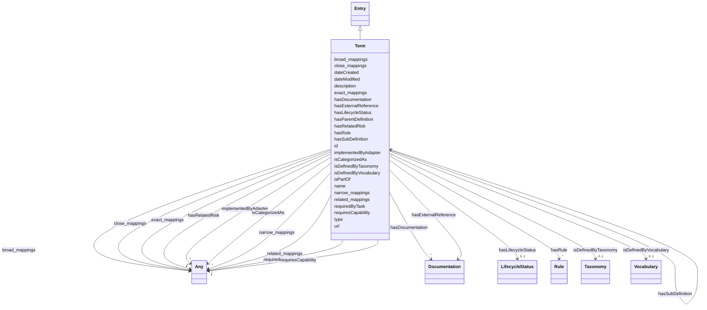

---
search:
  boost: 10.0
---

# Class: Term

_A term and its definitions._

<div data-search-exclude markdown="1">

URI: [nexus:Term](https://w3id.org/ai-atlas-nexus/Term)


```mermaid
 classDiagram
    class Term
    click Term href "../Term/"
      Entry <|-- Term
        click Entry href "../Entry/"

      Term : broad_mappings


        Term --> "*" Any : broad_mappings
        click Any href "../Any/"


      Term : close_mappings


        Term --> "*" Any : close_mappings
        click Any href "../Any/"


      Term : dateCreated

      Term : dateModified

      Term : description

      Term : exact_mappings


        Term --> "*" Any : exact_mappings
        click Any href "../Any/"


      Term : hasDocumentation


        Term --> "*" Documentation : hasDocumentation
        click Documentation href "../Documentation/"


      Term : hasExternalReference


        Term --> "*" Documentation : hasExternalReference
        click Documentation href "../Documentation/"


      Term : hasLifecycleStatus


        Term --> "0..1" LifecycleStatus : hasLifecycleStatus
        click LifecycleStatus href "../LifecycleStatus/"


      Term : hasParentDefinition


        Term --> "*" Term : hasParentDefinition
        click Term href "../Term/"


      Term : hasRelatedRisk


        Term --> "*" Any : hasRelatedRisk
        click Any href "../Any/"


      Term : hasRule


        Term --> "*" Rule : hasRule
        click Rule href "../Rule/"


      Term : hasSubDefinition


        Term --> "*" Term : hasSubDefinition
        click Term href "../Term/"


      Term : id

      Term : implementedByAdapter


        Term --> "*" Any : implementedByAdapter
        click Any href "../Any/"


      Term : isCategorizedAs


        Term --> "*" Any : isCategorizedAs
        click Any href "../Any/"


      Term : isDefinedByTaxonomy


        Term --> "0..1" Taxonomy : isDefinedByTaxonomy
        click Taxonomy href "../Taxonomy/"


      Term : isDefinedByVocabulary


        Term --> "0..1" Vocabulary : isDefinedByVocabulary
        click Vocabulary href "../Vocabulary/"


      Term : isPartOf

      Term : name

      Term : narrow_mappings


        Term --> "*" Any : narrow_mappings
        click Any href "../Any/"


      Term : related_mappings


        Term --> "*" Any : related_mappings
        click Any href "../Any/"


      Term : requiredByTask


        Term --> "*" Any : requiredByTask
        click Any href "../Any/"


      Term : requiresCapability


        Term --> "*" Any : requiresCapability
        click Any href "../Any/"


      Term : type

      Term : url


```

## Inheritance

- [Entity](Entity.md)
  - [Entry](Entry.md)
    - **Term**

## Slots

| Name                                              | Cardinality and Range                            | Description                                                                      | Inheritance         |
| ------------------------------------------------- | ------------------------------------------------ | -------------------------------------------------------------------------------- | ------------------- |
| [isDefinedByVocabulary](isDefinedByVocabulary.md) | 0..1 <br/> [Vocabulary](Vocabulary.md)           | A relationship where a term or a term group is defined by a vocabulary           | direct              |
| [hasDocumentation](hasDocumentation.md)           | \* <br/> [Documentation](Documentation.md)       | Indicates documentation associated with an entity                                | direct              |
| [hasParentDefinition](hasParentDefinition.md)     | \* <br/> [Term](Term.md)                         | Indicates parent terms associated with a term                                    | direct              |
| [hasSubDefinition](hasSubDefinition.md)           | \* <br/> [Term](Term.md)                         | Indicates child terms associated with a term                                     | direct              |
| [hasRelatedRisk](hasRelatedRisk.md)               | \* <br/> [Any](Any.md)                           | A relationship where an entity relates to a risk                                 | direct              |
| [isDefinedByTaxonomy](isDefinedByTaxonomy.md)     | 0..1 <br/> [Taxonomy](Taxonomy.md)               | A relationship where a concept or a concept group is defined by a taxonomy       | [Entry](Entry.md)   |
| [hasExternalReference](hasExternalReference.md)   | \* <br/> [Documentation](Documentation.md)       | External references / additional resources related to this entity, such as ar... | [Entry](Entry.md)   |
| [isPartOf](isPartOf.md)                           | 0..1 <br/> [String](String.md)                   | A relationship where an entity is part of another entity                         | [Entry](Entry.md)   |
| [requiredByTask](requiredByTask.md)               | \* <br/> [Any](Any.md)                           | Indicates that this entry is required to perform a specific AI task              | [Entry](Entry.md)   |
| [requiresCapability](requiresCapability.md)       | \* <br/> [Any](Any.md)                           | Indicates that this entry requires a specific capability                         | [Entry](Entry.md)   |
| [implementedByAdapter](implementedByAdapter.md)   | \* <br/> [Any](Any.md)                           | Indicates that this capability is implemented by a specific adapter              | [Entry](Entry.md)   |
| [hasRule](hasRule.md)                             | \* <br/> [Rule](Rule.md)                         | Specifying applicability or inclusion of a rule within specified context         | [Entry](Entry.md)   |
| [type](type.md)                                   | 0..1 <br/> [String](String.md)                   | The entry type or class designation specifying what kind of entry this is        | [Entry](Entry.md)   |
| [id](id.md)                                       | 1 <br/> [String](String.md)                      | A unique identifier to this instance of the model element                        | [Entity](Entity.md) |
| [name](name.md)                                   | 0..1 <br/> [String](String.md)                   | A text name of this instance                                                     | [Entity](Entity.md) |
| [description](description.md)                     | 0..1 <br/> [String](String.md)                   | The description of an entity                                                     | [Entity](Entity.md) |
| [url](url.md)                                     | 0..1 <br/> [Uri](Uri.md)                         | An optional URL associated with this instance                                    | [Entity](Entity.md) |
| [dateCreated](dateCreated.md)                     | 0..1 <br/> [Date](Date.md)                       | The date on which the entity was created                                         | [Entity](Entity.md) |
| [dateModified](dateModified.md)                   | 0..1 <br/> [Date](Date.md)                       | The date on which the entity was most recently modified                          | [Entity](Entity.md) |
| [exact_mappings](exact_mappings.md)               | \* <br/> [Any](Any.md)                           | The property is used to link two concepts, indicating a high degree of confid... | [Entity](Entity.md) |
| [close_mappings](close_mappings.md)               | \* <br/> [Any](Any.md)                           | The property is used to link two concepts that are sufficiently similar that ... | [Entity](Entity.md) |
| [related_mappings](related_mappings.md)           | \* <br/> [Any](Any.md)                           | The property skos:relatedMatch is used to state an associative mapping link b... | [Entity](Entity.md) |
| [narrow_mappings](narrow_mappings.md)             | \* <br/> [Any](Any.md)                           | The property is used to state a hierarchical mapping link between two concept... | [Entity](Entity.md) |
| [broad_mappings](broad_mappings.md)               | \* <br/> [Any](Any.md)                           | The property is used to state a hierarchical mapping link between two concept... | [Entity](Entity.md) |
| [isCategorizedAs](isCategorizedAs.md)             | \* <br/> [Any](Any.md)                           | A relationship where an entity has been deemed to be categorized                 | [Entity](Entity.md) |
| [hasLifecycleStatus](hasLifecycleStatus.md)       | 0..1 <br/> [LifecycleStatus](LifecycleStatus.md) | The editorial / publication lifecycle state of this entity                       | [Entity](Entity.md) |

## Usages

| used by                           | used in                                       | type          | used            |
| --------------------------------- | --------------------------------------------- | ------------- | --------------- |
| [Documentation](Documentation.md) | [isCategorizedAs](isCategorizedAs.md)         | range         | [Term](Term.md) |
| [Term](Term.md)                   | [hasParentDefinition](hasParentDefinition.md) | range         | [Term](Term.md) |
| [Term](Term.md)                   | [hasSubDefinition](hasSubDefinition.md)       | range         | [Term](Term.md) |
| [LLMIntrinsic](LLMIntrinsic.md)   | [hasRelatedTerm](hasRelatedTerm.md)           | range         | [Term](Term.md) |
| [LLMIntrinsic](LLMIntrinsic.md)   | [hasRelatedTerm](hasRelatedTerm.md)           | any_of[range] | [Term](Term.md) |

## Identifier and Mapping Information

### Schema Source

- from schema: https://w3id.org/ai-atlas-nexus/ai-risk-ontology

## Mappings

| Mapping Type | Mapped Value |
| ------------ | ------------ |
| self         | nexus:Term   |
| native       | nexus:Term   |

## LinkML Source

<!-- TODO: investigate https://stackoverflow.com/questions/37606292/how-to-create-tabbed-code-blocks-in-mkdocs-or-sphinx -->

### Direct

<details>
```yaml
name: Term
description: A term and its definitions.
from_schema: https://w3id.org/ai-atlas-nexus/ai-risk-ontology
is_a: Entry
slots:
- isDefinedByVocabulary
- hasDocumentation
- hasParentDefinition
- hasSubDefinition
- hasRelatedRisk

````
</details>

### Induced

<details>
```yaml
name: Term
description: A term and its definitions.
from_schema: https://w3id.org/ai-atlas-nexus/ai-risk-ontology
is_a: Entry
attributes:
  isDefinedByVocabulary:
    name: isDefinedByVocabulary
    description: A relationship where a term or a term group is defined by a vocabulary
    from_schema: https://w3id.org/ai-atlas-nexus/ai-risk-ontology
    rank: 1000
    slot_uri: schema:isPartOf
    alias: isDefinedByVocabulary
    owner: Term
    domain_of:
    - Entry
    - Term
    - Adapter
    - LLMIntrinsic
    range: Vocabulary
  hasDocumentation:
    name: hasDocumentation
    description: Indicates documentation associated with an entity.
    from_schema: https://w3id.org/ai-atlas-nexus/ai-risk-ontology
    rank: 1000
    slot_uri: airo:hasDocumentation
    alias: hasDocumentation
    owner: Term
    domain_of:
    - Dataset
    - Vocabulary
    - Taxonomy
    - Concept
    - Group
    - Entry
    - Term
    - Principle
    - RiskTaxonomy
    - RiskControlGroupTaxonomy
    - Action
    - BaseAi
    - LargeLanguageModelFamily
    - AiTaskTaxonomy
    - AiEval
    - EveryEvalAIResult
    - BenchmarkMetadataCard
    - Adapter
    - LLMIntrinsic
    range: Documentation
    multivalued: true
    inlined: false
  hasParentDefinition:
    name: hasParentDefinition
    description: Indicates parent terms associated with a term
    from_schema: https://w3id.org/ai-atlas-nexus/ai-risk-ontology
    rank: 1000
    slot_uri: nexus:hasParentDefinition
    alias: hasParentDefinition
    owner: Term
    domain_of:
    - Term
    range: Term
    multivalued: true
    inlined: false
  hasSubDefinition:
    name: hasSubDefinition
    description: Indicates child terms associated with a term
    from_schema: https://w3id.org/ai-atlas-nexus/ai-risk-ontology
    rank: 1000
    slot_uri: nexus:hasSubDefinition
    alias: hasSubDefinition
    owner: Term
    domain_of:
    - Term
    range: Term
    multivalued: true
    inlined: false
  hasRelatedRisk:
    name: hasRelatedRisk
    description: A relationship where an entity relates to a risk
    from_schema: https://w3id.org/ai-atlas-nexus/ai-risk-ontology
    rank: 1000
    domain: Any
    alias: hasRelatedRisk
    owner: Term
    domain_of:
    - Term
    - LLMQuestionPolicy
    - Action
    - AiSystem
    - AiEval
    - EveryEvalAIResult
    - BenchmarkMetadataCard
    - Adapter
    - LLMIntrinsic
    range: Any
    multivalued: true
    inlined: false
  isDefinedByTaxonomy:
    name: isDefinedByTaxonomy
    description: A relationship where a concept or a concept group is defined by a
      taxonomy
    from_schema: https://w3id.org/ai-atlas-nexus/ai-risk-ontology
    rank: 1000
    slot_uri: schema:isPartOf
    alias: isDefinedByTaxonomy
    owner: Term
    domain_of:
    - Concept
    - Control
    - Group
    - Entry
    - Policy
    - Rule
    - RiskControlGroup
    - RiskGroup
    - Risk
    - RiskControl
    - Action
    - RiskIncident
    - CapabilityGroup
    - AiTaskDomain
    - AiTaskGroup
    - Stakeholder
    - StakeholderGroup
    - Requirement
    range: Taxonomy
  hasExternalReference:
    name: hasExternalReference
    description: External references / additional resources related to this entity,
      such as articles, tools, or datasets. Distinct from hasDocumentation, which
      documents the entity itself. External references are not necessarily curated
      or vetted, and quality will vary.
    from_schema: https://w3id.org/ai-atlas-nexus/ai-risk-ontology
    aliases:
    - additional resources
    - external_links
    close_mappings:
    - rdfs:seeAlso
    rank: 1000
    slot_uri: nexus:hasExternalReference
    alias: hasExternalReference
    owner: Term
    domain_of:
    - Control
    - Entry
    range: Documentation
    multivalued: true
    inlined: false
  isPartOf:
    name: isPartOf
    description: A relationship where an entity is part of another entity
    from_schema: https://w3id.org/ai-atlas-nexus/ai-risk-ontology
    rank: 1000
    slot_uri: schema:isPartOf
    alias: isPartOf
    owner: Term
    domain_of:
    - Entry
    - Risk
    - CapabilityGroup
    - LargeLanguageModel
    - AiTaskGroup
    - Stakeholder
    range: string
  requiredByTask:
    name: requiredByTask
    description: Indicates that this entry is required to perform a specific AI task.
    from_schema: https://w3id.org/ai-atlas-nexus/ai-risk-ontology
    rank: 1000
    domain: Entry
    alias: requiredByTask
    owner: Term
    domain_of:
    - Entry
    - Capability
    inverse: requiresCapability
    range: Any
    multivalued: true
    inlined: false
  requiresCapability:
    name: requiresCapability
    description: Indicates that this entry requires a specific capability
    from_schema: https://w3id.org/ai-atlas-nexus/ai-risk-ontology
    rank: 1000
    domain: Any
    alias: requiresCapability
    owner: Term
    domain_of:
    - Entry
    - LargeLanguageModel
    - AiTask
    - Adapter
    inverse: requiredByTask
    range: Any
    multivalued: true
    inlined: false
  implementedByAdapter:
    name: implementedByAdapter
    description: Indicates that this capability is implemented by a specific adapter.
      This relationship distinguishes the abstract capability (what can be done) from
      the technical implementation mechanism (how it is added/extended via adapters).
    from_schema: https://w3id.org/ai-atlas-nexus/ai-risk-ontology
    rank: 1000
    domain: Any
    alias: implementedByAdapter
    owner: Term
    domain_of:
    - Entry
    - Capability
    inverse: implementsCapability
    range: Any
    multivalued: true
    inlined: false
  hasRule:
    name: hasRule
    description: Specifying applicability or inclusion of a rule within specified
      context.
    from_schema: https://w3id.org/ai-atlas-nexus/ai-risk-ontology
    rank: 1000
    slot_uri: dpv:hasRule
    alias: hasRule
    owner: Term
    domain_of:
    - Entry
    - LLMQuestionPolicy
    - Rule
    - Requirement
    range: Rule
    multivalued: true
    inlined: false
  type:
    name: type
    description: The entry type or class designation specifying what kind of entry
      this is.
    from_schema: https://w3id.org/ai-atlas-nexus/common
    designates_type: true
    alias: type
    owner: Term
    domain_of:
    - Vocabulary
    - Taxonomy
    - Concept
    - Control
    - Group
    - Entry
    - Policy
    - Rule
    - Permission
    - Prohibition
    - Obligation
    - Recommendation
    - Certification
    - BenchmarkMetadataCard
    - ControlActivity
    - ControlActivityPermission
    - ControlActivityProhibition
    - ControlActivityObligation
    - ControlActivityRecommendation
    - Requirement
    range: string
  id:
    name: id
    description: A unique identifier to this instance of the model element. Example
      identifiers include UUID, URI, URN, etc.
    from_schema: https://w3id.org/ai-atlas-nexus/ai-risk-ontology
    rank: 1000
    slot_uri: schema:identifier
    identifier: true
    alias: id
    owner: Term
    domain_of:
    - Entity
    range: string
    required: true
  name:
    name: name
    description: A text name of this instance.
    from_schema: https://w3id.org/ai-atlas-nexus/ai-risk-ontology
    rank: 1000
    slot_uri: schema:name
    alias: name
    owner: Term
    domain_of:
    - Entity
    - BenchmarkMetadataCard
    range: string
  description:
    name: description
    description: The description of an entity
    from_schema: https://w3id.org/ai-atlas-nexus/ai-risk-ontology
    rank: 1000
    slot_uri: schema:description
    alias: description
    owner: Term
    domain_of:
    - Entity
    range: string
  url:
    name: url
    description: An optional URL associated with this instance.
    from_schema: https://w3id.org/ai-atlas-nexus/ai-risk-ontology
    rank: 1000
    slot_uri: schema:url
    alias: url
    owner: Term
    domain_of:
    - Entity
    range: uri
  dateCreated:
    name: dateCreated
    description: The date on which the entity was created.
    from_schema: https://w3id.org/ai-atlas-nexus/ai-risk-ontology
    rank: 1000
    slot_uri: schema:dateCreated
    alias: dateCreated
    owner: Term
    domain_of:
    - Entity
    range: date
    required: false
  dateModified:
    name: dateModified
    description: The date on which the entity was most recently modified.
    from_schema: https://w3id.org/ai-atlas-nexus/ai-risk-ontology
    rank: 1000
    slot_uri: schema:dateModified
    alias: dateModified
    owner: Term
    domain_of:
    - Entity
    range: date
    required: false
  exact_mappings:
    name: exact_mappings
    description: The property is used to link two concepts, indicating a high degree
      of confidence that the concepts can be used interchangeably across a wide range
      of information retrieval applications
    from_schema: https://w3id.org/ai-atlas-nexus/ai-risk-ontology
    rank: 1000
    slot_uri: skos:exactMatch
    alias: exact_mappings
    owner: Term
    domain_of:
    - Entity
    range: Any
    multivalued: true
    inlined: false
  close_mappings:
    name: close_mappings
    description: The property is used to link two concepts that are sufficiently similar
      that they can be used interchangeably in some information retrieval applications.
    from_schema: https://w3id.org/ai-atlas-nexus/ai-risk-ontology
    rank: 1000
    slot_uri: skos:closeMatch
    alias: close_mappings
    owner: Term
    domain_of:
    - Entity
    range: Any
    multivalued: true
    inlined: false
  related_mappings:
    name: related_mappings
    description: The property skos:relatedMatch is used to state an associative mapping
      link between two concepts.
    from_schema: https://w3id.org/ai-atlas-nexus/ai-risk-ontology
    rank: 1000
    slot_uri: skos:relatedMatch
    alias: related_mappings
    owner: Term
    domain_of:
    - Entity
    range: Any
    multivalued: true
    inlined: false
  narrow_mappings:
    name: narrow_mappings
    description: The property is used to state a hierarchical mapping link between
      two concepts, indicating that the concept linked to, is a narrower concept than
      the originating concept.
    from_schema: https://w3id.org/ai-atlas-nexus/ai-risk-ontology
    rank: 1000
    slot_uri: skos:narrowMatch
    alias: narrow_mappings
    owner: Term
    domain_of:
    - Entity
    range: Any
    multivalued: true
    inlined: false
  broad_mappings:
    name: broad_mappings
    description: The property is used to state a hierarchical mapping link between
      two concepts, indicating that the concept linked to, is a broader concept than
      the originating concept.
    from_schema: https://w3id.org/ai-atlas-nexus/ai-risk-ontology
    rank: 1000
    slot_uri: skos:broadMatch
    alias: broad_mappings
    owner: Term
    domain_of:
    - Entity
    range: Any
    multivalued: true
    inlined: false
  isCategorizedAs:
    name: isCategorizedAs
    description: A relationship where an entity has been deemed to be categorized
    from_schema: https://w3id.org/ai-atlas-nexus/ai-risk-ontology
    rank: 1000
    slot_uri: nexus:isCategorizedAs
    alias: isCategorizedAs
    owner: Term
    domain_of:
    - Entity
    range: Any
    multivalued: true
    inlined: false
  hasLifecycleStatus:
    name: hasLifecycleStatus
    description: The editorial / publication lifecycle state of this entity. Distinct
      from AiLifecyclePhase, which describes an AI system's runtime evolution rather
      than the editorial workflow of a catalogued entry.
    from_schema: https://w3id.org/ai-atlas-nexus/ai-risk-ontology
    aliases:
    - lifecycle_status
    - doc_status
    rank: 1000
    slot_uri: adms:status
    alias: hasLifecycleStatus
    owner: Term
    domain_of:
    - Entity
    range: LifecycleStatus

````

</details></div>
